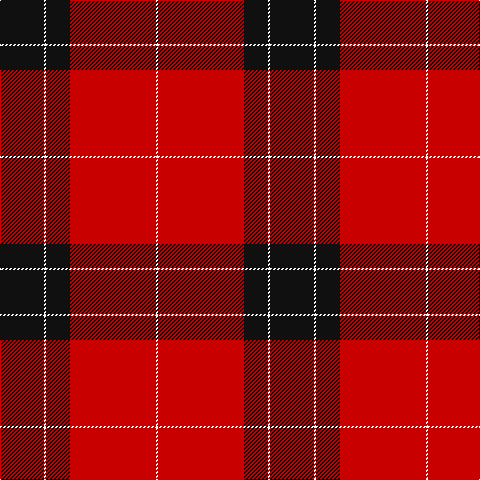

In pattern [KWKRW](/patterns/kwkrw/).

This was sourced from tartans-authority.  It is a [5 stripes tartan](/stripes/stripes5/).

Original link http://www.tartansauthority.com/tartan-ferret/display/6641/

## Thread count
K/44 W2 K24 R86 W/2

## Palette
Each colour and its ΔE from the base-6 reference it is a variant of.

| Colour | Shade | Base | ΔE (OKLab) |
|---|---|---|---|
| K | <code style="background-color:#101010;">#101010</code> `#101010` | K <code style="background-color:#000000;">#000000</code> | 0.17 |
| R | <code style="background-color:#C80000;">#C80000</code> `#C80000` | R <code style="background-color:#CC0000;">#CC0000</code> | 0.01 |
| W | <code style="background-color:#F8F8F8;">#F8F8F8</code> `#F8F8F8` | W <code style="background-color:#F7F7F7;">#F7F7F7</code> | 0.00 |

# Sample pattern

## Nearest tartans

The nearest existing variants by ΔTartan distance.

1. [Ramsay of Dalhousie](/setts/s6/k8w4k56r60k2r6-k101010-rdc0000-we0e0e0/) — ΔT 0.90
1. [Masai Shuka 15 (Artefact)](/setts/s5/r40k4r4k30w2-k101010-rc80000-we0e0e0/) — ΔT 1.15
1. [Aragon (Erskine)](/setts/s6/k12r2k48r56k2r8-k101010-rc80000/) — ΔT 1.23
1. [Ramsay (Red)](/setts/s6/k8w2k56r60b2r6-b440044-k101010-rc80000-wf8f8f8/) — ΔT 1.25
1. [Cunningham](/setts/s7/k6r2k60r56k2r2w6-k101010-rdc0000-we0e0e0/) — ΔT 1.27
1. [Campbell Red (artefact)](/setts/s5/r8k2r48k44r4-k101010-rdc0000/) — ΔT 1.29
1. [Dunbar](/setts/s6/r12g42k16r56g2r8-g004c00-k000000-rc80000/) — ΔT 1.31
1. [Rosser (Welsh Name)](/setts/s6/r16k57r36k2r4r2-k101010-rc80000/) — ΔT 1.32
1. [Knights Templar Hunting](/setts/s8/k44w2k24r86w2r86k24w2-k101010-rc80000-wf8f8f8/) — ΔT 1.36
1. [Maxwell](/setts/s7/r3g16r4k6r28g1r3-g004c00-k000000-rc80000/) — ΔT 1.39

## Neighbour map

Every grey dot is one of 15726 variants placed by the first two principal components of the ΔTartan feature space (44% of its variance). Red is this tartan; blue dots are its nearest — click one to open its page.

<svg viewBox="0 0 640 380" role="img" style="max-width:100%;height:auto;border:1px solid #e0e0e0;border-radius:4px;display:block" xmlns="http://www.w3.org/2000/svg"><image href="/nn/cloud.v1.png" width="640" height="380"/><a href="/setts/s6/k8w4k56r60k2r6-k101010-rdc0000-we0e0e0/"><circle cx="370.5" cy="152.9" r="4" fill="#3465a4"><title>Ramsay of Dalhousie</title></circle></a><a href="/setts/s5/r40k4r4k30w2-k101010-rc80000-we0e0e0/"><circle cx="387.3" cy="186.1" r="4" fill="#3465a4"><title>Masai Shuka 15 (Artefact)</title></circle></a><a href="/setts/s6/k12r2k48r56k2r8-k101010-rc80000/"><circle cx="417.2" cy="184.3" r="4" fill="#3465a4"><title>Aragon (Erskine)</title></circle></a><a href="/setts/s6/k8w2k56r60b2r6-b440044-k101010-rc80000-wf8f8f8/"><circle cx="366.8" cy="141.8" r="4" fill="#3465a4"><title>Ramsay (Red)</title></circle></a><a href="/setts/s7/k6r2k60r56k2r2w6-k101010-rdc0000-we0e0e0/"><circle cx="376.2" cy="135.4" r="4" fill="#3465a4"><title>Cunningham</title></circle></a><a href="/setts/s5/r8k2r48k44r4-k101010-rdc0000/"><circle cx="422.7" cy="195.0" r="4" fill="#3465a4"><title>Campbell Red (artefact)</title></circle></a><a href="/setts/s6/r12g42k16r56g2r8-g004c00-k000000-rc80000/"><circle cx="367.0" cy="176.8" r="4" fill="#3465a4"><title>Dunbar</title></circle></a><a href="/setts/s6/r16k57r36k2r4r2-k101010-rc80000/"><circle cx="361.8" cy="166.5" r="4" fill="#3465a4"><title>Rosser (Welsh Name)</title></circle></a><a href="/setts/s8/k44w2k24r86w2r86k24w2-k101010-rc80000-wf8f8f8/"><circle cx="451.0" cy="138.6" r="4" fill="#3465a4"><title>Knights Templar Hunting</title></circle></a><a href="/setts/s7/r3g16r4k6r28g1r3-g004c00-k000000-rc80000/"><circle cx="419.9" cy="157.0" r="4" fill="#3465a4"><title>Maxwell</title></circle></a><circle cx="410.4" cy="158.2" r="5" fill="#c00000"/></svg>

ID: /setts/s5/k44w2k24r86w2-k101010-rc80000-wf8f8f8/
