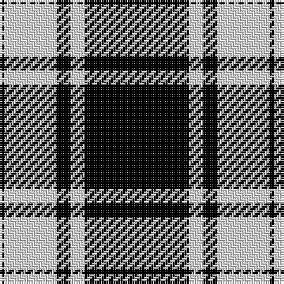

In pattern [KWKWK](/patterns/kwkwk/).

This was sourced from weddslist.  It is a [5 stripes tartan](/stripes/stripes5/).

Original link http://www.weddslist.com/cgi-bin/tartans/pg.pl?source=sts

## Thread count
K/2 LN22 K6 LN6 K/44

## Palette
Each colour and its ΔE from the base-6 reference it is a variant of.

| Colour | Shade | Base | ΔE (OKLab) |
|---|---|---|---|
| K | <code style="background-color:#000000;">#000000</code> `#000000` | K <code style="background-color:#000000;">#000000</code> | 0.00 |
| LN | <code style="background-color:#E0E0E0;">#E0E0E0</code> `#E0E0E0` | W <code style="background-color:#F4F4F0;">#F4F4F0</code> | 0.06 |

# Sample pattern

## Nearest tartans

The nearest existing variants by ΔTartan distance.

1. [Black Isle Corporate Tartan Tartan Number: 6183. Earliest known date: 15/07/2003 Designed for Black Isle Pewter Limited by Robert Howarth Guibal of Black Isle Pewter. Threadcount taken from a Marton Mills swatch book. See products available Copyright © Blair Urquhart, Comrie, 2015](/setts/s6/k96y44k20y20k4y8-k000000-y8e8e8e/) — ΔT 0.86
1. [MacPhee MacFee or MacIver](/setts/s5/k44w6k6w22k2-k101010-we0e0e0/) — ΔT 0.97
1. [Black Isle](/setts/s6/k106r44k20r20k4r8-k101010-r888888/) — ΔT 1.35
1. [Glen Coe Trade Tartan Tartan Number: 1243. Earliest known date: Modern Many new designs have been given district names to promote their Scottish connections. However, these names should not be confused with the District tartans which have earned their title through 'use and wont' and not a little history. See products available Copyright © Blair Urquhart, Comrie, 2015](/setts/s5/k74w18k6g18w6-g003820-k101010-we0e0e0/) — ΔT 1.46
1. [St Piran, Cornish Flag](/setts/s5/w10k40w20k2r4-k000000-rc00000-we0e0e0/) — ΔT 1.51
1. [Glen Coe #1 (Fashion)](/setts/s5/k74w18k6g18w6-g006818-k101010-wfcfcfc/) — ΔT 1.51
1. [Douglas VS](/setts/s8/k32g2k2g2k16g32k2g4-g7e7e7e-k000000/) — ΔT 1.52
1. [Glencoe](/setts/s5/k74w18k6g18w6-g008000-k000000-we0e0e0/) — ΔT 1.53
1. [DDB Canada (Fashion)](/setts/s7/k2r4k14r22k36y4k2-k101010-r888888-ye8c000/) — ΔT 1.57
1. [Kinloch Anderson Black and White](/setts/s10/k8w28k4w8k16w6k60w4k8w8-k000000-wf8f8f8/) — ΔT 1.59

## Neighbour map

Every grey dot is one of 15726 variants placed by the first two principal components of the ΔTartan feature space (44% of its variance). Red is this tartan; blue dots are its nearest — click one to open its page.

<svg viewBox="0 0 640 380" role="img" style="max-width:100%;height:auto;border:1px solid #e0e0e0;border-radius:4px;display:block" xmlns="http://www.w3.org/2000/svg"><image href="/nn/cloud.v1.png" width="640" height="380"/><a href="/setts/s6/k96y44k20y20k4y8-k000000-y8e8e8e/"><circle cx="411.0" cy="200.3" r="4" fill="#3465a4"><title>Black Isle Corporate Tartan Tartan Number: 6183. Earliest known date: 15/07/2003 Designed for Black Isle Pewter Limited by Robert Howarth Guibal of Black Isle Pewter. Threadcount taken from a Marton Mills swatch book. See products available Copyright © Blair Urquhart, Comrie, 2015</title></circle></a><a href="/setts/s5/k44w6k6w22k2-k101010-we0e0e0/"><circle cx="412.8" cy="199.4" r="4" fill="#3465a4"><title>MacPhee MacFee or MacIver</title></circle></a><a href="/setts/s6/k106r44k20r20k4r8-k101010-r888888/"><circle cx="449.4" cy="198.0" r="4" fill="#3465a4"><title>Black Isle</title></circle></a><a href="/setts/s5/k74w18k6g18w6-g003820-k101010-we0e0e0/"><circle cx="372.2" cy="208.0" r="4" fill="#3465a4"><title>Glen Coe Trade Tartan Tartan Number: 1243. Earliest known date: Modern Many new designs have been given district names to promote their Scottish connections. However, these names should not be confused with the District tartans which have earned their title through 'use and wont' and not a little history. See products available Copyright © Blair Urquhart, Comrie, 2015</title></circle></a><a href="/setts/s5/w10k40w20k2r4-k000000-rc00000-we0e0e0/"><circle cx="322.7" cy="187.8" r="4" fill="#3465a4"><title>St Piran, Cornish Flag</title></circle></a><a href="/setts/s5/k74w18k6g18w6-g006818-k101010-wfcfcfc/"><circle cx="363.0" cy="203.5" r="4" fill="#3465a4"><title>Glen Coe #1 (Fashion)</title></circle></a><a href="/setts/s8/k32g2k2g2k16g32k2g4-g7e7e7e-k000000/"><circle cx="372.6" cy="193.7" r="4" fill="#3465a4"><title>Douglas VS</title></circle></a><a href="/setts/s5/k74w18k6g18w6-g008000-k000000-we0e0e0/"><circle cx="361.8" cy="208.6" r="4" fill="#3465a4"><title>Glencoe</title></circle></a><a href="/setts/s7/k2r4k14r22k36y4k2-k101010-r888888-ye8c000/"><circle cx="394.1" cy="187.5" r="4" fill="#3465a4"><title>DDB Canada (Fashion)</title></circle></a><a href="/setts/s10/k8w28k4w8k16w6k60w4k8w8-k000000-wf8f8f8/"><circle cx="382.8" cy="176.9" r="4" fill="#3465a4"><title>Kinloch Anderson Black and White</title></circle></a><circle cx="411.7" cy="203.8" r="5" fill="#c00000"/></svg>

ID: /setts/s5/k44w6k6w22k2-k000000-we0e0e0/
