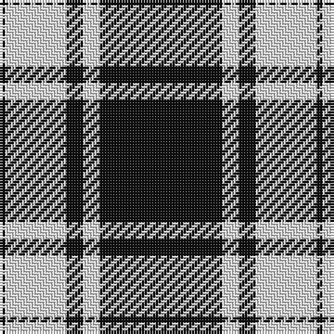

In pattern [KWKWK](/patterns/kwkwk/).

This was sourced from register-of-tartans.  It is a [5 stripes tartan](/stripes/stripes5/).

Original link https://www.tartanregister.gov.uk/tartanDetails.aspx?ref=2700

## Thread count
K/2 LN22 K6 LN6 K/44

## Palette
Each colour and its ΔE from the base-6 reference it is a variant of.

| Colour | Shade | Base | ΔE (OKLab) |
|---|---|---|---|
| K | <code style="background-color:#101010;">#101010</code> `#101010` | K <code style="background-color:#000000;">#000000</code> | 0.17 |
| LN | <code style="background-color:#E0E0E0;">#E0E0E0</code> `#E0E0E0` | W <code style="background-color:#F4F4F0;">#F4F4F0</code> | 0.06 |

# Sample pattern

## Nearest tartans

The nearest existing variants by ΔTartan distance.

1. [MacPhee, MacFee or MacIvor](/setts/s5/k44w6k6w22k2-k000000-we0e0e0/) — ΔT 0.97
1. [Saks Fifth Avenue (Corp)](/setts/s7/w48k32w2k32w6k16w4-k101010-wfcfcfc/) — ΔT 1.37
1. [Black Isle](/setts/s6/k106r44k20r20k4r8-k101010-r888888/) — ΔT 1.41
1. [St. Piran Cornish Flag](/setts/s8/r4k2w20k40w10k40w20k2-k101010-rc80000-we0e0e0/) — ΔT 1.44
1. [Sligo Irish County Tartan Tartan Number: 2256. Earliest known date: 1995 One of a series of Irish District tartans designed by Polly Wittering of the House of Edgar, with colours reminiscent of the Country with soft warm colours dominating. See products available Copyright © Blair Urquhart, Comrie, 2015](/setts/s6/b100k8b24k46y8k8-b687c94-k000000-yd49c1c/) — ΔT 1.45
1. [Menzies (1938)](/setts/s8/k144w16k12w16k24w8k4w48-k101010-wfcfcfc/) — ΔT 1.46
1. [Cornish Flag (District)](/setts/s5/w10k40w20k2r4-k101010-rc80000-we0e0e0/) — ΔT 1.47
1. [St Piran, Cornish Flag](/setts/s5/w10k40w20k2r4-k000000-rc00000-we0e0e0/) — ΔT 1.47
1. [Glen Coe #1 (Fashion)](/setts/s5/k74w18k6g18w6-g006818-k101010-wfcfcfc/) — ΔT 1.48
1. [Northern Kentucky University](/setts/s7/w10k6y12k10w6k60y4-k101010-wffffff-yfccc00/) — ΔT 1.54

## Neighbour map

Every grey dot is one of 15726 variants placed by the first two principal components of the ΔTartan feature space (44% of its variance). Red is this tartan; blue dots are its nearest — click one to open its page.

<svg viewBox="0 0 640 380" role="img" style="max-width:100%;height:auto;border:1px solid #e0e0e0;border-radius:4px;display:block" xmlns="http://www.w3.org/2000/svg"><image href="/nn/cloud.v1.png" width="640" height="380"/><a href="/setts/s5/k44w6k6w22k2-k000000-we0e0e0/"><circle cx="411.7" cy="203.8" r="4" fill="#3465a4"><title>MacPhee, MacFee or MacIvor</title></circle></a><a href="/setts/s7/w48k32w2k32w6k16w4-k101010-wfcfcfc/"><circle cx="350.3" cy="186.2" r="4" fill="#3465a4"><title>Saks Fifth Avenue (Corp)</title></circle></a><a href="/setts/s6/k106r44k20r20k4r8-k101010-r888888/"><circle cx="449.4" cy="198.0" r="4" fill="#3465a4"><title>Black Isle</title></circle></a><a href="/setts/s8/r4k2w20k40w10k40w20k2-k101010-rc80000-we0e0e0/"><circle cx="343.7" cy="173.2" r="4" fill="#3465a4"><title>St. Piran Cornish Flag</title></circle></a><a href="/setts/s6/b100k8b24k46y8k8-b687c94-k000000-yd49c1c/"><circle cx="368.7" cy="198.4" r="4" fill="#3465a4"><title>Sligo Irish County Tartan Tartan Number: 2256. Earliest known date: 1995 One of a series of Irish District tartans designed by Polly Wittering of the House of Edgar, with colours reminiscent of the Country with soft warm colours dominating. See products available Copyright © Blair Urquhart, Comrie, 2015</title></circle></a><a href="/setts/s8/k144w16k12w16k24w8k4w48-k101010-wfcfcfc/"><circle cx="450.7" cy="142.3" r="4" fill="#3465a4"><title>Menzies (1938)</title></circle></a><a href="/setts/s5/w10k40w20k2r4-k101010-rc80000-we0e0e0/"><circle cx="324.3" cy="184.2" r="4" fill="#3465a4"><title>Cornish Flag (District)</title></circle></a><a href="/setts/s5/w10k40w20k2r4-k000000-rc00000-we0e0e0/"><circle cx="322.7" cy="187.8" r="4" fill="#3465a4"><title>St Piran, Cornish Flag</title></circle></a><a href="/setts/s5/k74w18k6g18w6-g006818-k101010-wfcfcfc/"><circle cx="363.0" cy="203.5" r="4" fill="#3465a4"><title>Glen Coe #1 (Fashion)</title></circle></a><a href="/setts/s7/w10k6y12k10w6k60y4-k101010-wffffff-yfccc00/"><circle cx="404.6" cy="170.0" r="4" fill="#3465a4"><title>Northern Kentucky University</title></circle></a><circle cx="412.8" cy="199.4" r="5" fill="#c00000"/></svg>

ID: /setts/s5/k44w6k6w22k2-k101010-we0e0e0/
