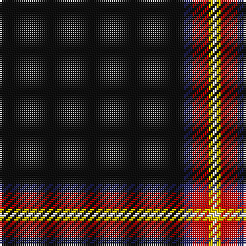

In pattern [KBRYW](/patterns/kbryw/).

This was sourced from register-of-tartans.  It is a [5 stripes tartan](/stripes/stripes5/).

Original link https://www.tartanregister.gov.uk/tartanDetails.aspx?ref=2888

## Thread count
K/90 DB4 R8 Y2 LN/2

## Palette
Each colour and its ΔE from the base-6 reference it is a variant of.

| Colour | Shade | Base | ΔE (OKLab) |
|---|---|---|---|
| DB | <code style="background-color:#202060;">#202060</code> `#202060` | B <code style="background-color:#2A418A;">#2A418A</code> | 0.11 |
| K | <code style="background-color:#101010;">#101010</code> `#101010` | K <code style="background-color:#000000;">#000000</code> | 0.17 |
| LN | <code style="background-color:#E0E0E0;">#E0E0E0</code> `#E0E0E0` | W <code style="background-color:#F7F7F7;">#F7F7F7</code> | 0.07 |
| R | <code style="background-color:#C80000;">#C80000</code> `#C80000` | R <code style="background-color:#CC0000;">#CC0000</code> | 0.01 |
| Y | <code style="background-color:#E8C000;">#E8C000</code> `#E8C000` | Y <code style="background-color:#F2BF00;">#F2BF00</code> | 0.02 |

# Sample pattern

## Nearest tartans

The nearest existing variants by ΔTartan distance.

1. [Fettes Personal Tartan Tartan Number: 7565. Earliest known date: 2008 Designed online for four kilts by Fiona Fettes. See products available Copyright © Blair Urquhart, Comrie, 2015](/setts/s5/k50b3w2r3wa1~b003c64-k101010-rc80000-wc49cd8-wae0e0e0~x2/) — ΔT 0.27
1. [McHattie (Personal)](/setts/s5/k45b2r4y1w1~b1474b4-k101010-rc80000-we0e0e0-ye8c000~x2/) — ΔT 0.28
1. [Fettes (Personal)](/setts/s5/k50b3ba2r3w1~b004878-baa060bc-k101010-rc80000-we0e0e0~x4/) — ΔT 0.44
1. [Forand (Personal)](/setts/s5/k100r1ra10b10y2~b1c0070-k101010-rc80000-ra888888-ye8c000~x2/) — ΔT 0.86
1. [Perratt (Personal)](/setts/s6/k83g4r4g10k1w3~g006818-k101010-rc80000-wfcfcfc~x2/) — ΔT 1.34
1. [Modern Craft (Masonic)](/setts/s8/k108ka4y4w2y4ka1b2w2~b2c2c80-k101010-ka1c1714-wfcfcfc-ya0a0a0~x2/) — ΔT 1.35
1. [Spirit of Lanarkshire (Corporate)](/setts/s8/k83y2b4r2k8g5r4w3~b2c2c80-g006818-k101010-rc80000-we0e0e0-ye8c000~x2/) — ΔT 1.47
1. [Modern Craft (Masonic)](/setts/s8/k108b4w4wa2w4b1ba2wa2~b5c5c5c-ba202060-k101010-wc0c0c0-wafcfcfc~x2/) — ΔT 1.52
1. [Dellen](/setts/s6/k80r6g3r12k2w2~g006818-k101010-rcc4438-wfcfcfc~x2/) — ΔT 1.53
1. [Dellen](/setts/s6/k80r6g3r12k2w2~g06392b-k1c1714-rb62531-wf9f5ef~x2/) — ΔT 1.53

## Neighbour map

Every grey dot is one of 15726 variants placed by the first two principal components of the ΔTartan feature space (44% of its variance). Red is this tartan; blue dots are its nearest — click one to open its page.

<svg viewBox="0 0 640 380" role="img" style="max-width:100%;height:auto;border:1px solid #e0e0e0;border-radius:4px;display:block" xmlns="http://www.w3.org/2000/svg"><image href="/nn/cloud.v1.png" width="640" height="380"/><a href="/setts/s5/k50b3w2r3wa1~b003c64-k101010-rc80000-wc49cd8-wae0e0e0~x2/"><circle cx="622.7" cy="135.3" r="4" fill="#3465a4"><title>Fettes Personal Tartan Tartan Number: 7565. Earliest known date: 2008 Designed online for four kilts by Fiona Fettes. See products available Copyright © Blair Urquhart, Comrie, 2015</title></circle></a><a href="/setts/s5/k45b2r4y1w1~b1474b4-k101010-rc80000-we0e0e0-ye8c000~x2/"><circle cx="611.2" cy="134.2" r="4" fill="#3465a4"><title>McHattie (Personal)</title></circle></a><a href="/setts/s5/k50b3ba2r3w1~b004878-baa060bc-k101010-rc80000-we0e0e0~x4/"><circle cx="626.0" cy="138.2" r="4" fill="#3465a4"><title>Fettes (Personal)</title></circle></a><a href="/setts/s5/k100r1ra10b10y2~b1c0070-k101010-rc80000-ra888888-ye8c000~x2/"><circle cx="597.1" cy="140.9" r="4" fill="#3465a4"><title>Forand (Personal)</title></circle></a><a href="/setts/s6/k83g4r4g10k1w3~g006818-k101010-rc80000-wfcfcfc~x2/"><circle cx="587.4" cy="135.3" r="4" fill="#3465a4"><title>Perratt (Personal)</title></circle></a><a href="/setts/s8/k108ka4y4w2y4ka1b2w2~b2c2c80-k101010-ka1c1714-wfcfcfc-ya0a0a0~x2/"><circle cx="619.8" cy="92.0" r="4" fill="#3465a4"><title>Modern Craft (Masonic)</title></circle></a><a href="/setts/s8/k83y2b4r2k8g5r4w3~b2c2c80-g006818-k101010-rc80000-we0e0e0-ye8c000~x2/"><circle cx="562.8" cy="89.9" r="4" fill="#3465a4"><title>Spirit of Lanarkshire (Corporate)</title></circle></a><a href="/setts/s8/k108b4w4wa2w4b1ba2wa2~b5c5c5c-ba202060-k101010-wc0c0c0-wafcfcfc~x2/"><circle cx="607.4" cy="86.6" r="4" fill="#3465a4"><title>Modern Craft (Masonic)</title></circle></a><a href="/setts/s6/k80r6g3r12k2w2~g006818-k101010-rcc4438-wfcfcfc~x2/"><circle cx="556.3" cy="136.6" r="4" fill="#3465a4"><title>Dellen</title></circle></a><a href="/setts/s6/k80r6g3r12k2w2~g06392b-k1c1714-rb62531-wf9f5ef~x2/"><circle cx="582.0" cy="144.5" r="4" fill="#3465a4"><title>Dellen</title></circle></a><circle cx="619.7" cy="137.5" r="5" fill="#c00000"/></svg>

ID: /setts/s5/k45b2r4y1w1~b202060-k101010-rc80000-we0e0e0-ye8c000~x2/
