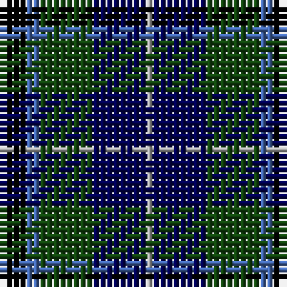

**Bands:** [KBGBY](/stripes/kbgby/) · **Stripes:** [K B DG DB LR](/stripes/stripes5/) K B DG DB LR

This was sourced from weddslist.  It is a [5 band tartan](/bands/bands5/).

Original link http://www.weddslist.com/cgi-bin/tartans/pg.pl?source=x

## Register references

External register numbers recorded for this tartan.

- Scottish Register of Tartans: [1166](https://www.tartanregister.gov.uk/tartanDetails.aspx?ref=1166)
- Scottish Register of Tartans: [1758](https://www.tartanregister.gov.uk/tartanDetails.aspx?ref=1758)
- Scottish Register of Tartans: [2307](https://www.tartanregister.gov.uk/tartanDetails.aspx?ref=2307)
- Scottish Register of Tartans: [2540](https://www.tartanregister.gov.uk/tartanDetails.aspx?ref=2540)
- Scottish Register of Tartans: [2625](https://www.tartanregister.gov.uk/tartanDetails.aspx?ref=2625)
- Scottish Register of Tartans: [2862](https://www.tartanregister.gov.uk/tartanDetails.aspx?ref=2862)
- Scottish Register of Tartans: [982](https://www.tartanregister.gov.uk/tartanDetails.aspx?ref=982)
- Scottish Tartans Authority (ITI): 1429
- Scottish Tartans Authority (ITI): 218
- Scottish Tartans World Register: 1042
- Scottish Tartans World Register: 127
- Scottish Tartans World Register: 1429
- Scottish Tartans World Register: 218
- Scottish Tartans World Register: 2218
- Scottish Tartans World Register: 737
- Scottish Tartans World Register: 897

## Variants

Other setts woven to the same stripe pattern.

- [Douglas](/setts/s5/k2b2dg8db8lr1~x2/)
- [Douglas](/setts/s5/k2b2dg8db8lr1/)
- [Dougles Green](/setts/s5/k4b2dg8db8lr1~x2/)

## Thread count
K/4 B2 DG8 DB8 N/1

## Palette
Each colour and its ΔE from the base-6 reference it is a variant of.

| Colour | Shade | Base | ΔE (OKLab) |
|---|---|---|---|
| B | <code style="background-color:#4367AE;">#4367AE</code> `#4367AE` | B <code style="background-color:#2A418A;">#2A418A</code> | 0.12 |
| DB | <code style="background-color:#000052;">#000052</code> `#000052` | B <code style="background-color:#2A418A;">#2A418A</code> | 0.20 |
| DG | <code style="background-color:#11450D;">#11450D</code> `#11450D` | G <code style="background-color:#006100;">#006100</code> | 0.09 |
| K | <code style="background-color:#000000;">#000000</code> `#000000` | K <code style="background-color:#000000;">#000000</code> | 0.00 |
| N | <code style="background-color:#AAAAAA;">#AAAAAA</code> `#AAAAAA` | Y <code style="background-color:#F2BF00;">#F2BF00</code> | 0.19 |

# Sample pattern

## Nearest tartans

The nearest existing variants by ΔTartan distance.

1. [Dougles Green](/setts/s5/k4b2dg8db8lr1~x2/) — ΔT 0.00
1. [Davidson of Tulloch](/setts/s5/r1db6k3dg6lr1~x2/) — ΔT 0.61
1. [Douglas](/setts/s5/k2b2dg8db8lr1~x2/) — ΔT 0.64
1. [Douglas](/setts/s5/k2b2dg8db8lr1/) — ΔT 0.64
1. [Bhatti](/setts/s5/k7lt3dg18db18w2~x2/) — ΔT 0.84
1. [Davidson of Tulloch](/setts/s5/r1db6k3dg6lb1/) — ΔT 0.90
1. [Leslie Hunting](/setts/s6/r2db8k8lr1dg8k1~x2/) — ΔT 0.94
1. [Leslie Hunting](/setts/s6/r2db8k8lr1dg8k1/) — ΔT 0.94
1. [Mitchell (Clan)](/setts/s6/k2g17k16r2db17lr2~x2/) — ΔT 0.97
1. [Leslie Hunting](/setts/s6/r2db8k8lb1dg8k1/) — ΔT 1.02

## Neighbour map

Every grey dot is one of 14299 variants placed by the first two principal components of the ΔTartan feature space (44% of its variance). Red is this tartan; blue dots are its nearest — click one to open its page.

<svg viewBox="0 0 640 380" role="img" style="max-width:100%;height:auto;border:1px solid #e0e0e0;border-radius:4px;display:block" xmlns="http://www.w3.org/2000/svg"><image href="/nn/cloud.v1.png" width="640" height="380"/><a href="/setts/s5/k4b2dg8db8lr1~x2/"><circle cx="147.0" cy="245.0" r="4" fill="#3465a4"><title>Dougles Green</title></circle></a><a href="/setts/s5/r1db6k3dg6lr1~x2/"><circle cx="140.2" cy="249.2" r="4" fill="#3465a4"><title>Davidson of Tulloch</title></circle></a><a href="/setts/s5/k2b2dg8db8lr1~x2/"><circle cx="182.5" cy="237.3" r="4" fill="#3465a4"><title>Douglas</title></circle></a><a href="/setts/s5/k2b2dg8db8lr1/"><circle cx="182.5" cy="237.3" r="4" fill="#3465a4"><title>Douglas</title></circle></a><a href="/setts/s5/k7lt3dg18db18w2~x2/"><circle cx="165.2" cy="225.1" r="4" fill="#3465a4"><title>Bhatti</title></circle></a><a href="/setts/s5/r1db6k3dg6lb1/"><circle cx="126.0" cy="241.9" r="4" fill="#3465a4"><title>Davidson of Tulloch</title></circle></a><a href="/setts/s6/r2db8k8lr1dg8k1~x2/"><circle cx="139.2" cy="226.5" r="4" fill="#3465a4"><title>Leslie Hunting</title></circle></a><a href="/setts/s6/r2db8k8lr1dg8k1/"><circle cx="139.2" cy="226.5" r="4" fill="#3465a4"><title>Leslie Hunting</title></circle></a><a href="/setts/s6/k2g17k16r2db17lr2~x2/"><circle cx="163.2" cy="221.4" r="4" fill="#3465a4"><title>Mitchell (Clan)</title></circle></a><a href="/setts/s6/r2db8k8lb1dg8k1/"><circle cx="124.9" cy="219.0" r="4" fill="#3465a4"><title>Leslie Hunting</title></circle></a><circle cx="147.0" cy="245.0" r="5" fill="#c00000"/></svg>

ID: /setts/s5/k4b2dg8db8lr1/
