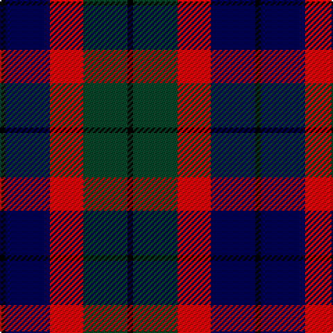

In pattern [KBRGK](/patterns/kbrgk/).

This was sourced from register-of-tartans.  It is a [5 stripes tartan](/stripes/stripes5/).

Original link https://www.tartanregister.gov.uk/tartanDetails.aspx?ref=4960

## Attestations

This cloth appears in 2 source records; the oldest owns this page.

- undated — Edinburgh Military Tattoo 50th (register-of-tartans, [record](https://www.tartanregister.gov.uk/tartanDetails.aspx?ref=4960))
- undated — Edinburgh Military Tattoo 50th Military Tartan Tartan Number: 3614. Earliest known date: 1998 Based on a Wilsons of Bannockburn sett, designed by Peter MacDonald in 1998 for the Edinburgh Military Tattoo to celebrate their 50th anniversary in 2000. The colours depict the three military forces - Navy, Army & Air Force with the black from Edinburgh's heraldic arms. Launched on June 16th 1999 in time for the final Tattoo of the 20th century. See products available Copyright © Blair Urquhart, Comrie, 2015 (house-of-tartan, [record](http://www.house-of-tartan.scotland.net/house/TartanViewjs.asp?colr=Def&tnam=3614))

## Thread count
K/4 DB32 R24 DG32 K/4

## Palette
Each colour and its ΔE from the base-6 reference it is a variant of.

| Colour | Shade | Base | ΔE (OKLab) |
|---|---|---|---|
| DB | <code style="background-color:#000048;">#000048</code> `#000048` | B <code style="background-color:#2A418A;">#2A418A</code> | 0.22 |
| DG | <code style="background-color:#004028;">#004028</code> `#004028` | G <code style="background-color:#006100;">#006100</code> | 0.13 |
| K | <code style="background-color:#000000;">#000000</code> `#000000` | K <code style="background-color:#000000;">#000000</code> | 0.00 |
| R | <code style="background-color:#C80000;">#C80000</code> `#C80000` | R <code style="background-color:#CC0000;">#CC0000</code> | 0.01 |

# Sample pattern

## Nearest tartans

The nearest existing variants by ΔTartan distance.

1. [Edinburgh International Conference Centre](/setts/s6/r8b38r6k40ra48b6-b304080-k000000-r806050-ra906030/) — ΔT 0.71
1. [Wilson's No.100](/setts/s6/g6b34k36y4g34k6-b5a008c-g005020-k101010-ye8c000/) — ΔT 0.98
1. [Gordon of Esslemont](/setts/s7/y12g6y6g44k46b46k8-b5a008c-g005020-k101010-ye8c000/) — ΔT 1.04
1. [Martin Hunting](/setts/s5/b40k10ka38g38y4-b780078-g006818-k000030-ka101010-ye8c000/) — ΔT 1.05
1. [Selkirk (Personal)](/setts/s5/b54ba8k54g54y8-b6c0070-ba1c1c50-g006818-k101010-yd09800/) — ΔT 1.10
1. [Atholl Highlanders (Military)](/setts/s6/r16g40k40b40k6r16-b1c0070-g005448-k101010-rd05054/) — ΔT 1.12
1. [Baillie (Highland Society)](/setts/s7/b6k2b16k12g16k2w4-b5a008c-g005020-k101010-we0e0e0/) — ΔT 1.18
1. [Unidentified #65](/setts/s6/g6k40ka40r40k6r6-g005020-k000028-ka101010-rdc0000/) — ΔT 1.18
1. [Lennie Family Tartan Tartan Number: 725. Earliest known date: 1819 Wilson's No 231. See products available Copyright © Blair Urquhart, Comrie, 2015](/setts/s6/g4b16k18ba4g20k4-b780078-ba5c8ca8-g006818-k101010/) — ΔT 1.20
1. [Hudson Valley Reg. Police P & D (Cor](/setts/s6/y10g32k32b32k4b4-b202060-g006818-k101010-ye8c000/) — ΔT 1.21

## Neighbour map

Every grey dot is one of 15726 variants placed by the first two principal components of the ΔTartan feature space (44% of its variance). Red is this tartan; blue dots are its nearest — click one to open its page.

<svg viewBox="0 0 640 380" role="img" style="max-width:100%;height:auto;border:1px solid #e0e0e0;border-radius:4px;display:block" xmlns="http://www.w3.org/2000/svg"><image href="/nn/cloud.v1.png" width="640" height="380"/><a href="/setts/s6/r8b38r6k40ra48b6-b304080-k000000-r806050-ra906030/"><circle cx="150.4" cy="221.8" r="4" fill="#3465a4"><title>Edinburgh International Conference Centre</title></circle></a><a href="/setts/s6/g6b34k36y4g34k6-b5a008c-g005020-k101010-ye8c000/"><circle cx="200.9" cy="235.4" r="4" fill="#3465a4"><title>Wilson's No.100</title></circle></a><a href="/setts/s7/y12g6y6g44k46b46k8-b5a008c-g005020-k101010-ye8c000/"><circle cx="145.2" cy="215.4" r="4" fill="#3465a4"><title>Gordon of Esslemont</title></circle></a><a href="/setts/s5/b40k10ka38g38y4-b780078-g006818-k000030-ka101010-ye8c000/"><circle cx="134.8" cy="226.3" r="4" fill="#3465a4"><title>Martin Hunting</title></circle></a><a href="/setts/s5/b54ba8k54g54y8-b6c0070-ba1c1c50-g006818-k101010-yd09800/"><circle cx="133.1" cy="240.5" r="4" fill="#3465a4"><title>Selkirk (Personal)</title></circle></a><a href="/setts/s6/r16g40k40b40k6r16-b1c0070-g005448-k101010-rd05054/"><circle cx="121.4" cy="259.2" r="4" fill="#3465a4"><title>Atholl Highlanders (Military)</title></circle></a><a href="/setts/s7/b6k2b16k12g16k2w4-b5a008c-g005020-k101010-we0e0e0/"><circle cx="174.0" cy="223.7" r="4" fill="#3465a4"><title>Baillie (Highland Society)</title></circle></a><a href="/setts/s6/g6k40ka40r40k6r6-g005020-k000028-ka101010-rdc0000/"><circle cx="163.1" cy="226.4" r="4" fill="#3465a4"><title>Unidentified #65</title></circle></a><a href="/setts/s6/g4b16k18ba4g20k4-b780078-ba5c8ca8-g006818-k101010/"><circle cx="163.2" cy="259.2" r="4" fill="#3465a4"><title>Lennie Family Tartan Tartan Number: 725. Earliest known date: 1819 Wilson's No 231. See products available Copyright © Blair Urquhart, Comrie, 2015</title></circle></a><a href="/setts/s6/y10g32k32b32k4b4-b202060-g006818-k101010-ye8c000/"><circle cx="147.9" cy="236.1" r="4" fill="#3465a4"><title>Hudson Valley Reg. Police P &amp; D (Cor</title></circle></a><circle cx="165.1" cy="243.8" r="5" fill="#c00000"/></svg>

ID: /setts/s5/k4b32r24g32k4-b000048-g004028-k000000-rc80000/
