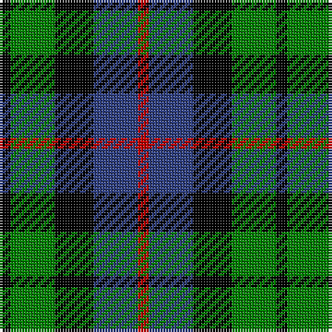

In pattern [KGKBR](/patterns/kgkbr/).

This was sourced from weddslist.  It is a [5 stripes tartan](/stripes/stripes5/).

Original link http://www.weddslist.com/cgi-bin/tartans/pg.pl?source=sts

## Thread count
K/4 G16 K14 B16 R/4

## Palette
Each colour and its ΔE from the base-6 reference it is a variant of.

| Colour | Shade | Base | ΔE (OKLab) |
|---|---|---|---|
| B | <code style="background-color:#304080;">#304080</code> `#304080` | B <code style="background-color:#2C4084;">#2C4084</code> | 0.01 |
| G | <code style="background-color:#008000;">#008000</code> `#008000` | G <code style="background-color:#006400;">#006400</code> | 0.09 |
| K | <code style="background-color:#000000;">#000000</code> `#000000` | K <code style="background-color:#000000;">#000000</code> | 0.00 |
| R | <code style="background-color:#C00000;">#C00000</code> `#C00000` | R <code style="background-color:#C80000;">#C80000</code> | 0.02 |

# Sample pattern

## Nearest tartans

The nearest existing variants by ΔTartan distance.

1. [Denholm (Fashion)](/setts/s5/k10g40k36b40r10-b2c2c80-g006818-k000000-rc80000/) — ΔT 0.57
1. [Unidentified, pattern](/setts/s4/b16k20g16r4-b304080-g008000-k000000-rc00000/) — ΔT 0.77
1. [Lennie](/setts/s6/g4b16k18ba4g20k4-b800080-ba5480b0-g008000-k000000/) — ΔT 0.91
1. [Wellington, or Waterloo](/setts/s6/b6g24k28b22r6b6-b5480b0-g008000-k000000-rc00000/) — ΔT 1.00
1. [Wilson's, No 220](/setts/s4/b16k22g18w4-b800080-g008000-k000000-we0e0e0/) — ΔT 1.13
1. [Dalmeny](/setts/s5/r8g30k30b30w8-b304080-g008000-k000000-rc00000-we0e0e0/) — ΔT 1.15
1. [Wellington, or Waterloo](/setts/s6/b6g16k18ba14r4ba4-b5480b0-ba304080-g008000-k000000-rc00000/) — ΔT 1.16
1. [Morrison](/setts/s6/k6g28k28g4b28r6-b304080-g008000-k000000-rc00000/) — ΔT 1.18
1. [Murray](/setts/s6/b4k4b24k16g22r4-b304080-g008000-k000000-rc00000/) — ΔT 1.20
1. [Campbell, The White Stripe](/setts/s6/b4k4b24k22g24w4-b304080-g008000-k000000-we0e0e0/) — ΔT 1.20

## Neighbour map

Every grey dot is one of 15726 variants placed by the first two principal components of the ΔTartan feature space (44% of its variance). Red is this tartan; blue dots are its nearest — click one to open its page.

<svg viewBox="0 0 640 380" role="img" style="max-width:100%;height:auto;border:1px solid #e0e0e0;border-radius:4px;display:block" xmlns="http://www.w3.org/2000/svg"><image href="/nn/cloud.v1.png" width="640" height="380"/><a href="/setts/s5/k10g40k36b40r10-b2c2c80-g006818-k000000-rc80000/"><circle cx="108.1" cy="283.4" r="4" fill="#3465a4"><title>Denholm (Fashion)</title></circle></a><a href="/setts/s4/b16k20g16r4-b304080-g008000-k000000-rc00000/"><circle cx="107.1" cy="292.9" r="4" fill="#3465a4"><title>Unidentified, pattern</title></circle></a><a href="/setts/s6/g4b16k18ba4g20k4-b800080-ba5480b0-g008000-k000000/"><circle cx="124.6" cy="244.4" r="4" fill="#3465a4"><title>Lennie</title></circle></a><a href="/setts/s6/b6g24k28b22r6b6-b5480b0-g008000-k000000-rc00000/"><circle cx="113.2" cy="248.3" r="4" fill="#3465a4"><title>Wellington, or Waterloo</title></circle></a><a href="/setts/s4/b16k22g18w4-b800080-g008000-k000000-we0e0e0/"><circle cx="108.6" cy="277.2" r="4" fill="#3465a4"><title>Wilson's, No 220</title></circle></a><a href="/setts/s5/r8g30k30b30w8-b304080-g008000-k000000-rc00000-we0e0e0/"><circle cx="33.5" cy="258.8" r="4" fill="#3465a4"><title>Dalmeny</title></circle></a><a href="/setts/s6/b6g16k18ba14r4ba4-b5480b0-ba304080-g008000-k000000-rc00000/"><circle cx="53.5" cy="244.1" r="4" fill="#3465a4"><title>Wellington, or Waterloo</title></circle></a><a href="/setts/s6/k6g28k28g4b28r6-b304080-g008000-k000000-rc00000/"><circle cx="133.8" cy="234.5" r="4" fill="#3465a4"><title>Morrison</title></circle></a><a href="/setts/s6/b4k4b24k16g22r4-b304080-g008000-k000000-rc00000/"><circle cx="149.3" cy="238.9" r="4" fill="#3465a4"><title>Murray</title></circle></a><a href="/setts/s6/b4k4b24k22g24w4-b304080-g008000-k000000-we0e0e0/"><circle cx="126.2" cy="235.3" r="4" fill="#3465a4"><title>Campbell, The White Stripe</title></circle></a><circle cx="96.4" cy="279.2" r="5" fill="#c00000"/></svg>

ID: /setts/s5/k4g16k14b16r4-b304080-g008000-k000000-rc00000/
