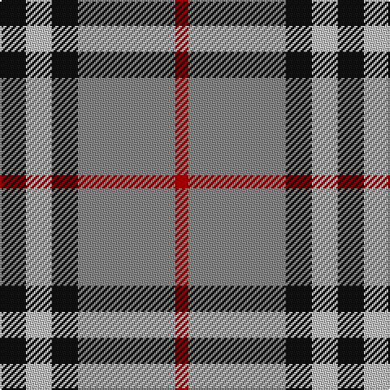

**Bands:** [KWKRR](/stripes/kwkrr/) · **Stripes:** [K LB K O R](/stripes/stripes5/) K LB K O R

This was sourced from tartans-authority.  It is a [5 band tartan](/bands/bands5/).

Original link http://www.tartansauthority.com/tartan-ferret/display/1237/

## Thread count
K/16 N16 K16 Na60 DR/8

## Palette
Each colour and its ΔE from the base-6 reference it is a variant of.

| Colour | Shade | Base | ΔE (OKLab) |
|---|---|---|---|
| DR | <code style="background-color:#880000;">#880000</code> `#880000` | R <code style="background-color:#CC0000;">#CC0000</code> | 0.15 |
| K | <code style="background-color:#101010;">#101010</code> `#101010` | K <code style="background-color:#000000;">#000000</code> | 0.17 |
| N | <code style="background-color:#C0C0C0;">#C0C0C0</code> `#C0C0C0` | W <code style="background-color:#F7F7F7;">#F7F7F7</code> | 0.17 |
| Na | <code style="background-color:#888888;">#888888</code> `#888888` | R <code style="background-color:#CC0000;">#CC0000</code> | 0.24 |

# Sample pattern

## Nearest tartans

The nearest existing variants by ΔTartan distance.

1. [New York State Police Pipe Band](/setts/s5/o5dp3o18k16ly3~x4/) — ΔT 0.66
1. [Bronte House Check (Fashion)](/setts/s6/r10dy60dt13lb24dt24dy8/) — ΔT 0.85
1. [Burberry Hunting](/setts/s5/k3w3k3y10r1~x6/) — ΔT 0.89
1. [Downside (Corporate)](/setts/s6/r4o41k5w14k18r4~x2/) — ΔT 0.94
1. [Burberry Check Corporate Tartan Tartan Number: 1239. Earliest known date: 1984 Nothing See products available Copyright © Blair Urquhart, Comrie, 2015](/setts/s5/k6w6k6lo21r2~x4/) — ΔT 1.00
1. [MacNab 7](/setts/s4/g15r3p11t2~x2/) — ΔT 1.05
1. [Loganair Uniform Skirt Corporate Tartan Tartan Number: 1629. Earliest known date: c.1985 Half actual count for display. Used until 1988 See products available Copyright © Blair Urquhart, Comrie, 2015](/setts/s4/r5o32k31w5/) — ΔT 1.07
1. [All as One (Corporate)](/setts/s5/k11t38r11g11k5~x2/) — ΔT 1.09
1. [Loganair](/setts/s4/r5o32k31w5~x2/) — ΔT 1.10
1. [Hill of Banchory Primary (School)](/setts/s7/db1ly6db8r1db8g6ly1~x4/) — ΔT 1.13

## Neighbour map

Every grey dot is one of 14299 variants placed by the first two principal components of the ΔTartan feature space (44% of its variance). Red is this tartan; blue dots are its nearest — click one to open its page.

<svg viewBox="0 0 640 380" role="img" style="max-width:100%;height:auto;border:1px solid #e0e0e0;border-radius:4px;display:block" xmlns="http://www.w3.org/2000/svg"><image href="/nn/cloud.v1.png" width="640" height="380"/><a href="/setts/s5/o5dp3o18k16ly3~x4/"><circle cx="235.5" cy="233.9" r="4" fill="#3465a4"><title>New York State Police Pipe Band</title></circle></a><a href="/setts/s6/r10dy60dt13lb24dt24dy8/"><circle cx="232.2" cy="220.2" r="4" fill="#3465a4"><title>Bronte House Check (Fashion)</title></circle></a><a href="/setts/s5/k3w3k3y10r1~x6/"><circle cx="232.2" cy="210.5" r="4" fill="#3465a4"><title>Burberry Hunting</title></circle></a><a href="/setts/s6/r4o41k5w14k18r4~x2/"><circle cx="224.3" cy="181.7" r="4" fill="#3465a4"><title>Downside (Corporate)</title></circle></a><a href="/setts/s5/k6w6k6lo21r2~x4/"><circle cx="244.9" cy="197.7" r="4" fill="#3465a4"><title>Burberry Check Corporate Tartan Tartan Number: 1239. Earliest known date: 1984 Nothing See products available Copyright © Blair Urquhart, Comrie, 2015</title></circle></a><a href="/setts/s4/g15r3p11t2~x2/"><circle cx="252.2" cy="248.6" r="4" fill="#3465a4"><title>MacNab 7</title></circle></a><a href="/setts/s4/r5o32k31w5/"><circle cx="209.3" cy="239.4" r="4" fill="#3465a4"><title>Loganair Uniform Skirt Corporate Tartan Tartan Number: 1629. Earliest known date: c.1985 Half actual count for display. Used until 1988 See products available Copyright © Blair Urquhart, Comrie, 2015</title></circle></a><a href="/setts/s5/k11t38r11g11k5~x2/"><circle cx="228.6" cy="231.3" r="4" fill="#3465a4"><title>All as One (Corporate)</title></circle></a><a href="/setts/s4/r5o32k31w5~x2/"><circle cx="210.3" cy="241.0" r="4" fill="#3465a4"><title>Loganair</title></circle></a><a href="/setts/s7/db1ly6db8r1db8g6ly1~x4/"><circle cx="234.4" cy="212.3" r="4" fill="#3465a4"><title>Hill of Banchory Primary (School)</title></circle></a><circle cx="242.6" cy="217.8" r="5" fill="#c00000"/></svg>

ID: /setts/s5/k4lb4k4o15r2~x4/
