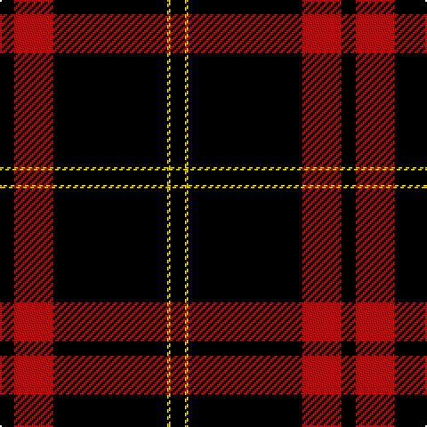

In pattern [KRKYK](/patterns/krkyk/).

This was sourced from weddslist.  It is a [5 stripes tartan](/stripes/stripes5/).

Original link http://www.weddslist.com/cgi-bin/tartans/pg.pl?source=sts

## Thread count
K/8 R22 K64 Y2 K/8

## Palette
Each colour and its ΔE from the base-6 reference it is a variant of.

| Colour | Shade | Base | ΔE (OKLab) |
|---|---|---|---|
| K | <code style="background-color:#000000;">#000000</code> `#000000` | K <code style="background-color:#000000;">#000000</code> | 0.00 |
| R | <code style="background-color:#C00000;">#C00000</code> `#C00000` | R <code style="background-color:#CC0000;">#CC0000</code> | 0.03 |
| Y | <code style="background-color:#F0C000;">#F0C000</code> `#F0C000` | Y <code style="background-color:#F2BF00;">#F2BF00</code> | 0.00 |

# Sample pattern

## Nearest tartans

The nearest existing variants by ΔTartan distance.

1. [Harvie](/setts/s5/k4r11k32y1k4x2~k101010-rdc0000-ye8c000/) — ΔT 1.36
1. [Perry, Pirrie](/setts/s5/k75r26w2k4y5x2~k000000-rc00000-we0e0e0-yf0c000/) — ΔT 1.44
1. [Harvie Family Tartan Tartan Number: 1177. Earliest known date: 1985 LT = Grey-Brown See products available Copyright © Blair Urquhart, Comrie, 2015](/setts/s5/k4r11k32y1k4x2~k101010-rc80000-ye8c000/) — ΔT 1.45
1. [Perry, dress](/setts/s5/k65r27w2k4y5x2~k000000-r800000-we0e0e0-yf0c000/) — ΔT 1.63
1. [Menzies, Black & Red](/setts/s8/k48r4k2r4k6r2k3r9x2~k000000-rc00000/) — ΔT 1.63
1. [Highland Brewing Company (USA)](/setts/s8/k42b2r3k5r16k8y2k3x2~b3c82af-k000000-rc8002c-ye0a126/) — ΔT 1.71
1. [Brockton](/setts/s8/k2w1k2r6k6r3k28w2x2~k101010-r880000-wffffff/) — ΔT 1.76
1. [Perry, Ancient](/setts/s5/k65r27w2k4y5x2~k000000-rc00000-we0e0e0-yf0c000/) — ΔT 1.77
1. [Lanoir](/setts/s6/k4r4k20r1k20w4x6~k101010-rc80000-we0e0e0/) — ΔT 1.81
1. [Union Fire Club Pipes & Drums (Corp.](/setts/s5/k30r10y1k8w3x4~k101010-rc80000-we0e0e0-ye8c000/) — ΔT 1.82

## Neighbour map

Every grey dot is one of 15726 variants placed by the first two principal components of the ΔTartan feature space (44% of its variance). Red is this tartan; blue dots are its nearest — click one to open its page.

<svg viewBox="0 0 640 380" role="img" style="max-width:100%;height:auto;border:1px solid #e0e0e0;border-radius:4px;display:block" xmlns="http://www.w3.org/2000/svg"><image href="/nn/cloud.v1.png" width="640" height="380"/><a href="/setts/s5/k4r11k32y1k4x2~k101010-rdc0000-ye8c000/"><circle cx="538.7" cy="192.0" r="4" fill="#3465a4"><title>Harvie</title></circle></a><a href="/setts/s5/k75r26w2k4y5x2~k000000-rc00000-we0e0e0-yf0c000/"><circle cx="460.5" cy="152.9" r="4" fill="#3465a4"><title>Perry, Pirrie</title></circle></a><a href="/setts/s5/k4r11k32y1k4x2~k101010-rc80000-ye8c000/"><circle cx="546.8" cy="195.8" r="4" fill="#3465a4"><title>Harvie Family Tartan Tartan Number: 1177. Earliest known date: 1985 LT = Grey-Brown See products available Copyright © Blair Urquhart, Comrie, 2015</title></circle></a><a href="/setts/s5/k65r27w2k4y5x2~k000000-r800000-we0e0e0-yf0c000/"><circle cx="433.9" cy="164.7" r="4" fill="#3465a4"><title>Perry, dress</title></circle></a><a href="/setts/s8/k48r4k2r4k6r2k3r9x2~k000000-rc00000/"><circle cx="542.8" cy="178.2" r="4" fill="#3465a4"><title>Menzies, Black &amp; Red</title></circle></a><a href="/setts/s8/k42b2r3k5r16k8y2k3x2~b3c82af-k000000-rc8002c-ye0a126/"><circle cx="445.9" cy="154.6" r="4" fill="#3465a4"><title>Highland Brewing Company (USA)</title></circle></a><a href="/setts/s8/k2w1k2r6k6r3k28w2x2~k101010-r880000-wffffff/"><circle cx="520.4" cy="161.7" r="4" fill="#3465a4"><title>Brockton</title></circle></a><a href="/setts/s5/k65r27w2k4y5x2~k000000-rc00000-we0e0e0-yf0c000/"><circle cx="425.6" cy="157.9" r="4" fill="#3465a4"><title>Perry, Ancient</title></circle></a><a href="/setts/s6/k4r4k20r1k20w4x6~k101010-rc80000-we0e0e0/"><circle cx="537.0" cy="217.1" r="4" fill="#3465a4"><title>Lanoir</title></circle></a><a href="/setts/s5/k30r10y1k8w3x4~k101010-rc80000-we0e0e0-ye8c000/"><circle cx="461.7" cy="175.9" r="4" fill="#3465a4"><title>Union Fire Club Pipes &amp; Drums (Corp.</title></circle></a><circle cx="526.6" cy="194.8" r="5" fill="#c00000"/></svg>

ID: /setts/s5/k4r11k32y1k4x2~k000000-rc00000-yf0c000/
