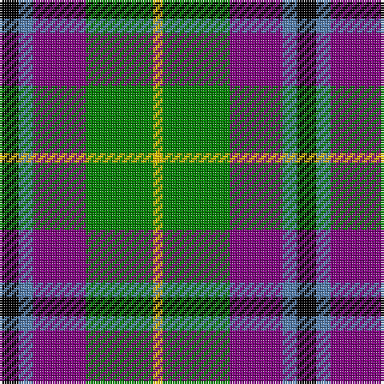

In pattern [KBBGY](/stripes/kbbgy/).

This was sourced from weddslist.  It is a [5 stripe tartan](/stripes/stripes5/).

Original link http://www.weddslist.com/cgi-bin/tartans/pg.pl?source=sts

## Thread count
K/8 B6 P22 G28 Y/4

## Palette
Each colour and the base-6 reference it is a variant of.

| Colour | Shade | Base |
|---|---|---|
| B | <code style="background-color:#5480B0;">#5480B0</code> `oklch(58.8% 0.089 251.5)` <small>#5480B0</small> | B <code style="background-color:#2A418A;">#2A418A</code> |
| G | <code style="background-color:#008000;">#008000</code> `oklch(52.0% 0.177 142.5)` <small>#008000</small> | G <code style="background-color:#006100;">#006100</code> |
| K | <code style="background-color:#000000;">#000000</code> `oklch(0.0% 0.000 0.0)` <small>#000000</small> | K <code style="background-color:#000000;">#000000</code> |
| P | <code style="background-color:#800080;">#800080</code> `oklch(42.1% 0.193 328.4)` <small>#800080</small> | B <code style="background-color:#2A418A;">#2A418A</code> |
| Y | <code style="background-color:#F0C000;">#F0C000</code> `oklch(82.7% 0.169 90.5)` <small>#F0C000</small> | Y <code style="background-color:#F2BF00;">#F2BF00</code> |

# Sample pattern

## Nearest tartans

The nearest existing variants by ΔTartan distance.

1. [Wellington, No 229](/setts/s5/k4t3p11g14w2~x2/) — ΔT 0.22
1. [Wilson's No 148](/setts/s5/k4t3g13p12w2~x2/) — ΔT 0.47
1. [Wilson's, No 176](/setts/s5/k4t3g12p13ly2~x2/) — ΔT 0.53
1. [Wilson's, No 183](/setts/s6/k2t1p6g6r1g1~x4/) — ΔT 0.74
1. [Davidson of Tulloch](/setts/s5/r2db10k5g12w2~x2/) — ΔT 0.84
1. [Davidson](/setts/s5/r1db6k3g6w1~x4/) — ΔT 0.98
1. [Lindley-Highfield (Name)](/setts/s7/dg7dp3w1g2dg1r2dp1~x8/) — ΔT 1.03
1. [MacTavish Dress](/setts/s6/r4t28k6lb12k12lo3~x2/) — ΔT 1.04
1. [Entre Rios Province (Provisional](/setts/s6/g36lb4g8k29r24w7~x2/) — ΔT 1.06
1. [Thompson's Fancy (Fashion)](/setts/s6/r1dy6db2lb4k4lb1~x6/) — ΔT 1.06

## Neighbour map

Every grey dot is one of 14299 variants placed by the first two principal components of the ΔTartan feature space (44% of its variance). Red is this tartan; blue dots are its nearest — click one to open its page.

<svg viewBox="0 0 640 380" role="img" style="max-width:100%;height:auto;border:1px solid #e0e0e0;border-radius:4px;display:block" xmlns="http://www.w3.org/2000/svg"><image href="/nn/cloud.v1.png" width="640" height="380"/><a href="/setts/s5/k4t3p11g14w2~x2/"><circle cx="145.9" cy="212.8" r="4" fill="#3465a4"><title>Wellington, No 229</title></circle></a><a href="/setts/s5/k4t3g13p12w2~x2/"><circle cx="132.5" cy="215.8" r="4" fill="#3465a4"><title>Wilson's No 148</title></circle></a><a href="/setts/s5/k4t3g12p13ly2~x2/"><circle cx="135.6" cy="215.8" r="4" fill="#3465a4"><title>Wilson's, No 176</title></circle></a><a href="/setts/s6/k2t1p6g6r1g1~x4/"><circle cx="161.5" cy="205.4" r="4" fill="#3465a4"><title>Wilson's, No 183</title></circle></a><a href="/setts/s5/r2db10k5g12w2~x2/"><circle cx="119.5" cy="224.9" r="4" fill="#3465a4"><title>Davidson of Tulloch</title></circle></a><a href="/setts/s5/r1db6k3g6w1~x4/"><circle cx="111.2" cy="229.6" r="4" fill="#3465a4"><title>Davidson</title></circle></a><a href="/setts/s7/dg7dp3w1g2dg1r2dp1~x8/"><circle cx="185.5" cy="194.0" r="4" fill="#3465a4"><title>Lindley-Highfield (Name)</title></circle></a><a href="/setts/s6/r4t28k6lb12k12lo3~x2/"><circle cx="168.3" cy="187.2" r="4" fill="#3465a4"><title>MacTavish Dress</title></circle></a><a href="/setts/s6/g36lb4g8k29r24w7~x2/"><circle cx="144.7" cy="193.6" r="4" fill="#3465a4"><title>Entre Rios Province (Provisional</title></circle></a><a href="/setts/s6/r1dy6db2lb4k4lb1~x6/"><circle cx="87.7" cy="218.9" r="4" fill="#3465a4"><title>Thompson's Fancy (Fashion)</title></circle></a><circle cx="147.9" cy="213.5" r="5" fill="#c00000"/></svg>

ID: /setts/s5/k4t3p11g14ly2~x2/
