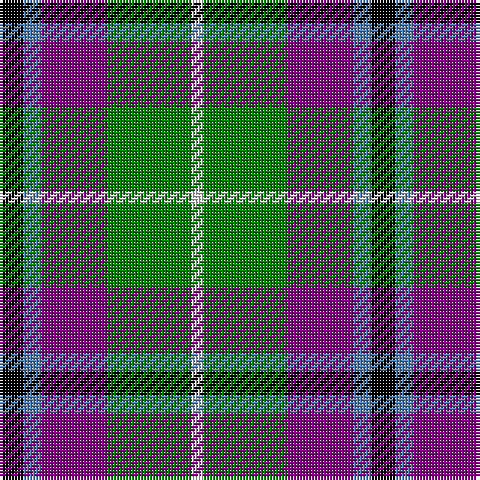

This page is one **sett** — a single exact thread-count. It belongs to the [tartan](/tartans/k4t3p11g14w2/)
(the same proportion at any scale), whose colour order is pattern [KBBGW](/stripes/kbbgw/).

Sourced from weddslist.  It is a [5 stripe tartan](/stripes/stripes5/).

Original link http://www.weddslist.com/cgi-bin/tartans/pg.pl?source=sts

## Thread count
K/8 B6 P22 G28 LN/4

## Palette

Palette: <strong>Tartan Register</strong> <small style="color:#888">(2 of 5 colours)</small>
<table><thead><tr><th>Colour</th><th>Threads</th><th>Shade</th><th>Base</th><th>OKLCh</th></tr></thead><tbody><tr><td>K/</td><td style="text-align:right;font-variant-numeric:tabular-nums">8</td><td><code style="background-color:#000000;">#000000</code> <small style="color:#888">#000000</small></td><td>K <code style="background-color:#000000;">#000000</code></td><td><small style="color:#888">oklch(0.0% 0.000 0.0)</small></td></tr><tr><td>B</td><td style="text-align:right;font-variant-numeric:tabular-nums">6</td><td><code style="background-color:#5480B0;">#5480B0</code> <small style="color:#888">#5480B0</small></td><td>B <code style="background-color:#2A418A;">#2A418A</code></td><td><small style="color:#888">oklch(58.8% 0.089 251.5)</small></td></tr><tr><td>P</td><td style="text-align:right;font-variant-numeric:tabular-nums">22</td><td><code style="background-color:#800080;">#800080</code> <small style="color:#888">#800080</small></td><td>B <code style="background-color:#2A418A;">#2A418A</code></td><td><small style="color:#888">oklch(42.1% 0.193 328.4)</small></td></tr><tr><td>G</td><td style="text-align:right;font-variant-numeric:tabular-nums">28</td><td><code style="background-color:#008000;">#008000</code> <small style="color:#888">#008000</small></td><td>G <code style="background-color:#006100;">#006100</code></td><td><small style="color:#888">oklch(52.0% 0.177 142.5)</small></td></tr><tr><td>LN/</td><td style="text-align:right;font-variant-numeric:tabular-nums">4</td><td><code style="background-color:#E0E0E0;">#E0E0E0</code> <small style="color:#888">#E0E0E0</small></td><td>W <code style="background-color:#F7F7F7;">#F7F7F7</code></td><td><small style="color:#888">oklch(90.7% 0.000 89.9)</small></td></tr></tbody></table>

# Sample pattern

## Nearest tartans

The nearest existing variants by ΔTartan distance, with this tartan at the top so the swatches line up against it.

ΔTartan

Tartan

Sett

—

<a href="/ttd/edit/#slug=k4t3p11g14w2~x2">Wellington, No 229</a> <a class="nn-out" href="/setts/s5/k4t3p11g14w2~x2/" title="open its dictionary page">↗</a>

0.21

<a href="/ttd/edit/#slug=k4t3p11g14ly2~x2">Wellington, No 122</a> <a class="nn-out" href="/setts/s5/k4t3p11g14ly2~x2/" title="open its dictionary page">↗</a>

0.35

<a href="/ttd/edit/#slug=k4t3g13p12w2~x2">Wilson's No 148</a> <a class="nn-out" href="/setts/s5/k4t3g13p12w2~x2/" title="open its dictionary page">↗</a>

0.48

<a href="/ttd/edit/#slug=k4t3g12p13ly2~x2">Wilson's, No 176</a> <a class="nn-out" href="/setts/s5/k4t3g12p13ly2~x2/" title="open its dictionary page">↗</a>

0.77

<a href="/ttd/edit/#slug=k2t1p6g6r1g1~x4">Wilson's, No 183</a> <a class="nn-out" href="/setts/s6/k2t1p6g6r1g1~x4/" title="open its dictionary page">↗</a>

0.83

<a href="/ttd/edit/#slug=r2db10k5g12w2~x2">Davidson of Tulloch</a> <a class="nn-out" href="/setts/s5/r2db10k5g12w2~x2/" title="open its dictionary page">↗</a>

0.93

<a href="/ttd/edit/#slug=r4t28k6lb12k12lo3~x2">MacTavish Dress</a> <a class="nn-out" href="/setts/s6/r4t28k6lb12k12lo3~x2/" title="open its dictionary page">↗</a>

0.98

<a href="/ttd/edit/#slug=r1db6k3g6w1~x4">Davidson</a> <a class="nn-out" href="/setts/s5/r1db6k3g6w1~x4/" title="open its dictionary page">↗</a>

1.01

<a href="/ttd/edit/#slug=r1dy6db2lb4k4lb1~x6">Thompson's Fancy (Fashion)</a> <a class="nn-out" href="/setts/s6/r1dy6db2lb4k4lb1~x6/" title="open its dictionary page">↗</a>

1.03

<a href="/ttd/edit/#slug=lr4g24db10r3db12lo4~x2">Inglis (Name)</a> <a class="nn-out" href="/setts/s6/lr4g24db10r3db12lo4~x2/" title="open its dictionary page">↗</a>

1.06

<a href="/ttd/edit/#slug=dg7dp3w1g2dg1r2dp1~x8">Lindley-Highfield (Name)</a> <a class="nn-out" href="/setts/s7/dg7dp3w1g2dg1r2dp1~x8/" title="open its dictionary page">↗</a>

## Neighbour map

Every grey dot is one of 14359 variants placed by the first two principal components of the ΔTartan feature space (44% of its variance). Red is this tartan; blue dots are its nearest — click one to open its page.

<svg viewBox="0 0 640 380" role="img" style="max-width:100%;height:auto;border:1px solid #e0e0e0;border-radius:4px;display:block" xmlns="http://www.w3.org/2000/svg"><image href="/nn/cloud.v1.png" width="640" height="380"/><a href="/setts/s5/k4t3p11g14ly2~x2/"><circle cx="147.5" cy="214.8" r="4" fill="#3465a4"><title>Wellington, No 122</title></circle></a><a href="/setts/s5/k4t3g13p12w2~x2/"><circle cx="132.1" cy="217.2" r="4" fill="#3465a4"><title>Wilson's No 148</title></circle></a><a href="/setts/s5/k4t3g12p13ly2~x2/"><circle cx="135.2" cy="217.1" r="4" fill="#3465a4"><title>Wilson's, No 176</title></circle></a><a href="/setts/s6/k2t1p6g6r1g1~x4/"><circle cx="161.0" cy="206.7" r="4" fill="#3465a4"><title>Wilson's, No 183</title></circle></a><a href="/setts/s5/r2db10k5g12w2~x2/"><circle cx="119.2" cy="226.2" r="4" fill="#3465a4"><title>Davidson of Tulloch</title></circle></a><a href="/setts/s6/r4t28k6lb12k12lo3~x2/"><circle cx="167.8" cy="188.3" r="4" fill="#3465a4"><title>MacTavish Dress</title></circle></a><a href="/setts/s5/r1db6k3g6w1~x4/"><circle cx="111.0" cy="231.1" r="4" fill="#3465a4"><title>Davidson</title></circle></a><a href="/setts/s6/r1dy6db2lb4k4lb1~x6/"><circle cx="87.4" cy="220.3" r="4" fill="#3465a4"><title>Thompson's Fancy (Fashion)</title></circle></a><a href="/setts/s6/lr4g24db10r3db12lo4~x2/"><circle cx="183.1" cy="210.0" r="4" fill="#3465a4"><title>Inglis (Name)</title></circle></a><a href="/setts/s7/dg7dp3w1g2dg1r2dp1~x8/"><circle cx="185.0" cy="195.1" r="4" fill="#3465a4"><title>Lindley-Highfield (Name)</title></circle></a><circle cx="145.5" cy="214.1" r="5" fill="#c00000"/></svg>

ID: /setts/s5/k4t3p11g14w2~x2/
