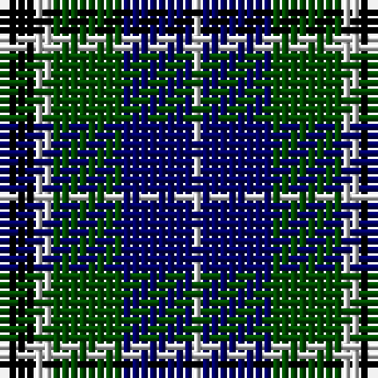

In pattern [KWGBW](/patterns/kwgbw/).

This was sourced from weddslist.  It is a [5 stripes tartan](/stripes/stripes5/).

Original link http://www.weddslist.com/cgi-bin/tartans/pg.pl?source=rb

## Thread count
K/4 N2 G8 DB8 N/1

## Palette
Each colour and its ΔE from the base-6 reference it is a variant of.

| Colour | Shade | Base | ΔE (OKLab) |
|---|---|---|---|
| DB | <code style="background-color:#000064;">#000064</code> `#000064` | B <code style="background-color:#2A418A;">#2A418A</code> | 0.18 |
| G | <code style="background-color:#004C00;">#004C00</code> `#004C00` | G <code style="background-color:#006100;">#006100</code> | 0.07 |
| K | <code style="background-color:#000000;">#000000</code> `#000000` | K <code style="background-color:#000000;">#000000</code> | 0.00 |
| N | <code style="background-color:#D0D0D0;">#D0D0D0</code> `#D0D0D0` | W <code style="background-color:#F7F7F7;">#F7F7F7</code> | 0.12 |

# Sample pattern

## Nearest tartans

The nearest existing variants by ΔTartan distance.

1. [Douglas](/setts/s5/k2w2g8b8w1~b000064-g004c00-k000000-wd0d0d0/) — ΔT 0.63
1. [Campbell, The White Stripe](/setts/s6/b2k2b12k11g12w2~b304080-g008000-k000000-we0e0e0~x2/) — ΔT 0.82
1. [MacNeil 1](/setts/s6/w1b9k9g9k2w1~b304080-g008000-k000000-we0e0e0~x4/) — ΔT 0.87
1. [Unnamed, No 26](/setts/s6/w4b4g22k20b20w3~b304080-g008000-k000000-we0e0e0/) — ΔT 0.89
1. [MacKirdy](/setts/s5/k2g12k11b12w1~b304080-g008000-k000000-we0e0e0~x2/) — ΔT 0.89
1. [Herd/Hurd](/setts/s6/b3g12k13w2b13w3~b2c2c80-g006818-k101010-wfcfcfc~x2/) — ΔT 0.91
1. [Murray](/setts/s6/b2k2b12k8g11r2~b304080-g008000-k000000-rc00000~x2/) — ΔT 0.92
1. [Fletcher #2](/setts/s7/b10k3b10k14r2g14k4~b1474b4-g007800-k000000-rc80000~x2/) — ΔT 0.92
1. [Fletcher](/setts/s7/b6k1b6k8r1g8k2~b304080-g008000-k000000-rc00000~x2/) — ΔT 0.93
1. [Morrison](/setts/s6/k3g14k14g2b14r3~b304080-g008000-k000000-rc00000~x2/) — ΔT 0.94

## Neighbour map

Every grey dot is one of 15726 variants placed by the first two principal components of the ΔTartan feature space (44% of its variance). Red is this tartan; blue dots are its nearest — click one to open its page.

<svg viewBox="0 0 640 380" role="img" style="max-width:100%;height:auto;border:1px solid #e0e0e0;border-radius:4px;display:block" xmlns="http://www.w3.org/2000/svg"><image href="/nn/cloud.v1.png" width="640" height="380"/><a href="/setts/s5/k2w2g8b8w1~b000064-g004c00-k000000-wd0d0d0/"><circle cx="163.9" cy="233.7" r="4" fill="#3465a4"><title>Douglas</title></circle></a><a href="/setts/s6/b2k2b12k11g12w2~b304080-g008000-k000000-we0e0e0~x2/"><circle cx="125.5" cy="236.5" r="4" fill="#3465a4"><title>Campbell, The White Stripe</title></circle></a><a href="/setts/s6/w1b9k9g9k2w1~b304080-g008000-k000000-we0e0e0~x4/"><circle cx="142.4" cy="217.5" r="4" fill="#3465a4"><title>MacNeil 1</title></circle></a><a href="/setts/s6/w4b4g22k20b20w3~b304080-g008000-k000000-we0e0e0/"><circle cx="114.0" cy="225.2" r="4" fill="#3465a4"><title>Unnamed, No 26</title></circle></a><a href="/setts/s5/k2g12k11b12w1~b304080-g008000-k000000-we0e0e0~x2/"><circle cx="157.2" cy="227.7" r="4" fill="#3465a4"><title>MacKirdy</title></circle></a><a href="/setts/s6/b3g12k13w2b13w3~b2c2c80-g006818-k101010-wfcfcfc~x2/"><circle cx="122.5" cy="236.2" r="4" fill="#3465a4"><title>Herd/Hurd</title></circle></a><a href="/setts/s6/b2k2b12k8g11r2~b304080-g008000-k000000-rc00000~x2/"><circle cx="148.6" cy="240.0" r="4" fill="#3465a4"><title>Murray</title></circle></a><a href="/setts/s7/b10k3b10k14r2g14k4~b1474b4-g007800-k000000-rc80000~x2/"><circle cx="127.6" cy="238.9" r="4" fill="#3465a4"><title>Fletcher #2</title></circle></a><a href="/setts/s7/b6k1b6k8r1g8k2~b304080-g008000-k000000-rc00000~x2/"><circle cx="154.4" cy="232.0" r="4" fill="#3465a4"><title>Fletcher</title></circle></a><a href="/setts/s6/k3g14k14g2b14r3~b304080-g008000-k000000-rc00000~x2/"><circle cx="133.2" cy="235.5" r="4" fill="#3465a4"><title>Morrison</title></circle></a><circle cx="131.6" cy="243.1" r="5" fill="#c00000"/></svg>

ID: /setts/s5/k4w2g8b8w1~b000064-g004c00-k000000-wd0d0d0/
