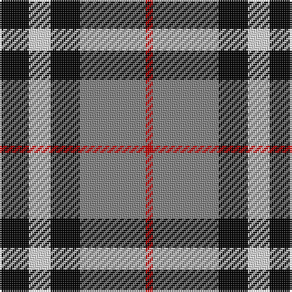

In pattern [KWKGR](/patterns/kwkgr/).

This was sourced from weddslist.  It is a [5 stripes tartan](/stripes/stripes5/).

Original link http://www.weddslist.com/cgi-bin/tartans/pg.pl?source=sts

## Thread count
K/16 LN12 K16 N36 R/4

## Palette
Each colour and its ΔE from the base-6 reference it is a variant of.

| Colour | Shade | Base | ΔE (OKLab) |
|---|---|---|---|
| K | <code style="background-color:#000000;">#000000</code> `#000000` | K <code style="background-color:#000000;">#000000</code> | 0.00 |
| LN | <code style="background-color:#E0E0E0;">#E0E0E0</code> `#E0E0E0` | W <code style="background-color:#F7F7F7;">#F7F7F7</code> | 0.07 |
| N | <code style="background-color:#808080;">#808080</code> `#808080` | G <code style="background-color:#006100;">#006100</code> | 0.23 |
| R | <code style="background-color:#C00000;">#C00000</code> `#C00000` | R <code style="background-color:#CC0000;">#CC0000</code> | 0.03 |

# Sample pattern

## Nearest tartans

The nearest existing variants by ΔTartan distance.

1. [Oban Grey](/setts/s5/k4w3k4g9r1x4~g808080-k101010-rdc0000-we0e0e0/) — ΔT 0.76
1. [Oban Grey District Tartan Tartan Number: 1237. Earliest known date: pre 2003 Not an official district but a name chosen by the weavers. See products available Copyright © Blair Urquhart, Comrie, 2015](/setts/s5/k4w3k4r9ra1x4~k101010-r888888-rac80000-we0e0e0/) — ΔT 0.80
1. [Greystone (Burberry Grey)](/setts/s5/k3w3k3b10r1x6~b646464-k000000-r8c0000-wc8c8c8/) — ΔT 0.89
1. [Kilgour](/setts/s6/b14g21b4r21b14y2x2~b000050-g008000-rc00000-yf0c000/) — ΔT 0.94
1. [Loganair, Uniform Skirt](/setts/s4/r5g32k31w5x2~g808080-k000000-rc00000-we0e0e0/) — ΔT 0.96
1. [Thom(p)son, Grey](/setts/s6/r2g20k5w10k10r2x2~g808080-k000000-rc00000-we0e0e0/) — ΔT 0.96
1. [Meg, Merrilees](/setts/s6/w23b6w6r5k35r10x2~b304080-k000000-rc00000-we0e0e0/) — ΔT 1.04
1. [Wcwm 759-3](/setts/s6/w5r34k24r4ra24r4x2~k000000-r8c8c8c-ra8c0000-wc8c8c8/) — ΔT 1.04
1. [Thom(p)son camel](/setts/s6/r4ra30k6w13k13w3x2~k000000-rc00000-ra806050-we0e0e0/) — ΔT 1.06
1. [Loganair](/setts/s4/r5ra32k31w5x2~k101010-r880000-ra888888-we0e0e0/) — ΔT 1.09

## Neighbour map

Every grey dot is one of 15726 variants placed by the first two principal components of the ΔTartan feature space (44% of its variance). Red is this tartan; blue dots are its nearest — click one to open its page.

<svg viewBox="0 0 640 380" role="img" style="max-width:100%;height:auto;border:1px solid #e0e0e0;border-radius:4px;display:block" xmlns="http://www.w3.org/2000/svg"><image href="/nn/cloud.v1.png" width="640" height="380"/><a href="/setts/s5/k4w3k4g9r1x4~g808080-k101010-rdc0000-we0e0e0/"><circle cx="185.1" cy="227.2" r="4" fill="#3465a4"><title>Oban Grey</title></circle></a><a href="/setts/s5/k4w3k4r9ra1x4~k101010-r888888-rac80000-we0e0e0/"><circle cx="183.3" cy="226.2" r="4" fill="#3465a4"><title>Oban Grey District Tartan Tartan Number: 1237. Earliest known date: pre 2003 Not an official district but a name chosen by the weavers. See products available Copyright © Blair Urquhart, Comrie, 2015</title></circle></a><a href="/setts/s5/k3w3k3b10r1x6~b646464-k000000-r8c0000-wc8c8c8/"><circle cx="228.3" cy="213.3" r="4" fill="#3465a4"><title>Greystone (Burberry Grey)</title></circle></a><a href="/setts/s6/b14g21b4r21b14y2x2~b000050-g008000-rc00000-yf0c000/"><circle cx="182.9" cy="226.1" r="4" fill="#3465a4"><title>Kilgour</title></circle></a><a href="/setts/s4/r5g32k31w5x2~g808080-k000000-rc00000-we0e0e0/"><circle cx="194.5" cy="242.5" r="4" fill="#3465a4"><title>Loganair, Uniform Skirt</title></circle></a><a href="/setts/s6/r2g20k5w10k10r2x2~g808080-k000000-rc00000-we0e0e0/"><circle cx="162.2" cy="194.8" r="4" fill="#3465a4"><title>Thom(p)son, Grey</title></circle></a><a href="/setts/s6/w23b6w6r5k35r10x2~b304080-k000000-rc00000-we0e0e0/"><circle cx="156.2" cy="204.5" r="4" fill="#3465a4"><title>Meg, Merrilees</title></circle></a><a href="/setts/s6/w5r34k24r4ra24r4x2~k000000-r8c8c8c-ra8c0000-wc8c8c8/"><circle cx="188.8" cy="206.0" r="4" fill="#3465a4"><title>Wcwm 759-3</title></circle></a><a href="/setts/s6/r4ra30k6w13k13w3x2~k000000-rc00000-ra806050-we0e0e0/"><circle cx="182.6" cy="192.1" r="4" fill="#3465a4"><title>Thom(p)son camel</title></circle></a><a href="/setts/s4/r5ra32k31w5x2~k101010-r880000-ra888888-we0e0e0/"><circle cx="207.8" cy="244.6" r="4" fill="#3465a4"><title>Loganair</title></circle></a><circle cx="173.1" cy="225.9" r="5" fill="#c00000"/></svg>

ID: /setts/s5/k4w3k4g9r1x4~g808080-k000000-rc00000-we0e0e0/
