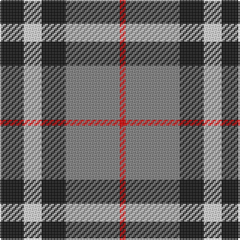

This page is one **sett** — a single exact thread-count. It belongs to the [tartan](/tartans/k4w3k4y9r1/)
(the same proportion at any scale), whose colour order is pattern [KWKGR](/stripes/kwkgr/).

Sourced from register-of-tartans.  It is a [5 stripe tartan](/stripes/stripes5/).

Original link https://www.tartanregister.gov.uk/tartanDetails.aspx?ref=3212

## Also known as

This cloth is also recorded under:

- Oban, Grey

2 attestations — the source records this cloth was collapsed from (oldest owns this page)

<ul>
<li>undated — Oban Grey (register-of-tartans, <a href="https://www.tartanregister.gov.uk/tartanDetails.aspx?ref=3212">record</a>)</li>
<li>undated — Oban, Grey (weddslist, <a href="http://www.weddslist.com/cgi-bin/tartans/pg.pl?source=sts">record</a>)</li>
</ul>

## Register references

External register numbers recorded for this tartan.

- Scottish Register of Tartans: [3212](https://www.tartanregister.gov.uk/tartanDetails.aspx?ref=3212)
- Scottish Tartans World Register: 1237

## Thread count
K/16 LN12 K16 N36 R/4

## Palette

Palette: <strong>Tartan Register</strong>
<table><thead><tr><th>Colour</th><th>Threads</th><th>Shade</th><th>Base</th><th>OKLCh</th></tr></thead><tbody><tr><td>K/</td><td style="text-align:right;font-variant-numeric:tabular-nums">16</td><td><code style="background-color:#101010;">#101010</code> <small style="color:#888">#101010</small></td><td>K <code style="background-color:#000000;">#000000</code></td><td><small style="color:#888">oklch(17.3% 0.000 89.9)</small></td></tr><tr><td>LN</td><td style="text-align:right;font-variant-numeric:tabular-nums">12</td><td><code style="background-color:#E0E0E0;">#E0E0E0</code> <small style="color:#888">#E0E0E0</small></td><td>W <code style="background-color:#F7F7F7;">#F7F7F7</code></td><td><small style="color:#888">oklch(90.7% 0.000 89.9)</small></td></tr><tr><td>K</td><td style="text-align:right;font-variant-numeric:tabular-nums">16</td><td><code style="background-color:#101010;">#101010</code> <small style="color:#888">#101010</small></td><td>K <code style="background-color:#000000;">#000000</code></td><td><small style="color:#888">oklch(17.3% 0.000 89.9)</small></td></tr><tr><td>N</td><td style="text-align:right;font-variant-numeric:tabular-nums">36</td><td><code style="background-color:#808080;">#808080</code> <small style="color:#888">#808080</small></td><td>G <code style="background-color:#006100;">#006100</code></td><td><small style="color:#888">oklch(60.0% 0.000 89.9)</small></td></tr><tr><td>R/</td><td style="text-align:right;font-variant-numeric:tabular-nums">4</td><td><code style="background-color:#DC0000;">#DC0000</code> <small style="color:#888">#DC0000</small></td><td>R <code style="background-color:#CC0000;">#CC0000</code></td><td><small style="color:#888">oklch(56.2% 0.230 29.2)</small></td></tr></tbody></table>

# Sample pattern

## Nearest tartans

The nearest existing variants by ΔTartan distance, with this tartan at the top so the swatches line up against it.

ΔTartan

Tartan

Sett

—

<a href="/ttd/edit/#slug=k4w3k4y9r1~x4">Oban Grey</a> <a class="nn-out" href="/setts/s5/k4w3k4y9r1~x4/" title="open its dictionary page">↗</a>

0.09

<a href="/ttd/edit/#slug=k4w3k4o9r1~x4">Oban Grey District Tartan Tartan Number: 1237. Earliest known date: pre 2003 Not an official district but a name chosen by the weavers. See products available Copyright © Blair Urquhart, Comrie, 2015</a> <a class="nn-out" href="/setts/s5/k4w3k4o9r1~x4/" title="open its dictionary page">↗</a>

0.90

<a href="/ttd/edit/#slug=r5o32k31w5">Loganair Uniform Skirt Corporate Tartan Tartan Number: 1629. Earliest known date: c.1985 Half actual count for display. Used until 1988 See products available Copyright © Blair Urquhart, Comrie, 2015</a> <a class="nn-out" href="/setts/s4/r5o32k31w5/" title="open its dictionary page">↗</a>

0.93

<a href="/ttd/edit/#slug=r5o32k31w5~x2">Loganair</a> <a class="nn-out" href="/setts/s4/r5o32k31w5~x2/" title="open its dictionary page">↗</a>

0.94

<a href="/ttd/edit/#slug=r2y20k5w10k10r2~x2">Thom(p)son, Grey</a> <a class="nn-out" href="/setts/s6/r2y20k5w10k10r2~x2/" title="open its dictionary page">↗</a>

0.95

<a href="/ttd/edit/#slug=r2o20k5w10k10r2~x2">Thompson Grey Family Tartan Tartan Number: 1611. Earliest known date: pre 2003 Designed for Lord Thomson of Fleet in 1958 based on a sample in the Moy Hall collection dating from the mid 19th century. The tartan is also suitable for MacTavishs and Thompsons, who claim descent from the Clan MacIntosh. See products available Copyright © Blair Urquhart, Comrie, 2015</a> <a class="nn-out" href="/setts/s6/r2o20k5w10k10r2~x2/" title="open its dictionary page">↗</a>

0.97

<a href="/ttd/edit/#slug=k3w3k3y10r1~x6">Burberry Hunting</a> <a class="nn-out" href="/setts/s5/k3w3k3y10r1~x6/" title="open its dictionary page">↗</a>

0.97

<a href="/ttd/edit/#slug=db14g21db4r21db14ly2~x2">Kilgour</a> <a class="nn-out" href="/setts/s6/db14g21db4r21db14ly2~x2/" title="open its dictionary page">↗</a>

0.97

<a href="/ttd/edit/#slug=db3dg6ly1r3~x10">Delroeux, John Michael (Personal)</a> <a class="nn-out" href="/setts/s4/db3dg6ly1r3~x10/" title="open its dictionary page">↗</a>

1.03

<a href="/ttd/edit/#slug=ly5g22dp15dp11dp5g2~x2">Scottish Ballet</a> <a class="nn-out" href="/setts/s6/ly5g22dp15dp11dp5g2~x2/" title="open its dictionary page">↗</a>

1.05

<a href="/ttd/edit/#slug=r4o30k6w13k13w3~x2">Thom(p)son camel</a> <a class="nn-out" href="/setts/s6/r4o30k6w13k13w3~x2/" title="open its dictionary page">↗</a>

## Neighbour map

Every grey dot is one of 14299 variants placed by the first two principal components of the ΔTartan feature space (44% of its variance). Red is this tartan; blue dots are its nearest — click one to open its page.

<svg viewBox="0 0 640 380" role="img" style="max-width:100%;height:auto;border:1px solid #e0e0e0;border-radius:4px;display:block" xmlns="http://www.w3.org/2000/svg"><image href="/nn/cloud.v1.png" width="640" height="380"/><a href="/setts/s5/k4w3k4o9r1~x4/"><circle cx="185.8" cy="222.5" r="4" fill="#3465a4"><title>Oban Grey District Tartan Tartan Number: 1237. Earliest known date: pre 2003 Not an official district but a name chosen by the weavers. See products available Copyright © Blair Urquhart, Comrie, 2015</title></circle></a><a href="/setts/s4/r5o32k31w5/"><circle cx="209.3" cy="239.4" r="4" fill="#3465a4"><title>Loganair Uniform Skirt Corporate Tartan Tartan Number: 1629. Earliest known date: c.1985 Half actual count for display. Used until 1988 See products available Copyright © Blair Urquhart, Comrie, 2015</title></circle></a><a href="/setts/s4/r5o32k31w5~x2/"><circle cx="210.3" cy="241.0" r="4" fill="#3465a4"><title>Loganair</title></circle></a><a href="/setts/s6/r2y20k5w10k10r2~x2/"><circle cx="164.9" cy="190.5" r="4" fill="#3465a4"><title>Thom(p)son, Grey</title></circle></a><a href="/setts/s6/r2o20k5w10k10r2~x2/"><circle cx="174.6" cy="192.3" r="4" fill="#3465a4"><title>Thompson Grey Family Tartan Tartan Number: 1611. Earliest known date: pre 2003 Designed for Lord Thomson of Fleet in 1958 based on a sample in the Moy Hall collection dating from the mid 19th century. The tartan is also suitable for MacTavishs and Thompsons, who claim descent from the Clan MacIntosh. See products available Copyright © Blair Urquhart, Comrie, 2015</title></circle></a><a href="/setts/s5/k3w3k3y10r1~x6/"><circle cx="232.2" cy="210.5" r="4" fill="#3465a4"><title>Burberry Hunting</title></circle></a><a href="/setts/s6/db14g21db4r21db14ly2~x2/"><circle cx="185.6" cy="224.4" r="4" fill="#3465a4"><title>Kilgour</title></circle></a><a href="/setts/s4/db3dg6ly1r3~x10/"><circle cx="171.0" cy="256.6" r="4" fill="#3465a4"><title>Delroeux, John Michael (Personal)</title></circle></a><a href="/setts/s6/ly5g22dp15dp11dp5g2~x2/"><circle cx="194.9" cy="212.8" r="4" fill="#3465a4"><title>Scottish Ballet</title></circle></a><a href="/setts/s6/r4o30k6w13k13w3~x2/"><circle cx="185.0" cy="187.3" r="4" fill="#3465a4"><title>Thom(p)son camel</title></circle></a><circle cx="187.5" cy="223.6" r="5" fill="#c00000"/></svg>

ID: /setts/s5/k4w3k4y9r1~x4/
