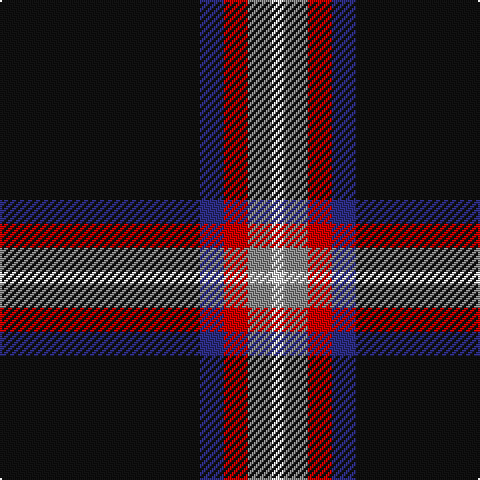

In pattern [KBRRW](/patterns/kbrrw/).

This was sourced from tartans-authority.  It is a [5 stripes tartan](/stripes/stripes5/).

Original link http://www.tartansauthority.com/tartan-ferret/display/10288/

## Thread count
K/100 DB12 R12 N12 LN/6

## Palette
Each colour and its ΔE from the base-6 reference it is a variant of.

| Colour | Shade | Base | ΔE (OKLab) |
|---|---|---|---|
| DB | <code style="background-color:#2C2C80;">#2C2C80</code> `#2C2C80` | B <code style="background-color:#2A418A;">#2A418A</code> | 0.06 |
| K | <code style="background-color:#101010;">#101010</code> `#101010` | K <code style="background-color:#000000;">#000000</code> | 0.17 |
| LN | <code style="background-color:#E0E0E0;">#E0E0E0</code> `#E0E0E0` | W <code style="background-color:#F7F7F7;">#F7F7F7</code> | 0.07 |
| N | <code style="background-color:#888888;">#888888</code> `#888888` | R <code style="background-color:#CC0000;">#CC0000</code> | 0.24 |
| R | <code style="background-color:#C80000;">#C80000</code> `#C80000` | R <code style="background-color:#CC0000;">#CC0000</code> | 0.01 |

# Sample pattern

## Nearest tartans

The nearest existing variants by ΔTartan distance.

1. [Fily, Sylvain Roger](/setts/s5/r2g2k20w1b1~b0000cd-g008b00-k101010-rff0000-wffffff~x6/) — ΔT 1.18
1. [Rogues (United States), The](/setts/s4/r3b12k50y3~b506987-k101010-rff2400-yffc125~x2/) — ΔT 1.19
1. [Fily (Personal)](/setts/s5/r2g2k20w1b1~b2c2c80-g006818-k101010-rc80000-we0e0e0~x6/) — ΔT 1.20
1. [Rogues, The (Corporate)](/setts/s4/r3b12k50y3~b5c8ca8-k101010-rc80000-yfccc00~x2/) — ΔT 1.24
1. [C-Tec N.I. Ltd](/setts/s4/k62b15w6y4~b000080-k1c1714-wf8f8f8-yfccc00~x2/) — ΔT 1.26
1. [MacShimsi](/setts/s5/r11ra5g5k40y3~g006818-k101010-rb43448-ra901c38-ye8c000~x2/) — ΔT 1.33
1. [Friends of Nordegg](/setts/s6/k50g6b6r6ba6w3~b0000cd-ba666666-g008b00-k101010-rff0000-wffffff~x2/) — ΔT 1.34
1. [Harley Davidson (Corporate)](/setts/s6/r4b6k4ra8k49r2~b5c5c5c-k101010-r888888-rab84c00/) — ΔT 1.37
1. [Perry (Calgary), Alex (Personal)](/setts/s4/k62b24y5w3~b3f4441-k120a01-wf7f1e8-yef8f06~x2/) — ΔT 1.47
1. [MacShimsi Personal Tartan Tartan Number: 7318. Earliest known date: 2007 Designed for the MacShimsi Clan in Dundee See products available Copyright © Blair Urquhart, Comrie, 2015](/setts/s5/r11b5g5k40y3~b601830-g285828-k101010-r882c4c-ydcd00c~x2/) — ΔT 1.47

## Neighbour map

Every grey dot is one of 15726 variants placed by the first two principal components of the ΔTartan feature space (44% of its variance). Red is this tartan; blue dots are its nearest — click one to open its page.

<svg viewBox="0 0 640 380" role="img" style="max-width:100%;height:auto;border:1px solid #e0e0e0;border-radius:4px;display:block" xmlns="http://www.w3.org/2000/svg"><image href="/nn/cloud.v1.png" width="640" height="380"/><a href="/setts/s5/r2g2k20w1b1~b0000cd-g008b00-k101010-rff0000-wffffff~x6/"><circle cx="474.6" cy="155.4" r="4" fill="#3465a4"><title>Fily, Sylvain Roger</title></circle></a><a href="/setts/s4/r3b12k50y3~b506987-k101010-rff2400-yffc125~x2/"><circle cx="464.0" cy="205.1" r="4" fill="#3465a4"><title>Rogues (United States), The</title></circle></a><a href="/setts/s5/r2g2k20w1b1~b2c2c80-g006818-k101010-rc80000-we0e0e0~x6/"><circle cx="496.6" cy="164.4" r="4" fill="#3465a4"><title>Fily (Personal)</title></circle></a><a href="/setts/s4/r3b12k50y3~b5c8ca8-k101010-rc80000-yfccc00~x2/"><circle cx="454.1" cy="201.7" r="4" fill="#3465a4"><title>Rogues, The (Corporate)</title></circle></a><a href="/setts/s4/k62b15w6y4~b000080-k1c1714-wf8f8f8-yfccc00~x2/"><circle cx="422.2" cy="204.8" r="4" fill="#3465a4"><title>C-Tec N.I. Ltd</title></circle></a><a href="/setts/s5/r11ra5g5k40y3~g006818-k101010-rb43448-ra901c38-ye8c000~x2/"><circle cx="348.0" cy="181.6" r="4" fill="#3465a4"><title>MacShimsi</title></circle></a><a href="/setts/s6/k50g6b6r6ba6w3~b0000cd-ba666666-g008b00-k101010-rff0000-wffffff~x2/"><circle cx="337.7" cy="134.0" r="4" fill="#3465a4"><title>Friends of Nordegg</title></circle></a><a href="/setts/s6/r4b6k4ra8k49r2~b5c5c5c-k101010-r888888-rab84c00/"><circle cx="488.0" cy="166.8" r="4" fill="#3465a4"><title>Harley Davidson (Corporate)</title></circle></a><a href="/setts/s4/k62b24y5w3~b3f4441-k120a01-wf7f1e8-yef8f06~x2/"><circle cx="419.8" cy="206.3" r="4" fill="#3465a4"><title>Perry (Calgary), Alex (Personal)</title></circle></a><a href="/setts/s5/r11b5g5k40y3~b601830-g285828-k101010-r882c4c-ydcd00c~x2/"><circle cx="364.6" cy="191.1" r="4" fill="#3465a4"><title>MacShimsi Personal Tartan Tartan Number: 7318. Earliest known date: 2007 Designed for the MacShimsi Clan in Dundee See products available Copyright © Blair Urquhart, Comrie, 2015</title></circle></a><circle cx="416.8" cy="168.1" r="5" fill="#c00000"/></svg>

ID: /setts/s5/k50b6r6ra6w3~b2c2c80-k101010-rc80000-ra888888-we0e0e0~x2/
