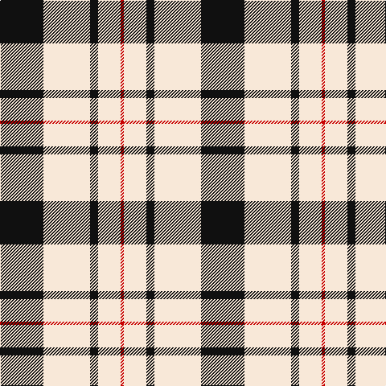

In pattern [KWKWR](/patterns/kwkwr/).

This was sourced from register-of-tartans.  It is a [5 stripes tartan](/stripes/stripes5/).

Original link https://www.tartanregister.gov.uk/tartanDetails.aspx?ref=2901

## Attestations

This cloth appears in 2 source records; the oldest owns this page.

- 01/06/2007 — McPartlin (Personal) (register-of-tartans, [record](https://www.tartanregister.gov.uk/tartanDetails.aspx?ref=2901))
- June 2007 — McPartlin (Personal) (tartans-authority, [record](http://www.tartansauthority.com/tartan-ferret/display/7244/))

## Thread count
K/54 LY58 K10 LY28 R/4

## Palette
Each colour and its ΔE from the base-6 reference it is a variant of.

| Colour | Shade | Base | ΔE (OKLab) |
|---|---|---|---|
| K | <code style="background-color:#101010;">#101010</code> `#101010` | K <code style="background-color:#000000;">#000000</code> | 0.17 |
| LY | <code style="background-color:#F8E8D8;">#F8E8D8</code> `#F8E8D8` | W <code style="background-color:#F7F7F7;">#F7F7F7</code> | 0.05 |
| R | <code style="background-color:#C80000;">#C80000</code> `#C80000` | R <code style="background-color:#CC0000;">#CC0000</code> | 0.01 |

# Sample pattern

## Nearest tartans

The nearest existing variants by ΔTartan distance.

1. [MacLeod Black & White Clan Tartan Tartan Number: 1828. Earliest known date: 1906 Same sett as MacLeod Black and Red 1591. Similar to Erskine (1185) and very close ro Campbell of Armadie (3481). See products available Copyright © Blair Urquhart, Comrie, 2015](/setts/s5/w16k2w16k24w2-k101010-we0e0e0/) — ΔT 1.02
1. [MacPherson of Cluny (Black and White)](/setts/s7/w10r6w70k56w8k22w4-k101010-rc80000-wfcfcfc/) — ΔT 1.24
1. [MacLeod Black & White](/setts/s5/w28k4w28k38w4-k101010-wfcfcfc/) — ΔT 1.26
1. [MacPherson of Cluny Clan Tartan Tartan Number: 1830. Earliest known date: 1948 Also known as MacPherson Dress often woven with purple in place of red See products available Copyright © Blair Urquhart, Comrie, 2015](/setts/s7/w10r6w70k56w8k22w4-k101010-rc80000-we0e0e0/) — ΔT 1.29
1. [MacLeod, Black & White](/setts/s5/w16k2w16k24w2-k000000-we0e0e0/) — ΔT 1.30
1. [Gangs of New York Fashion Check Tartan Tartan Number: 8248. Earliest known date: 8th July 2010 The period was the 1860s, a rather attractive time for men, all frock coats and top hats. Narrow-leg trousers and checks were fashionable. I accentuated Daniel's height and slenderness by extending his top hat, making his trousers thinner and his shoes longer. The other members of his gang were dressed along the same lines but not so finely: no one had the same presence as Bill the Butcher. See products available Copyright © Blair Urquhart, Comrie, 2015](/setts/s6/w10k40w4r10w40r4-k101010-rc80000-wf8e8d8/) — ΔT 1.32
1. [Blackberry (Fashion)](/setts/s7/r16y12k22y12k22y60r6-k101010-ra80000-yc8bc9c/) — ΔT 1.35
1. [Forbes Dress (Clans Originaux)](/setts/s7/w12b6w40k4w6k50w6-b1474b4-k101010-wfcfcfc/) — ΔT 1.36
1. [Macleod, Winnifred (Personal)](/setts/s5/k46y6k46w72r8-k101010-rc80000-we0e0e0-ye8c000/) — ΔT 1.38
1. [Macleod, Winnifred Mary, Dress](/setts/s5/k46y6k46w72r8-k101010-rc80028-we0e0e0-ye8c000/) — ΔT 1.38

## Neighbour map

Every grey dot is one of 15726 variants placed by the first two principal components of the ΔTartan feature space (44% of its variance). Red is this tartan; blue dots are its nearest — click one to open its page.

<svg viewBox="0 0 640 380" role="img" style="max-width:100%;height:auto;border:1px solid #e0e0e0;border-radius:4px;display:block" xmlns="http://www.w3.org/2000/svg"><image href="/nn/cloud.v1.png" width="640" height="380"/><a href="/setts/s5/w16k2w16k24w2-k101010-we0e0e0/"><circle cx="322.8" cy="230.5" r="4" fill="#3465a4"><title>MacLeod Black &amp; White Clan Tartan Tartan Number: 1828. Earliest known date: 1906 Same sett as MacLeod Black and Red 1591. Similar to Erskine (1185) and very close ro Campbell of Armadie (3481). See products available Copyright © Blair Urquhart, Comrie, 2015</title></circle></a><a href="/setts/s7/w10r6w70k56w8k22w4-k101010-rc80000-wfcfcfc/"><circle cx="301.1" cy="161.0" r="4" fill="#3465a4"><title>MacPherson of Cluny (Black and White)</title></circle></a><a href="/setts/s5/w28k4w28k38w4-k101010-wfcfcfc/"><circle cx="314.5" cy="238.3" r="4" fill="#3465a4"><title>MacLeod Black &amp; White</title></circle></a><a href="/setts/s7/w10r6w70k56w8k22w4-k101010-rc80000-we0e0e0/"><circle cx="305.9" cy="164.7" r="4" fill="#3465a4"><title>MacPherson of Cluny Clan Tartan Tartan Number: 1830. Earliest known date: 1948 Also known as MacPherson Dress often woven with purple in place of red See products available Copyright © Blair Urquhart, Comrie, 2015</title></circle></a><a href="/setts/s5/w16k2w16k24w2-k000000-we0e0e0/"><circle cx="320.8" cy="233.0" r="4" fill="#3465a4"><title>MacLeod, Black &amp; White</title></circle></a><a href="/setts/s6/w10k40w4r10w40r4-k101010-rc80000-wf8e8d8/"><circle cx="250.9" cy="191.6" r="4" fill="#3465a4"><title>Gangs of New York Fashion Check Tartan Tartan Number: 8248. Earliest known date: 8th July 2010 The period was the 1860s, a rather attractive time for men, all frock coats and top hats. Narrow-leg trousers and checks were fashionable. I accentuated Daniel's height and slenderness by extending his top hat, making his trousers thinner and his shoes longer. The other members of his gang were dressed along the same lines but not so finely: no one had the same presence as Bill the Butcher. See products available Copyright © Blair Urquhart, Comrie, 2015</title></circle></a><a href="/setts/s7/r16y12k22y12k22y60r6-k101010-ra80000-yc8bc9c/"><circle cx="277.8" cy="201.2" r="4" fill="#3465a4"><title>Blackberry (Fashion)</title></circle></a><a href="/setts/s7/w12b6w40k4w6k50w6-b1474b4-k101010-wfcfcfc/"><circle cx="281.0" cy="173.0" r="4" fill="#3465a4"><title>Forbes Dress (Clans Originaux)</title></circle></a><a href="/setts/s5/k46y6k46w72r8-k101010-rc80000-we0e0e0-ye8c000/"><circle cx="247.2" cy="201.9" r="4" fill="#3465a4"><title>Macleod, Winnifred (Personal)</title></circle></a><a href="/setts/s5/k46y6k46w72r8-k101010-rc80028-we0e0e0-ye8c000/"><circle cx="247.3" cy="201.9" r="4" fill="#3465a4"><title>Macleod, Winnifred Mary, Dress</title></circle></a><circle cx="300.4" cy="204.9" r="5" fill="#c00000"/></svg>

ID: /setts/s5/k54w58k10w28r4-k101010-rc80000-wf8e8d8/
