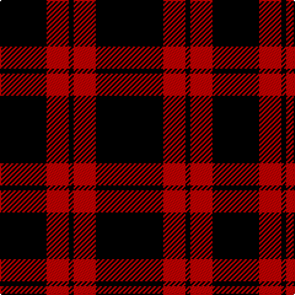

In pattern [KRKRK](/patterns/krkrk/).

This was sourced from weddslist.  It is a [5 stripes tartan](/stripes/stripes5/).

Original link http://www.weddslist.com/cgi-bin/tartans/pg.pl?source=sts

## Thread count
K/38 R18 K4 R18 K/55

## Palette
Each colour and its ΔE from the base-6 reference it is a variant of.

| Colour | Shade | Base | ΔE (OKLab) |
|---|---|---|---|
| K | <code style="background-color:#000000;">#000000</code> `#000000` | K <code style="background-color:#000000;">#000000</code> | 0.00 |
| R | <code style="background-color:#C00000;">#C00000</code> `#C00000` | R <code style="background-color:#C80000;">#C80000</code> | 0.02 |

# Sample pattern

## Nearest tartans

The nearest existing variants by ΔTartan distance.

1. [Unidentified Kirtle](/setts/s5/k55r18k4r18k38-k101010-rdc0000/) — ΔT 1.33
1. [Romsdal, Tresfjord](/setts/s5/k4r8k14ra2k2-k000000-r800000-rac00000/) — ΔT 1.73
1. [Cameron, Black & Red (dress)](/setts/s6/k4r16k4r16k52r4-k000000-rc00000/) — ΔT 1.84
1. [Punky Princess](/setts/s7/k28r4k8y6k24r16k2-k000000-rff00cc-ybbbbbb/) — ΔT 1.87
1. [New Zealand (2000)](/setts/s6/k84w8k20w36k52g8-g007800-k000000-wc8c8c8/) — ΔT 1.87
1. [MacLeod of Raasay](/setts/s5/k24r4k24r36k4-k000000-rc00000/) — ΔT 1.99
1. [Harvie](/setts/s5/k8r22k64y2k8-k000000-rc00000-yf0c000/) — ΔT 2.10
1. [Burberry Black](/setts/s5/y18k18y18k60r6-k000000-rc80000-yb0b0b0/) — ΔT 2.14
1. [Punky Princess (Fashion)](/setts/s7/k28r4k8w6k24r16k2-k101010-re87878-wc0c0c0/) — ΔT 2.16
1. [Red Watch](/setts/s3/k40r12k4-k000000-r780028/) — ΔT 2.17

## Neighbour map

Every grey dot is one of 15726 variants placed by the first two principal components of the ΔTartan feature space (44% of its variance). Red is this tartan; blue dots are its nearest — click one to open its page.

<svg viewBox="0 0 640 380" role="img" style="max-width:100%;height:auto;border:1px solid #e0e0e0;border-radius:4px;display:block" xmlns="http://www.w3.org/2000/svg"><image href="/nn/cloud.v1.png" width="640" height="380"/><a href="/setts/s5/k55r18k4r18k38-k101010-rdc0000/"><circle cx="471.8" cy="260.9" r="4" fill="#3465a4"><title>Unidentified Kirtle</title></circle></a><a href="/setts/s5/k4r8k14ra2k2-k000000-r800000-rac00000/"><circle cx="388.1" cy="266.1" r="4" fill="#3465a4"><title>Romsdal, Tresfjord</title></circle></a><a href="/setts/s6/k4r16k4r16k52r4-k000000-rc00000/"><circle cx="417.4" cy="214.7" r="4" fill="#3465a4"><title>Cameron, Black &amp; Red (dress)</title></circle></a><a href="/setts/s7/k28r4k8y6k24r16k2-k000000-rff00cc-ybbbbbb/"><circle cx="393.5" cy="211.3" r="4" fill="#3465a4"><title>Punky Princess</title></circle></a><a href="/setts/s6/k84w8k20w36k52g8-g007800-k000000-wc8c8c8/"><circle cx="415.8" cy="235.2" r="4" fill="#3465a4"><title>New Zealand (2000)</title></circle></a><a href="/setts/s5/k24r4k24r36k4-k000000-rc00000/"><circle cx="350.0" cy="261.8" r="4" fill="#3465a4"><title>MacLeod of Raasay</title></circle></a><a href="/setts/s5/k8r22k64y2k8-k000000-rc00000-yf0c000/"><circle cx="527.9" cy="187.4" r="4" fill="#3465a4"><title>Harvie</title></circle></a><a href="/setts/s5/y18k18y18k60r6-k000000-rc80000-yb0b0b0/"><circle cx="348.5" cy="235.8" r="4" fill="#3465a4"><title>Burberry Black</title></circle></a><a href="/setts/s7/k28r4k8w6k24r16k2-k101010-re87878-wc0c0c0/"><circle cx="399.3" cy="212.1" r="4" fill="#3465a4"><title>Punky Princess (Fashion)</title></circle></a><a href="/setts/s3/k40r12k4-k000000-r780028/"><circle cx="552.3" cy="305.7" r="4" fill="#3465a4"><title>Red Watch</title></circle></a><circle cx="459.5" cy="263.0" r="5" fill="#c00000"/></svg>

ID: /setts/s5/k55r18k4r18k38-k000000-rc00000/
