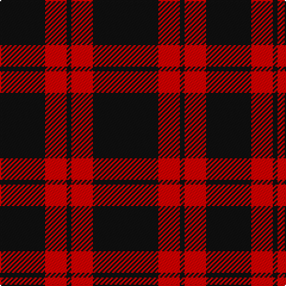

This page is one **sett** — a single exact thread-count. It belongs to the [tartan](/tartans/k55r18k4r18k38/)
(the same proportion at any scale), whose colour order is pattern [KRKRK](/stripes/krkrk/).

Sourced from register-of-tartans.  It is a [5 stripe tartan](/stripes/stripes5/).

Original link https://www.tartanregister.gov.uk/tartanDetails.aspx?ref=4301

2 attestations — the source records this cloth was collapsed from (oldest owns this page)

<ul>
<li>Historic — Unidentified Kirtle (register-of-tartans, <a href="https://www.tartanregister.gov.uk/tartanDetails.aspx?ref=4301">record</a>)</li>
<li>undated — Unidentified Kirtle (weddslist, <a href="http://www.weddslist.com/cgi-bin/tartans/pg.pl?source=sts">record</a>)</li>
</ul>

## Register references

External register numbers recorded for this tartan.

- Scottish Register of Tartans: [4301](https://www.tartanregister.gov.uk/tartanDetails.aspx?ref=4301)
- Scottish Tartans World Register: 2571

## Thread count
K/55 R18 K4 R18 K/38

## Palette
Each colour and the base-6 reference it is a variant of.

| Colour | Shade | Base |
|---|---|---|
| K | <code style="background-color:#101010;">#101010</code> `oklch(17.3% 0.000 89.9)` <small>#101010</small> | K <code style="background-color:#000000;">#000000</code> |
| R | <code style="background-color:#DC0000;">#DC0000</code> `oklch(56.2% 0.230 29.2)` <small>#DC0000</small> | R <code style="background-color:#CC0000;">#CC0000</code> |

# Sample pattern

## Nearest tartans

The nearest existing variants by ΔTartan distance, with this tartan at the top so the swatches line up against it.

ΔTartan

Tartan

Sett

—

<a href="/ttd/edit/#slug=k55r18k4r18k38">Unidentified Kirtle</a> <a class="nn-out" href="/setts/s5/k55r18k4r18k38/" title="open its dictionary page">↗</a>

1.68

<a href="/ttd/edit/#slug=k14r2k4lb3k12r8k1~x2">Punky Princess (Fashion)</a> <a class="nn-out" href="/setts/s7/k14r2k4lb3k12r8k1~x2/" title="open its dictionary page">↗</a>

1.78

<a href="/ttd/edit/#slug=k13r2k13r19k2~x2">MacLeod of Raasay (Highland Society of London)</a> <a class="nn-out" href="/setts/s5/k13r2k13r19k2~x2/" title="open its dictionary page">↗</a>

1.84

<a href="/ttd/edit/#slug=k30r3k2r3k2r27k30r4~x2">Murray of Ochtertyre #2</a> <a class="nn-out" href="/setts/s8/k30r3k2r3k2r27k30r4~x2/" title="open its dictionary page">↗</a>

1.86

<a href="/ttd/edit/#slug=k69r14ly5~x2">Batson (Personal)</a> <a class="nn-out" href="/setts/s3/k69r14ly5~x2/" title="open its dictionary page">↗</a>

1.96

<a href="/ttd/edit/#slug=r20k3r4lb2k7~x2">Loevenstein Castle</a> <a class="nn-out" href="/setts/s5/r20k3r4lb2k7~x2/" title="open its dictionary page">↗</a>

2.00

<a href="/ttd/edit/#slug=r20k3r4w2k7~x2">Loevenstein Castle 1 (Artefact)</a> <a class="nn-out" href="/setts/s5/r20k3r4w2k7~x2/" title="open its dictionary page">↗</a>

2.04

<a href="/ttd/edit/#slug=k6r1k6r9k1~x4">MacLeod of Raasay</a> <a class="nn-out" href="/setts/s5/k6r1k6r9k1~x4/" title="open its dictionary page">↗</a>

2.06

<a href="/ttd/edit/#slug=k4r4k20r1k20w4~x6">Lanoir</a> <a class="nn-out" href="/setts/s6/k4r4k20r1k20w4~x6/" title="open its dictionary page">↗</a>

2.06

<a href="/ttd/edit/#slug=k2r4k7r1k1~x2">Romsdal, Tresfjord</a> <a class="nn-out" href="/setts/s5/k2r4k7r1k1~x2/" title="open its dictionary page">↗</a>

2.06

<a href="/ttd/edit/#slug=k1r4k1r4k13r1~x4">Cameron, Black &amp; Red (dress)</a> <a class="nn-out" href="/setts/s6/k1r4k1r4k13r1~x4/" title="open its dictionary page">↗</a>

## Neighbour map

Every grey dot is one of 14299 variants placed by the first two principal components of the ΔTartan feature space (44% of its variance). Red is this tartan; blue dots are its nearest — click one to open its page.

<svg viewBox="0 0 640 380" role="img" style="max-width:100%;height:auto;border:1px solid #e0e0e0;border-radius:4px;display:block" xmlns="http://www.w3.org/2000/svg"><image href="/nn/cloud.v1.png" width="640" height="380"/><a href="/setts/s7/k14r2k4lb3k12r8k1~x2/"><circle cx="399.0" cy="210.5" r="4" fill="#3465a4"><title>Punky Princess (Fashion)</title></circle></a><a href="/setts/s5/k13r2k13r19k2~x2/"><circle cx="373.7" cy="261.7" r="4" fill="#3465a4"><title>MacLeod of Raasay (Highland Society of London)</title></circle></a><a href="/setts/s8/k30r3k2r3k2r27k30r4~x2/"><circle cx="438.1" cy="204.6" r="4" fill="#3465a4"><title>Murray of Ochtertyre #2</title></circle></a><a href="/setts/s3/k69r14ly5~x2/"><circle cx="514.4" cy="245.1" r="4" fill="#3465a4"><title>Batson (Personal)</title></circle></a><a href="/setts/s5/r20k3r4lb2k7~x2/"><circle cx="404.5" cy="217.4" r="4" fill="#3465a4"><title>Loevenstein Castle</title></circle></a><a href="/setts/s5/r20k3r4w2k7~x2/"><circle cx="397.8" cy="214.6" r="4" fill="#3465a4"><title>Loevenstein Castle 1 (Artefact)</title></circle></a><a href="/setts/s5/k6r1k6r9k1~x4/"><circle cx="348.3" cy="259.3" r="4" fill="#3465a4"><title>MacLeod of Raasay</title></circle></a><a href="/setts/s6/k4r4k20r1k20w4~x6/"><circle cx="538.4" cy="209.3" r="4" fill="#3465a4"><title>Lanoir</title></circle></a><a href="/setts/s5/k2r4k7r1k1~x2/"><circle cx="387.4" cy="266.4" r="4" fill="#3465a4"><title>Romsdal, Tresfjord</title></circle></a><a href="/setts/s6/k1r4k1r4k13r1~x4/"><circle cx="417.0" cy="213.1" r="4" fill="#3465a4"><title>Cameron, Black &amp; Red (dress)</title></circle></a><circle cx="469.6" cy="259.9" r="5" fill="#c00000"/></svg>

ID: /setts/s5/k55r18k4r18k38/
