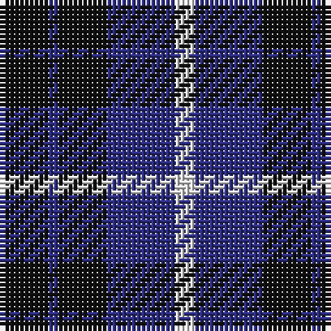

In pattern [KBKBW](/patterns/kbkbw/).

This was sourced from house-of-tartan.  It is a [5 stripes tartan](/stripes/stripes5/).

Original link http://www.house-of-tartan.scotland.net/house/TartanViewjs.asp?colr=Def&tnam=1058

## Thread count
K/10 DB2 K10 DB14 LN/4

## Palette
Each colour and its ΔE from the base-6 reference it is a variant of.

| Colour | Shade | Base | ΔE (OKLab) |
|---|---|---|---|
| DB | <code style="background-color:#2C2C80;">#2C2C80</code> `#2C2C80` | B <code style="background-color:#2A418A;">#2A418A</code> | 0.06 |
| K | <code style="background-color:#101010;">#101010</code> `#101010` | K <code style="background-color:#000000;">#000000</code> | 0.17 |
| LN | <code style="background-color:#E0E0E0;">#E0E0E0</code> `#E0E0E0` | W <code style="background-color:#F7F7F7;">#F7F7F7</code> | 0.07 |

# Sample pattern

## Nearest tartans

The nearest existing variants by ΔTartan distance.

1. [Grampian Television (Corporate)](/setts/s5/k12b3k12b18w5x2~b305470-k101010-wfcfcfc/) — ΔT 0.95
1. [Grampian, T.V.](/setts/s5/k5b1k5b7w2x2~b304080-k000000-we0e0e0/) — ΔT 1.03
1. [College of Radiographers Corporate Tartan Tartan Number: 1274. Earliest known date: 1988 Marketed in Edinburgh around 1930s but no longer seen. See products available Copyright © Blair Urquhart, Comrie, 2015](/setts/s5/k15y2k10b18w3x2~b2c2c80-k101010-we0e0e0-ye8c000/) — ΔT 1.08
1. [College of Radiographers](/setts/s5/k15y2k10b18w3x2~b00008c-k101010-wc8c8c8-yc88c00/) — ΔT 1.21
1. [Wallace (Personal)](/setts/s4/k1b7k7y1x10~b200084-k101010-yfccc3c/) — ΔT 1.24
1. [Old Brigade](/setts/s6/b9k9r3b9k9y1x4~b000080-k101010-rff0000-yffe600/) — ΔT 1.27
1. [Grampian Television](/setts/s8/k12b3k12b18w5b18k12b3x2~b305470-k101010-wfcfcfc/) — ΔT 1.30
1. [Laval (Tartan de..)](/setts/s5/b2w2ba8b8w1x2~b000050-ba600030-we0e0e0/) — ΔT 1.30
1. [Baru](/setts/s5/b23g8b23g35w5x2~b780078-g003820-we0e0e0/) — ΔT 1.36
1. [Unnamed, No 54](/setts/s6/b2g6b6ba5b1ba2x2~b000050-ba300030-g008000/) — ΔT 1.43

## Neighbour map

Every grey dot is one of 15726 variants placed by the first two principal components of the ΔTartan feature space (44% of its variance). Red is this tartan; blue dots are its nearest — click one to open its page.

<svg viewBox="0 0 640 380" role="img" style="max-width:100%;height:auto;border:1px solid #e0e0e0;border-radius:4px;display:block" xmlns="http://www.w3.org/2000/svg"><image href="/nn/cloud.v1.png" width="640" height="380"/><a href="/setts/s5/k12b3k12b18w5x2~b305470-k101010-wfcfcfc/"><circle cx="226.9" cy="283.4" r="4" fill="#3465a4"><title>Grampian Television (Corporate)</title></circle></a><a href="/setts/s5/k5b1k5b7w2x2~b304080-k000000-we0e0e0/"><circle cx="232.3" cy="277.8" r="4" fill="#3465a4"><title>Grampian, T.V.</title></circle></a><a href="/setts/s5/k15y2k10b18w3x2~b2c2c80-k101010-we0e0e0-ye8c000/"><circle cx="264.5" cy="246.0" r="4" fill="#3465a4"><title>College of Radiographers Corporate Tartan Tartan Number: 1274. Earliest known date: 1988 Marketed in Edinburgh around 1930s but no longer seen. See products available Copyright © Blair Urquhart, Comrie, 2015</title></circle></a><a href="/setts/s5/k15y2k10b18w3x2~b00008c-k101010-wc8c8c8-yc88c00/"><circle cx="270.4" cy="252.6" r="4" fill="#3465a4"><title>College of Radiographers</title></circle></a><a href="/setts/s4/k1b7k7y1x10~b200084-k101010-yfccc3c/"><circle cx="305.5" cy="281.9" r="4" fill="#3465a4"><title>Wallace (Personal)</title></circle></a><a href="/setts/s6/b9k9r3b9k9y1x4~b000080-k101010-rff0000-yffe600/"><circle cx="230.5" cy="262.9" r="4" fill="#3465a4"><title>Old Brigade</title></circle></a><a href="/setts/s8/k12b3k12b18w5b18k12b3x2~b305470-k101010-wfcfcfc/"><circle cx="255.2" cy="270.9" r="4" fill="#3465a4"><title>Grampian Television</title></circle></a><a href="/setts/s5/b2w2ba8b8w1x2~b000050-ba600030-we0e0e0/"><circle cx="251.8" cy="246.3" r="4" fill="#3465a4"><title>Laval (Tartan de..)</title></circle></a><a href="/setts/s5/b23g8b23g35w5x2~b780078-g003820-we0e0e0/"><circle cx="291.5" cy="279.2" r="4" fill="#3465a4"><title>Baru</title></circle></a><a href="/setts/s6/b2g6b6ba5b1ba2x2~b000050-ba300030-g008000/"><circle cx="204.1" cy="286.1" r="4" fill="#3465a4"><title>Unnamed, No 54</title></circle></a><circle cx="253.6" cy="282.8" r="5" fill="#c00000"/></svg>

ID: /setts/s5/k5b1k5b7w2x2~b2c2c80-k101010-we0e0e0/
