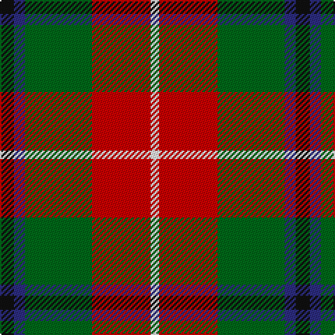

In pattern [KBGRW](/patterns/kbgrw/).

This was sourced from register-of-tartans.  It is a [5 stripes tartan](/stripes/stripes5/).

Original link https://www.tartanregister.gov.uk/tartanDetails.aspx?ref=3633

## Attestations

This cloth appears in 2 source records; the oldest owns this page.

- 01/11/2002 — Sachie Hara Scottish Check (Personal) (register-of-tartans, [record](https://www.tartanregister.gov.uk/tartanDetails.aspx?ref=3633))
- pre 2004 — Sachie Hara (Personal) (tartans-authority, [record](http://www.tartansauthority.com/tartan-ferret/display/6228/))

## Thread count
K/10 DB8 G48 R42 W/6

## Palette
Each colour and its ΔE from the base-6 reference it is a variant of.

| Colour | Shade | Base | ΔE (OKLab) |
|---|---|---|---|
| B | <code style="background-color:#1474B4;">#1474B4</code> `#1474B4` | B <code style="background-color:#2A418A;">#2A418A</code> | 0.15 |
| DB | <code style="background-color:#2C2C80;">#2C2C80</code> `#2C2C80` | B <code style="background-color:#2A418A;">#2A418A</code> | 0.06 |
| G | <code style="background-color:#006818;">#006818</code> `#006818` | G <code style="background-color:#006100;">#006100</code> | 0.02 |
| K | <code style="background-color:#101010;">#101010</code> `#101010` | K <code style="background-color:#000000;">#000000</code> | 0.17 |
| R | <code style="background-color:#C80000;">#C80000</code> `#C80000` | R <code style="background-color:#CC0000;">#CC0000</code> | 0.01 |
| W | <code style="background-color:#FCFCFC;">#FCFCFC</code> `#FCFCFC` | W <code style="background-color:#F7F7F7;">#F7F7F7</code> | 0.01 |

# Sample pattern

## Nearest tartans

The nearest existing variants by ΔTartan distance.

1. [Turnbull Dress Clan Tartan Tartan Number: 1035. Earliest known date: 1979 An unusual dress tartan having no white. See products available Copyright © Blair Urquhart, Comrie, 2015](/setts/s5/k7b3g28r28y3~b2c2c80-g006818-k101010-rc80000-ye8c000~x2/) — ΔT 0.59
1. [Turnbull, dress](/setts/s5/k7b3g28r28y3~b304080-g008000-k000000-rc00000-yf0c000~x2/) — ΔT 0.67
1. [Turnbull Dress](/setts/s5/k2b1g10r10y1~b2c2c80-g006818-k101010-rc80000-yd8b000~x6/) — ΔT 0.82
1. [ChuMac (Personal)](/setts/s5/g15y3r3b8w2~b440044-g006818-rc80000-wfcfcfc-ye8c000~x6/) — ΔT 1.00
1. [Strathblane (Fashion)](/setts/s5/g12k4w2r6ra3~g604000-k101010-r888888-rac80000-we0e0e0~x2/) — ΔT 1.00
1. [Douglas of Roxburgh](/setts/s5/k6b3g20r20y3~b2c2c80-g003800-k000000-rc80000-ye8c000~x2/) — ΔT 1.05
1. [British Hills](/setts/s5/r2g17r8b8y2~b2c4084-g003c14-rff0000-ye8c000~x4/) — ΔT 1.09
1. [Celtic Combat](/setts/s6/k2r20k8g18r3w2~g005010-k101010-rc04c04-we0e0e0~x2/) — ΔT 1.10
1. [ChuMac (Personal)](/setts/s5/g15y3r3b8w2~b543060-g006430-re01c18-we8e8e8-yf0c400~x6/) — ΔT 1.10
1. [Entre Rios Province (Provisional](/setts/s6/g36w4g8k29r24wa7~g44a054-k101010-rc80000-wa8ace8-wae0e0e0~x2/) — ΔT 1.13

## Neighbour map

Every grey dot is one of 15726 variants placed by the first two principal components of the ΔTartan feature space (44% of its variance). Red is this tartan; blue dots are its nearest — click one to open its page.

<svg viewBox="0 0 640 380" role="img" style="max-width:100%;height:auto;border:1px solid #e0e0e0;border-radius:4px;display:block" xmlns="http://www.w3.org/2000/svg"><image href="/nn/cloud.v1.png" width="640" height="380"/><a href="/setts/s5/k7b3g28r28y3~b2c2c80-g006818-k101010-rc80000-ye8c000~x2/"><circle cx="215.4" cy="198.0" r="4" fill="#3465a4"><title>Turnbull Dress Clan Tartan Tartan Number: 1035. Earliest known date: 1979 An unusual dress tartan having no white. See products available Copyright © Blair Urquhart, Comrie, 2015</title></circle></a><a href="/setts/s5/k7b3g28r28y3~b304080-g008000-k000000-rc00000-yf0c000~x2/"><circle cx="195.4" cy="191.4" r="4" fill="#3465a4"><title>Turnbull, dress</title></circle></a><a href="/setts/s5/k2b1g10r10y1~b2c2c80-g006818-k101010-rc80000-yd8b000~x6/"><circle cx="234.7" cy="194.4" r="4" fill="#3465a4"><title>Turnbull Dress</title></circle></a><a href="/setts/s5/g15y3r3b8w2~b440044-g006818-rc80000-wfcfcfc-ye8c000~x6/"><circle cx="190.1" cy="205.5" r="4" fill="#3465a4"><title>ChuMac (Personal)</title></circle></a><a href="/setts/s5/g12k4w2r6ra3~g604000-k101010-r888888-rac80000-we0e0e0~x2/"><circle cx="172.0" cy="229.4" r="4" fill="#3465a4"><title>Strathblane (Fashion)</title></circle></a><a href="/setts/s5/k6b3g20r20y3~b2c2c80-g003800-k000000-rc80000-ye8c000~x2/"><circle cx="162.8" cy="211.7" r="4" fill="#3465a4"><title>Douglas of Roxburgh</title></circle></a><a href="/setts/s5/r2g17r8b8y2~b2c4084-g003c14-rff0000-ye8c000~x4/"><circle cx="218.8" cy="223.4" r="4" fill="#3465a4"><title>British Hills</title></circle></a><a href="/setts/s6/k2r20k8g18r3w2~g005010-k101010-rc04c04-we0e0e0~x2/"><circle cx="235.8" cy="205.1" r="4" fill="#3465a4"><title>Celtic Combat</title></circle></a><a href="/setts/s5/g15y3r3b8w2~b543060-g006430-re01c18-we8e8e8-yf0c400~x6/"><circle cx="203.6" cy="210.8" r="4" fill="#3465a4"><title>ChuMac (Personal)</title></circle></a><a href="/setts/s6/g36w4g8k29r24wa7~g44a054-k101010-rc80000-wa8ace8-wae0e0e0~x2/"><circle cx="142.3" cy="195.5" r="4" fill="#3465a4"><title>Entre Rios Province (Provisional</title></circle></a><circle cx="192.5" cy="203.0" r="5" fill="#c00000"/></svg>

ID: /setts/s5/k5b4g24r21w3~b2c2c80-g006818-k101010-rc80000-wfcfcfc~x2/
