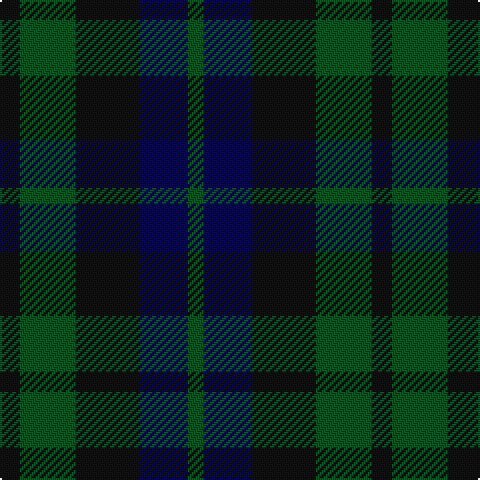

In pattern [GBKGK](/stripes/gbkgk/).

This was sourced from register-of-tartans.  It is a [5 stripe tartan](/stripes/stripes5/).

Original link https://www.tartanregister.gov.uk/tartanDetails.aspx?ref=4230

## Also known as

This cloth is also recorded under:

- Unidentified #29

## Register references

External register numbers recorded for this tartan.

- Scottish Register of Tartans: [4230](https://www.tartanregister.gov.uk/tartanDetails.aspx?ref=4230)
- Scottish Tartans World Register: 726

## Thread count
K/10 G28 K32 DB24 G/8

## Palette
Each colour and the base-6 reference it is a variant of.

| Colour | Shade | Base |
|---|---|---|
| DB | <code style="background-color:#080848;">#080848</code> `oklch(20.2% 0.112 270.4)` <small>#080848</small> | B <code style="background-color:#2A418A;">#2A418A</code> |
| G | <code style="background-color:#005020;">#005020</code> `oklch(37.7% 0.105 149.6)` <small>#005020</small> | G <code style="background-color:#006100;">#006100</code> |
| K | <code style="background-color:#101010;">#101010</code> `oklch(17.3% 0.000 89.9)` <small>#101010</small> | K <code style="background-color:#000000;">#000000</code> |

# Sample pattern

## Nearest tartans

The nearest existing variants by ΔTartan distance, with this tartan at the top so the swatches line up against it.

ΔTartan

Tartan

Sett

—

<a href="/ttd/edit/#slug=k5dg14k16db12dg4~x2">Unidentified #29</a> <a class="nn-out" href="/setts/s5/k5dg14k16db12dg4~x2/" title="open its dictionary page">↗</a>

1.07

<a href="/ttd/edit/#slug=k3dg4k1dg4k3db4k1~x2">Unidentified No 63</a> <a class="nn-out" href="/setts/s7/k3dg4k1dg4k3db4k1~x2/" title="open its dictionary page">↗</a>

1.13

<a href="/ttd/edit/#slug=k1dg3k3db3k1db1~x4">Sutherland 42nd</a> <a class="nn-out" href="/setts/s6/k1dg3k3db3k1db1~x4/" title="open its dictionary page">↗</a>

1.45

<a href="/ttd/edit/#slug=db2dg6db6dp5db1dp2~x2">Unidentified no. 54</a> <a class="nn-out" href="/setts/s6/db2dg6db6dp5db1dp2~x2/" title="open its dictionary page">↗</a>

1.51

<a href="/ttd/edit/#slug=dg1db3dg3r1~x4">Barwell</a> <a class="nn-out" href="/setts/s4/dg1db3dg3r1~x4/" title="open its dictionary page">↗</a>

1.55

<a href="/ttd/edit/#slug=k3dg20k20g20k3~x2">MacCormick Hunting (Name)</a> <a class="nn-out" href="/setts/s5/k3dg20k20g20k3~x2/" title="open its dictionary page">↗</a>

1.62

<a href="/ttd/edit/#slug=k4dg16k13db16t3db3~x2">I Y</a> <a class="nn-out" href="/setts/s6/k4dg16k13db16t3db3~x2/" title="open its dictionary page">↗</a>

1.65

<a href="/ttd/edit/#slug=g7dy6dt7dy1dt2~x6">Bright of Garth (Personal)</a> <a class="nn-out" href="/setts/s5/g7dy6dt7dy1dt2~x6/" title="open its dictionary page">↗</a>

1.74

<a href="/ttd/edit/#slug=k12dg12k2dg12k12db12t3~x2">MacIntyre</a> <a class="nn-out" href="/setts/s7/k12dg12k2dg12k12db12t3~x2/" title="open its dictionary page">↗</a>

1.74

<a href="/ttd/edit/#slug=k18dg18dy21r4~x2">Tennant</a> <a class="nn-out" href="/setts/s4/k18dg18dy21r4~x2/" title="open its dictionary page">↗</a>

1.80

<a href="/ttd/edit/#slug=k6dg6r1dg6k6db6k1~x2">MacCallum #2</a> <a class="nn-out" href="/setts/s7/k6dg6r1dg6k6db6k1~x2/" title="open its dictionary page">↗</a>

## Neighbour map

Every grey dot is one of 14299 variants placed by the first two principal components of the ΔTartan feature space (44% of its variance). Red is this tartan; blue dots are its nearest — click one to open its page.

<svg viewBox="0 0 640 380" role="img" style="max-width:100%;height:auto;border:1px solid #e0e0e0;border-radius:4px;display:block" xmlns="http://www.w3.org/2000/svg"><image href="/nn/cloud.v1.png" width="640" height="380"/><a href="/setts/s7/k3dg4k1dg4k3db4k1~x2/"><circle cx="235.4" cy="344.1" r="4" fill="#3465a4"><title>Unidentified No 63</title></circle></a><a href="/setts/s6/k1dg3k3db3k1db1~x4/"><circle cx="233.7" cy="348.8" r="4" fill="#3465a4"><title>Sutherland 42nd</title></circle></a><a href="/setts/s6/db2dg6db6dp5db1dp2~x2/"><circle cx="289.7" cy="332.8" r="4" fill="#3465a4"><title>Unidentified no. 54</title></circle></a><a href="/setts/s4/dg1db3dg3r1~x4/"><circle cx="334.1" cy="366.0" r="4" fill="#3465a4"><title>Barwell</title></circle></a><a href="/setts/s5/k3dg20k20g20k3~x2/"><circle cx="276.4" cy="320.3" r="4" fill="#3465a4"><title>MacCormick Hunting (Name)</title></circle></a><a href="/setts/s6/k4dg16k13db16t3db3~x2/"><circle cx="238.7" cy="310.4" r="4" fill="#3465a4"><title>I Y</title></circle></a><a href="/setts/s5/g7dy6dt7dy1dt2~x6/"><circle cx="292.3" cy="332.0" r="4" fill="#3465a4"><title>Bright of Garth (Personal)</title></circle></a><a href="/setts/s7/k12dg12k2dg12k12db12t3~x2/"><circle cx="212.5" cy="302.5" r="4" fill="#3465a4"><title>MacIntyre</title></circle></a><a href="/setts/s4/k18dg18dy21r4~x2/"><circle cx="210.2" cy="344.2" r="4" fill="#3465a4"><title>Tennant</title></circle></a><a href="/setts/s7/k6dg6r1dg6k6db6k1~x2/"><circle cx="220.8" cy="296.4" r="4" fill="#3465a4"><title>MacCallum #2</title></circle></a><circle cx="264.5" cy="364.3" r="5" fill="#c00000"/></svg>

ID: /setts/s5/k5dg14k16db12dg4~x2/
