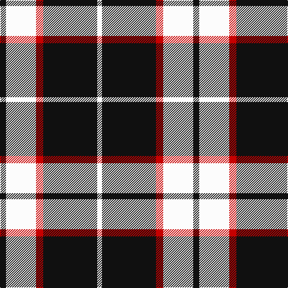

**Bands:** [KWRKW](/stripes/kwrkw/) · **Stripes:** [K W R K W](/stripes/stripes5/) K W R K W

This was sourced from tartans-authority.  It is a [5 band tartan](/bands/bands5/).

Original link http://www.tartansauthority.com/tartan-ferret/display/8819/

## Thread count
K/10 W50 R12 K90 W/8

## Palette
Each colour and its ΔE from the base-6 reference it is a variant of.

| Colour | Shade | Base | ΔE (OKLab) |
|---|---|---|---|
| K | <code style="background-color:#101010;">#101010</code> `#101010` | K <code style="background-color:#000000;">#000000</code> | 0.17 |
| R | <code style="background-color:#C80000;">#C80000</code> `#C80000` | R <code style="background-color:#CC0000;">#CC0000</code> | 0.01 |
| W | <code style="background-color:#FCFCFC;">#FCFCFC</code> `#FCFCFC` | W <code style="background-color:#F7F7F7;">#F7F7F7</code> | 0.01 |

# Sample pattern

## Nearest tartans

The nearest existing variants by ΔTartan distance.

1. [Cornish Flag (District)](/setts/s5/w5k20w10k1r2~x2/) — ΔT 0.92
1. [Stutterheim (Corporate)](/setts/s6/k4ly18db44k3ly10k4/) — ΔT 1.10
1. [Takla Makan #2 (Artefact)](/setts/s4/k4lo15k4w2~x2/) — ΔT 1.18
1. [Cairn (Marton Mills)](/setts/s5/k2w1k8w8k1~x8/) — ΔT 1.22
1. [Glen Coe #1 (Fashion)](/setts/s5/k37w9k3g9w3~x2/) — ΔT 1.29
1. [MacLeod, Black & White](/setts/s5/w8k1w8k12w1~x2/) — ΔT 1.30
1. [Machair (warp)](/setts/s6/o72k16w9k4w5k16~x2/) — ΔT 1.31
1. [Flynn](/setts/s6/o58k22o8k17r5k14~x2/) — ΔT 1.31
1. [Menzies Dress Tartan Tartan Number: 12444. Earliest known date: See products available Copyright © Blair Urquhart, Comrie, 2015](/setts/s9/w6k1w2k4w4k2w4k15r1~x2/) — ΔT 1.31
1. [Loch Tummel](/setts/s5/dy38w9dy3k9w3~x2/) — ΔT 1.32

## Neighbour map

Every grey dot is one of 14299 variants placed by the first two principal components of the ΔTartan feature space (44% of its variance). Red is this tartan; blue dots are its nearest — click one to open its page.

<svg viewBox="0 0 640 380" role="img" style="max-width:100%;height:auto;border:1px solid #e0e0e0;border-radius:4px;display:block" xmlns="http://www.w3.org/2000/svg"><image href="/nn/cloud.v1.png" width="640" height="380"/><a href="/setts/s5/w5k20w10k1r2~x2/"><circle cx="325.2" cy="181.5" r="4" fill="#3465a4"><title>Cornish Flag (District)</title></circle></a><a href="/setts/s6/k4ly18db44k3ly10k4/"><circle cx="298.4" cy="176.7" r="4" fill="#3465a4"><title>Stutterheim (Corporate)</title></circle></a><a href="/setts/s4/k4lo15k4w2~x2/"><circle cx="308.2" cy="235.5" r="4" fill="#3465a4"><title>Takla Makan #2 (Artefact)</title></circle></a><a href="/setts/s5/k2w1k8w8k1~x8/"><circle cx="312.6" cy="237.3" r="4" fill="#3465a4"><title>Cairn (Marton Mills)</title></circle></a><a href="/setts/s5/k37w9k3g9w3~x2/"><circle cx="364.0" cy="201.8" r="4" fill="#3465a4"><title>Glen Coe #1 (Fashion)</title></circle></a><a href="/setts/s5/w8k1w8k12w1~x2/"><circle cx="320.2" cy="229.4" r="4" fill="#3465a4"><title>MacLeod, Black &amp; White</title></circle></a><a href="/setts/s6/o72k16w9k4w5k16~x2/"><circle cx="362.1" cy="168.9" r="4" fill="#3465a4"><title>Machair (warp)</title></circle></a><a href="/setts/s6/o58k22o8k17r5k14~x2/"><circle cx="321.4" cy="214.7" r="4" fill="#3465a4"><title>Flynn</title></circle></a><a href="/setts/s9/w6k1w2k4w4k2w4k15r1~x2/"><circle cx="316.1" cy="166.3" r="4" fill="#3465a4"><title>Menzies Dress Tartan Tartan Number: 12444. Earliest known date: See products available Copyright © Blair Urquhart, Comrie, 2015</title></circle></a><a href="/setts/s5/dy38w9dy3k9w3~x2/"><circle cx="382.7" cy="192.8" r="4" fill="#3465a4"><title>Loch Tummel</title></circle></a><circle cx="316.9" cy="198.2" r="5" fill="#c00000"/></svg>

ID: /setts/s5/k5w25r6k45w4~x2/
