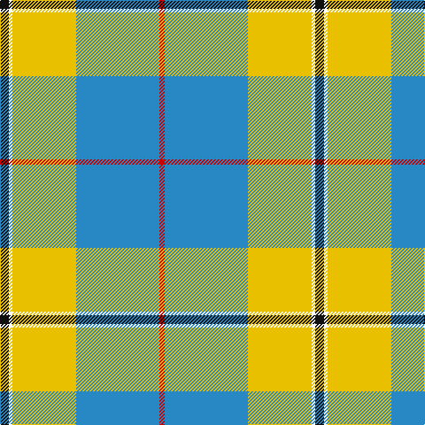

In pattern [KWYBR](/patterns/kwybr/).

This was sourced from register-of-tartans.  It is a [5 stripes tartan](/stripes/stripes5/).

Original link https://www.tartanregister.gov.uk/tartanDetails.aspx?ref=4807

## Attestations

This cloth appears in 2 source records; the oldest owns this page.

- 01/01/1973 — Oliver Dress Pink (register-of-tartans, [record](https://www.tartanregister.gov.uk/tartanDetails.aspx?ref=4807))
- circa 1980s — Cornish National Day (District) (tartans-authority, [record](http://www.tartansauthority.com/tartan-ferret/display/1262/))

## Register references

External register numbers recorded for this tartan.

- Scottish Register of Tartans: [4807](https://www.tartanregister.gov.uk/tartanDetails.aspx?ref=4807)
- Scottish Tartans Authority (ITI): 1259
- Scottish Tartans World Register: 1259

## Thread count
K/10 W4 Y72 B94 R/6

## Palette
Each colour and its ΔE from the base-6 reference it is a variant of.

| Colour | Shade | Base | ΔE (OKLab) |
|---|---|---|---|
| B | <code style="background-color:#2888C4;">#2888C4</code> `#2888C4` | B <code style="background-color:#2A418A;">#2A418A</code> | 0.21 |
| K | <code style="background-color:#101010;">#101010</code> `#101010` | K <code style="background-color:#000000;">#000000</code> | 0.17 |
| R | <code style="background-color:#C80000;">#C80000</code> `#C80000` | R <code style="background-color:#CC0000;">#CC0000</code> | 0.01 |
| W | <code style="background-color:#FCFCFC;">#FCFCFC</code> `#FCFCFC` | W <code style="background-color:#F7F7F7;">#F7F7F7</code> | 0.01 |
| Y | <code style="background-color:#E8C000;">#E8C000</code> `#E8C000` | Y <code style="background-color:#F2BF00;">#F2BF00</code> | 0.02 |

# Sample pattern

## Nearest tartans

The nearest existing variants by ΔTartan distance.

1. [Cornish National Day District Tartan Tartan Number: 1262. Earliest known date: 1984 Sample presented by D.G.Teall. Proportionally similar to the usual Cornish National. See products available Copyright © Blair Urquhart, Comrie, 2015](/setts/s5/k5w2y36b47r3~b2888c4-k101010-rc80000-we0e0e0-ye8c000~x2/) — ΔT 0.04
1. [Cornish, National Day](/setts/s5/k5w2y36b47r3~b8080d0-k000000-rc00000-we0e0e0-yf0c000~x2/) — ΔT 1.04
1. [Kinloch of Loch Awe (Personal)](/setts/s5/w18r29b2ba3k1~b2888c4-ba780078-k101010-r888888-wf8f8f8~x2/) — ΔT 1.12
1. [Cornish National Day](/setts/s8/k5w2y36b47r3b47y36w2~b2888c4-k101010-rc80000-wfcfcfc-ye8c000~x2/) — ΔT 1.15
1. [Scotstown](/setts/s5/y2g17w6b5r1~b1474b4-g005020-rfa4b00-wffffff-ya0a0a0~x4/) — ΔT 1.42
1. [Manx Laxey Dress Green](/setts/s5/w14b4y1g8ba2~b780078-ba2c2c80-g006818-we0e0e0-ye8c000~x2/) — ΔT 1.44
1. [Exabyte](/setts/s5/r3w35b4g47wa3~b304080-g008000-r802040-wc0c0c0-wae0e0e0~x2/) — ΔT 1.46
1. [Tilburg Hunting (District)](/setts/s7/b6k3b37y41w3y6w3~b1068a4-k101010-we0e0e0-yd8a810~x2/) — ΔT 1.47
1. [Galicia](/setts/s6/b53k2w53k2r4y7~b788cb4-k000000-r9c0000-wfcfcfc-yc89800~x2/) — ΔT 1.49
1. [Herriot (New Zealand) (Name)](/setts/s6/w15y2b5ya3ba40b10~b003c64-ba64809c-we0e0e0-ye8c000-yaa0a0a0/) — ΔT 1.50

## Neighbour map

Every grey dot is one of 15726 variants placed by the first two principal components of the ΔTartan feature space (44% of its variance). Red is this tartan; blue dots are its nearest — click one to open its page.

<svg viewBox="0 0 640 380" role="img" style="max-width:100%;height:auto;border:1px solid #e0e0e0;border-radius:4px;display:block" xmlns="http://www.w3.org/2000/svg"><image href="/nn/cloud.v1.png" width="640" height="380"/><a href="/setts/s5/k5w2y36b47r3~b2888c4-k101010-rc80000-we0e0e0-ye8c000~x2/"><circle cx="289.2" cy="146.8" r="4" fill="#3465a4"><title>Cornish National Day District Tartan Tartan Number: 1262. Earliest known date: 1984 Sample presented by D.G.Teall. Proportionally similar to the usual Cornish National. See products available Copyright © Blair Urquhart, Comrie, 2015</title></circle></a><a href="/setts/s5/k5w2y36b47r3~b8080d0-k000000-rc00000-we0e0e0-yf0c000~x2/"><circle cx="286.9" cy="138.3" r="4" fill="#3465a4"><title>Cornish, National Day</title></circle></a><a href="/setts/s5/w18r29b2ba3k1~b2888c4-ba780078-k101010-r888888-wf8f8f8~x2/"><circle cx="322.9" cy="134.1" r="4" fill="#3465a4"><title>Kinloch of Loch Awe (Personal)</title></circle></a><a href="/setts/s8/k5w2y36b47r3b47y36w2~b2888c4-k101010-rc80000-wfcfcfc-ye8c000~x2/"><circle cx="294.5" cy="140.3" r="4" fill="#3465a4"><title>Cornish National Day</title></circle></a><a href="/setts/s5/y2g17w6b5r1~b1474b4-g005020-rfa4b00-wffffff-ya0a0a0~x4/"><circle cx="253.9" cy="167.2" r="4" fill="#3465a4"><title>Scotstown</title></circle></a><a href="/setts/s5/w14b4y1g8ba2~b780078-ba2c2c80-g006818-we0e0e0-ye8c000~x2/"><circle cx="202.1" cy="167.7" r="4" fill="#3465a4"><title>Manx Laxey Dress Green</title></circle></a><a href="/setts/s5/r3w35b4g47wa3~b304080-g008000-r802040-wc0c0c0-wae0e0e0~x2/"><circle cx="288.6" cy="172.0" r="4" fill="#3465a4"><title>Exabyte</title></circle></a><a href="/setts/s7/b6k3b37y41w3y6w3~b1068a4-k101010-we0e0e0-yd8a810~x2/"><circle cx="286.1" cy="163.3" r="4" fill="#3465a4"><title>Tilburg Hunting (District)</title></circle></a><a href="/setts/s6/b53k2w53k2r4y7~b788cb4-k000000-r9c0000-wfcfcfc-yc89800~x2/"><circle cx="259.3" cy="113.3" r="4" fill="#3465a4"><title>Galicia</title></circle></a><a href="/setts/s6/w15y2b5ya3ba40b10~b003c64-ba64809c-we0e0e0-ye8c000-yaa0a0a0/"><circle cx="292.6" cy="151.8" r="4" fill="#3465a4"><title>Herriot (New Zealand) (Name)</title></circle></a><circle cx="287.9" cy="146.2" r="5" fill="#c00000"/></svg>

ID: /setts/s5/k5w2y36b47r3~b2888c4-k101010-rc80000-wfcfcfc-ye8c000~x2/
