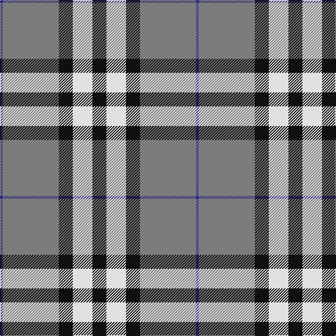

In pattern [BGKWK](/patterns/bgkwk/).

This was sourced from register-of-tartans.  It is a [5 stripes tartan](/stripes/stripes5/).

Original link https://www.tartanregister.gov.uk/tartanDetails.aspx?ref=442

## Attestations

This cloth appears in 2 source records; the oldest owns this page.

- 01/01/2007 — Burberry Grey (Original) (register-of-tartans, [record](https://www.tartanregister.gov.uk/tartanDetails.aspx?ref=442))
- pre 2007 — Burberry, Grey (Original) (Fashion) (tartans-authority, [record](http://www.tartansauthority.com/tartan-ferret/display/7268/))

## Thread count
DB/4 N80 K20 LN28 K/20

## Palette
Each colour and its ΔE from the base-6 reference it is a variant of.

| Colour | Shade | Base | ΔE (OKLab) |
|---|---|---|---|
| DB | <code style="background-color:#2C2C80;">#2C2C80</code> `#2C2C80` | B <code style="background-color:#2A418A;">#2A418A</code> | 0.06 |
| K | <code style="background-color:#101010;">#101010</code> `#101010` | K <code style="background-color:#000000;">#000000</code> | 0.17 |
| LN | <code style="background-color:#E0E0E0;">#E0E0E0</code> `#E0E0E0` | W <code style="background-color:#F7F7F7;">#F7F7F7</code> | 0.07 |
| N | <code style="background-color:#7C7C7C;">#7C7C7C</code> `#7C7C7C` | G <code style="background-color:#006100;">#006100</code> | 0.22 |

# Sample pattern

## Nearest tartans

The nearest existing variants by ΔTartan distance.

1. [Kansai Highland Games](/setts/s5/b2k1b16g17w2~b780078-g289c18-k101010-wfcfcfc~x4/) — ΔT 0.79
1. [Kansai Highland Games Corporate Tartan Tartan Number: 2708. Earliest known date: 1999 Designed for the first Highland Games in Japan, started by Maud Robertson and heavy weight husband, Masonori Nomiyam. See products available Copyright © Blair Urquhart, Comrie, 2015](/setts/s5/b2k1b16g16w2~b780078-g289c18-k101010-we0e0e0~x4/) — ΔT 0.80
1. [Tiree Grey](/setts/s6/w3k3w3k3r15ra1~k101010-r888888-ra880000-wc0c0c0~x4/) — ΔT 0.90
1. [Yusra (Malay) (Personal)](/setts/s7/r12y3w14b10y2b24r2~b003c64-rc80000-we0e0e0-ye8c000~x2/) — ΔT 1.19
1. [Perkins 2015](/setts/s7/k3b10y5b29k10r6k2~b5c8ca8-k101010-rc80000-ye8c000~x2/) — ΔT 1.20
1. [Yusra (Personal)](/setts/s7/r12y3w14b10y2b24r2~b003c64-rc80000-we0e0e0-yfccc00~x2/) — ΔT 1.20
1. [Stutterheim](/setts/s6/k4y18b44k3y10k4~b565c76-k101010-yecdc8e/) — ΔT 1.31
1. [Downside (Corporate)](/setts/s6/r4ra41k5w14k18r4~k101010-rc80000-ra888888-we0e0e0~x2/) — ΔT 1.32
1. [Burberry Hunting](/setts/s5/k3w3k3g10r1~g406054-k101010-rc80000-wfcfcfc~x6/) — ΔT 1.33
1. [Solberg-Bell](/setts/s6/y8k2b20ba4w1k2~b003c64-ba5c8ca8-k101010-wfcfcfc-yfccc00~x4/) — ΔT 1.33

## Neighbour map

Every grey dot is one of 15726 variants placed by the first two principal components of the ΔTartan feature space (44% of its variance). Red is this tartan; blue dots are its nearest — click one to open its page.

<svg viewBox="0 0 640 380" role="img" style="max-width:100%;height:auto;border:1px solid #e0e0e0;border-radius:4px;display:block" xmlns="http://www.w3.org/2000/svg"><image href="/nn/cloud.v1.png" width="640" height="380"/><a href="/setts/s5/b2k1b16g17w2~b780078-g289c18-k101010-wfcfcfc~x4/"><circle cx="286.2" cy="180.1" r="4" fill="#3465a4"><title>Kansai Highland Games</title></circle></a><a href="/setts/s5/b2k1b16g16w2~b780078-g289c18-k101010-we0e0e0~x4/"><circle cx="290.9" cy="184.0" r="4" fill="#3465a4"><title>Kansai Highland Games Corporate Tartan Tartan Number: 2708. Earliest known date: 1999 Designed for the first Highland Games in Japan, started by Maud Robertson and heavy weight husband, Masonori Nomiyam. See products available Copyright © Blair Urquhart, Comrie, 2015</title></circle></a><a href="/setts/s6/w3k3w3k3r15ra1~k101010-r888888-ra880000-wc0c0c0~x4/"><circle cx="289.5" cy="173.4" r="4" fill="#3465a4"><title>Tiree Grey</title></circle></a><a href="/setts/s7/r12y3w14b10y2b24r2~b003c64-rc80000-we0e0e0-ye8c000~x2/"><circle cx="227.9" cy="184.4" r="4" fill="#3465a4"><title>Yusra (Malay) (Personal)</title></circle></a><a href="/setts/s7/k3b10y5b29k10r6k2~b5c8ca8-k101010-rc80000-ye8c000~x2/"><circle cx="315.1" cy="179.1" r="4" fill="#3465a4"><title>Perkins 2015</title></circle></a><a href="/setts/s7/r12y3w14b10y2b24r2~b003c64-rc80000-we0e0e0-yfccc00~x2/"><circle cx="226.7" cy="183.7" r="4" fill="#3465a4"><title>Yusra (Personal)</title></circle></a><a href="/setts/s6/k4y18b44k3y10k4~b565c76-k101010-yecdc8e/"><circle cx="303.8" cy="182.6" r="4" fill="#3465a4"><title>Stutterheim</title></circle></a><a href="/setts/s6/r4ra41k5w14k18r4~k101010-rc80000-ra888888-we0e0e0~x2/"><circle cx="222.1" cy="185.3" r="4" fill="#3465a4"><title>Downside (Corporate)</title></circle></a><a href="/setts/s5/k3w3k3g10r1~g406054-k101010-rc80000-wfcfcfc~x6/"><circle cx="229.5" cy="214.0" r="4" fill="#3465a4"><title>Burberry Hunting</title></circle></a><a href="/setts/s6/y8k2b20ba4w1k2~b003c64-ba5c8ca8-k101010-wfcfcfc-yfccc00~x4/"><circle cx="264.0" cy="143.4" r="4" fill="#3465a4"><title>Solberg-Bell</title></circle></a><circle cx="278.4" cy="179.8" r="5" fill="#c00000"/></svg>

ID: /setts/s5/k5w7k5g20b1~b2c2c80-g7c7c7c-k101010-we0e0e0~x4/
