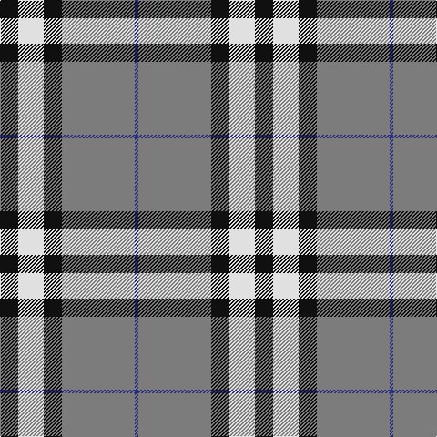

In pattern [BGKWK](/stripes/bgkwk/).

This was sourced from register-of-tartans.  It is a [5 stripe tartan](/stripes/stripes5/).

Original link https://www.tartanregister.gov.uk/tartanDetails.aspx?ref=442

## Also known as

This cloth is also recorded under:

- Burberry, Grey

## Attestations

This cloth appears in 2 source records; the oldest owns this page.

- 01/01/2007 — Burberry Grey (Original) (register-of-tartans, [record](https://www.tartanregister.gov.uk/tartanDetails.aspx?ref=442))
- pre 2007 — Burberry, Grey (Original) (Fashion) (tartans-authority, [record](http://www.tartansauthority.com/tartan-ferret/display/7268/))

## Register references

External register numbers recorded for this tartan.

- Scottish Register of Tartans: [442](https://www.tartanregister.gov.uk/tartanDetails.aspx?ref=442)
- Scottish Tartans Authority (ITI): 7268

## Thread count
K/20 LN28 K20 N80 DB/4

## Palette
Each colour and its ΔE from the base-6 reference it is a variant of.

| Colour | Shade | Base | ΔE (OKLab) |
|---|---|---|---|
| DB | <code style="background-color:#2C2C80;">#2C2C80</code> `#2C2C80` | B <code style="background-color:#2A418A;">#2A418A</code> | 0.06 |
| K | <code style="background-color:#101010;">#101010</code> `#101010` | K <code style="background-color:#000000;">#000000</code> | 0.17 |
| LN | <code style="background-color:#E0E0E0;">#E0E0E0</code> `#E0E0E0` | W <code style="background-color:#F7F7F7;">#F7F7F7</code> | 0.07 |
| N | <code style="background-color:#7C7C7C;">#7C7C7C</code> `#7C7C7C` | G <code style="background-color:#006100;">#006100</code> | 0.22 |

# Sample pattern

## Nearest tartans

The nearest existing variants by ΔTartan distance.

1. [Kansai Highland Games](/setts/s5/dp2k1dp16g17w2~x4/) — ΔT 0.79
1. [Kansai Highland Games Corporate Tartan Tartan Number: 2708. Earliest known date: 1999 Designed for the first Highland Games in Japan, started by Maud Robertson and heavy weight husband, Masonori Nomiyam. See products available Copyright © Blair Urquhart, Comrie, 2015](/setts/s5/dp2k1dp16g16w2~x4/) — ΔT 0.80
1. [Tiree Grey](/setts/s6/lb3k3lb3k3o15r1~x4/) — ΔT 0.90
1. [Yusra (Malay) (Personal)](/setts/s7/r12ly3w14dt10ly2dt24r2~x2/) — ΔT 1.19
1. [Perkins 2015](/setts/s7/k3t10ly5t29k10r6k2~x2/) — ΔT 1.20
1. [Stutterheim](/setts/s6/k4ly18n44k3ly10k4/) — ΔT 1.32
1. [Downside (Corporate)](/setts/s6/r4o41k5w14k18r4~x2/) — ΔT 1.32
1. [Burberry Hunting](/setts/s5/k3w3k3y10r1~x6/) — ΔT 1.33
1. [Macleod, Winnifred Mary, Dress](/setts/s5/k23ly3k23w36r4~x2/) — ΔT 1.34
1. [Solberg-Bell](/setts/s6/ly8k2dt20t4w1k2~x4/) — ΔT 1.34

## Neighbour map

Every grey dot is one of 14299 variants placed by the first two principal components of the ΔTartan feature space (44% of its variance). Red is this tartan; blue dots are its nearest — click one to open its page.

<svg viewBox="0 0 640 380" role="img" style="max-width:100%;height:auto;border:1px solid #e0e0e0;border-radius:4px;display:block" xmlns="http://www.w3.org/2000/svg"><image href="/nn/cloud.v1.png" width="640" height="380"/><a href="/setts/s5/dp2k1dp16g17w2~x4/"><circle cx="288.3" cy="176.1" r="4" fill="#3465a4"><title>Kansai Highland Games</title></circle></a><a href="/setts/s5/dp2k1dp16g16w2~x4/"><circle cx="293.0" cy="180.2" r="4" fill="#3465a4"><title>Kansai Highland Games Corporate Tartan Tartan Number: 2708. Earliest known date: 1999 Designed for the first Highland Games in Japan, started by Maud Robertson and heavy weight husband, Masonori Nomiyam. See products available Copyright © Blair Urquhart, Comrie, 2015</title></circle></a><a href="/setts/s6/lb3k3lb3k3o15r1~x4/"><circle cx="291.5" cy="170.8" r="4" fill="#3465a4"><title>Tiree Grey</title></circle></a><a href="/setts/s7/r12ly3w14dt10ly2dt24r2~x2/"><circle cx="230.1" cy="180.5" r="4" fill="#3465a4"><title>Yusra (Malay) (Personal)</title></circle></a><a href="/setts/s7/k3t10ly5t29k10r6k2~x2/"><circle cx="317.3" cy="176.0" r="4" fill="#3465a4"><title>Perkins 2015</title></circle></a><a href="/setts/s6/k4ly18n44k3ly10k4/"><circle cx="305.9" cy="177.5" r="4" fill="#3465a4"><title>Stutterheim</title></circle></a><a href="/setts/s6/r4o41k5w14k18r4~x2/"><circle cx="224.3" cy="181.7" r="4" fill="#3465a4"><title>Downside (Corporate)</title></circle></a><a href="/setts/s5/k3w3k3y10r1~x6/"><circle cx="232.2" cy="210.5" r="4" fill="#3465a4"><title>Burberry Hunting</title></circle></a><a href="/setts/s5/k23ly3k23w36r4~x2/"><circle cx="247.9" cy="198.9" r="4" fill="#3465a4"><title>Macleod, Winnifred Mary, Dress</title></circle></a><a href="/setts/s6/ly8k2dt20t4w1k2~x4/"><circle cx="267.0" cy="141.0" r="4" fill="#3465a4"><title>Solberg-Bell</title></circle></a><circle cx="280.6" cy="176.0" r="5" fill="#c00000"/></svg>

ID: /setts/s5/k5w7k5y20db1~x4/
