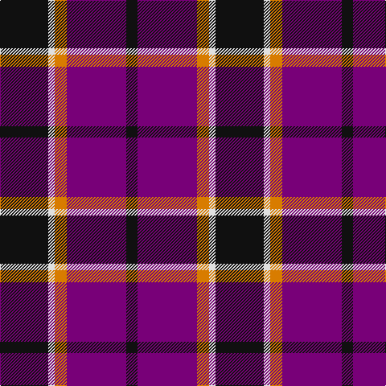

This page is one **sett** — a single exact thread-count. It belongs to the [tartan](/tartans/k60ln8o15p74k14/)
(the same proportion at any scale), whose colour order is pattern [KBYWK](/stripes/kbywk/).

Sourced from tartans-authority.  It is a [5 stripe tartan](/stripes/stripes5/).

Original link http://www.tartansauthority.com/tartan-ferret/display/7620/

2 attestations — the source records this cloth was collapsed from (oldest owns this page)

<ul>
<li>pre 2008 — Gingles (Personal) (tartans-authority, <a href="http://www.tartansauthority.com/tartan-ferret/display/7620/">record</a>)</li>
<li>undated — Gingles (Personal) (register-of-tartans, <a href="https://www.tartanregister.gov.uk/tartanDetails.aspx?ref=5640">record</a>)</li>
</ul>

## Register references

External register numbers recorded for this tartan.

- Scottish Register of Tartans: [5640](https://www.tartanregister.gov.uk/tartanDetails.aspx?ref=5640)
- Scottish Tartans Authority (ITI): 7620

## Thread count
K/60 LN8 O15 P74 K/14

## Palette
Each colour and the base-6 reference it is a variant of.

| Colour | Shade | Base |
|---|---|---|
| K | <code style="background-color:#101010;">#101010</code> `oklch(17.3% 0.000 89.9)` <small>#101010</small> | K <code style="background-color:#000000;">#000000</code> |
| LN | <code style="background-color:#E0E0E0;">#E0E0E0</code> `oklch(90.7% 0.000 89.9)` <small>#E0E0E0</small> | W <code style="background-color:#F7F7F7;">#F7F7F7</code> |
| O | <code style="background-color:#D87C00;">#D87C00</code> `oklch(67.3% 0.155 61.8)` <small>#D87C00</small> | Y <code style="background-color:#F2BF00;">#F2BF00</code> |
| P | <code style="background-color:#780078;">#780078</code> `oklch(40.2% 0.185 328.4)` <small>#780078</small> | B <code style="background-color:#2A418A;">#2A418A</code> |

# Sample pattern

## Nearest tartans

The nearest existing variants by ΔTartan distance, with this tartan at the top so the swatches line up against it.

ΔTartan

Tartan

Sett

—

<a href="/ttd/edit/#slug=k60w8lo15dp74k14">Gingles (Personal)</a> <a class="nn-out" href="/setts/s5/k60w8lo15dp74k14/" title="open its dictionary page">↗</a>

0.91

<a href="/ttd/edit/#slug=r2dp8k8w1r2~x2">Inder (Corporate)</a> <a class="nn-out" href="/setts/s5/r2dp8k8w1r2~x2/" title="open its dictionary page">↗</a>

1.04

<a href="/ttd/edit/#slug=b2r12db2b6k6b1~x2">MacTavish</a> <a class="nn-out" href="/setts/s6/b2r12db2b6k6b1~x2/" title="open its dictionary page">↗</a>

1.04

<a href="/ttd/edit/#slug=b2r12db2b6k6b1">MacTavish</a> <a class="nn-out" href="/setts/s6/b2r12db2b6k6b1/" title="open its dictionary page">↗</a>

1.19

<a href="/ttd/edit/#slug=r36lb3r5k21db24k3~x2">Graham of Menteith (Red)</a> <a class="nn-out" href="/setts/s6/r36lb3r5k21db24k3~x2/" title="open its dictionary page">↗</a>

1.22

<a href="/ttd/edit/#slug=r12db3g5db16ly2g2~x2">Dunbog Primary (School)</a> <a class="nn-out" href="/setts/s6/r12db3g5db16ly2g2~x2/" title="open its dictionary page">↗</a>

1.22

<a href="/ttd/edit/#slug=r9k4r9k25ly3dp18k4~x2">Wounded Warriors Canada</a> <a class="nn-out" href="/setts/s7/r9k4r9k25ly3dp18k4~x2/" title="open its dictionary page">↗</a>

1.24

<a href="/ttd/edit/#slug=r26t3r4k16db16k4~x2">Graham of Menteith, (Red)</a> <a class="nn-out" href="/setts/s6/r26t3r4k16db16k4~x2/" title="open its dictionary page">↗</a>

1.24

<a href="/ttd/edit/#slug=db13k13db13r29ly4~x2">Highland Pub Company</a> <a class="nn-out" href="/setts/s5/db13k13db13r29ly4~x2/" title="open its dictionary page">↗</a>

1.32

<a href="/ttd/edit/#slug=r5db35k25db8ly10r5~x2">University of Notre Dame</a> <a class="nn-out" href="/setts/s6/r5db35k25db8ly10r5~x2/" title="open its dictionary page">↗</a>

1.33

<a href="/ttd/edit/#slug=db8k3r4ly1~x2">Unidentified #17</a> <a class="nn-out" href="/setts/s4/db8k3r4ly1~x2/" title="open its dictionary page">↗</a>

## Neighbour map

Every grey dot is one of 14299 variants placed by the first two principal components of the ΔTartan feature space (44% of its variance). Red is this tartan; blue dots are its nearest — click one to open its page.

<svg viewBox="0 0 640 380" role="img" style="max-width:100%;height:auto;border:1px solid #e0e0e0;border-radius:4px;display:block" xmlns="http://www.w3.org/2000/svg"><image href="/nn/cloud.v1.png" width="640" height="380"/><a href="/setts/s5/r2dp8k8w1r2~x2/"><circle cx="203.7" cy="221.9" r="4" fill="#3465a4"><title>Inder (Corporate)</title></circle></a><a href="/setts/s6/b2r12db2b6k6b1~x2/"><circle cx="210.5" cy="195.6" r="4" fill="#3465a4"><title>MacTavish</title></circle></a><a href="/setts/s6/b2r12db2b6k6b1/"><circle cx="210.5" cy="195.6" r="4" fill="#3465a4"><title>MacTavish</title></circle></a><a href="/setts/s6/r36lb3r5k21db24k3~x2/"><circle cx="249.2" cy="194.7" r="4" fill="#3465a4"><title>Graham of Menteith (Red)</title></circle></a><a href="/setts/s6/r12db3g5db16ly2g2~x2/"><circle cx="223.9" cy="209.5" r="4" fill="#3465a4"><title>Dunbog Primary (School)</title></circle></a><a href="/setts/s7/r9k4r9k25ly3dp18k4~x2/"><circle cx="229.9" cy="209.8" r="4" fill="#3465a4"><title>Wounded Warriors Canada</title></circle></a><a href="/setts/s6/r26t3r4k16db16k4~x2/"><circle cx="205.9" cy="207.4" r="4" fill="#3465a4"><title>Graham of Menteith, (Red)</title></circle></a><a href="/setts/s5/db13k13db13r29ly4~x2/"><circle cx="184.5" cy="248.2" r="4" fill="#3465a4"><title>Highland Pub Company</title></circle></a><a href="/setts/s6/r5db35k25db8ly10r5~x2/"><circle cx="220.8" cy="221.1" r="4" fill="#3465a4"><title>University of Notre Dame</title></circle></a><a href="/setts/s4/db8k3r4ly1~x2/"><circle cx="237.9" cy="245.7" r="4" fill="#3465a4"><title>Unidentified #17</title></circle></a><circle cx="248.1" cy="217.5" r="5" fill="#c00000"/></svg>

ID: /setts/s5/k60w8lo15dp74k14/
