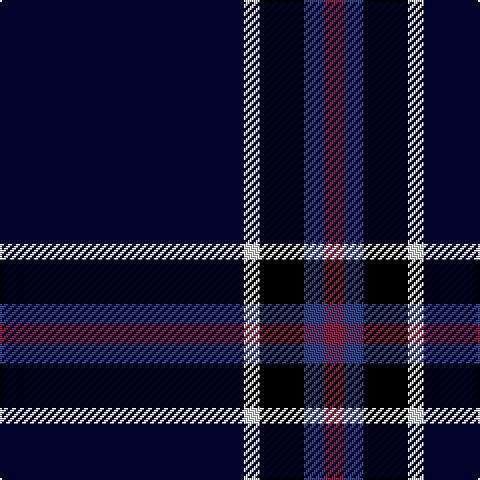

In pattern [KWKBR](/patterns/kwkbr/).

This was sourced from weddslist.  It is a [5 stripes tartan](/stripes/stripes5/).

Original link http://www.weddslist.com/cgi-bin/tartans/pg.pl?source=sts

## Thread count
DB/122 LN8 K22 B10 DR/10

## Palette
Each colour and its ΔE from the base-6 reference it is a variant of.

| Colour | Shade | Base | ΔE (OKLab) |
|---|---|---|---|
| B | <code style="background-color:#304080;">#304080</code> `#304080` | B <code style="background-color:#2A418A;">#2A418A</code> | 0.02 |
| DB | <code style="background-color:#000030;">#000030</code> `#000030` | K <code style="background-color:#000000;">#000000</code> | 0.17 |
| DR | <code style="background-color:#802040;">#802040</code> `#802040` | R <code style="background-color:#CC0000;">#CC0000</code> | 0.17 |
| K | <code style="background-color:#000000;">#000000</code> `#000000` | K <code style="background-color:#000000;">#000000</code> | 0.00 |
| LN | <code style="background-color:#E0E0E0;">#E0E0E0</code> `#E0E0E0` | W <code style="background-color:#F7F7F7;">#F7F7F7</code> | 0.07 |

# Sample pattern

## Nearest tartans

The nearest existing variants by ΔTartan distance.

1. [Pride of Nova Scotia (Corporate)](/setts/s7/k3y2k36b16k5b2w3x2~b344454-k00002c-we0e0e0-ybc8c00/) — ΔT 1.36
1. [Loretto School](/setts/s8/b4r14ba6r5b12g8b70ra4~b000048-ba5a008c-g004c00-rff0000-rab458ac/) — ΔT 1.55
1. [Ailsa, Navy (Fashion)](/setts/s6/k60r3k5r3y18ra3x2~k00002c-r880000-ra888888-ya0a0a0/) — ΔT 1.59
1. [Lochcarron (1985)](/setts/s5/b12w1k2b1r1x8~b000064-k000000-rc80000-wc8c8c8/) — ΔT 1.66
1. [Jon's Theme (Fashion)](/setts/s6/k1y2k3b12k18w1x2~b2c2c80-k00002c-wfcfcfc-ybc8c00/) — ΔT 1.69
1. [Edinburgh Crystal (Corporate)](/setts/s5/b30w2k6ba3r3x4~b14283c-ba2c2c80-k101010-rc80000-we0e0e0/) — ΔT 1.73
1. [Special Air Service](/setts/s5/b26ba6g1r1w2x2~b141e46-ba5c8ca8-g005020-r660000-wf8f4d0/) — ΔT 1.74
1. [Laidlaw's Highland Drovers (Corp)](/setts/s7/b35k10b4w2b3r2y2x2~b2c2c80-k101010-rc80000-we0e0e0-ye8c000/) — ΔT 1.75
1. [Genet, Edmond Charles 'Citizen' (Personal)](/setts/s7/r4k9g9ka40r2ka2w2x2~g285800-k101010-ka000028-rdc0000-wf8f8f8/) — ΔT 1.76
1. [London Scottish Rugby Club](/setts/s6/r5k40w1k13g8ka4x2~g008000-k000030-ka000000-rc00000-we0e0e0/) — ΔT 1.78

## Neighbour map

Every grey dot is one of 15726 variants placed by the first two principal components of the ΔTartan feature space (44% of its variance). Red is this tartan; blue dots are its nearest — click one to open its page.

<svg viewBox="0 0 640 380" role="img" style="max-width:100%;height:auto;border:1px solid #e0e0e0;border-radius:4px;display:block" xmlns="http://www.w3.org/2000/svg"><image href="/nn/cloud.v1.png" width="640" height="380"/><a href="/setts/s7/k3y2k36b16k5b2w3x2~b344454-k00002c-we0e0e0-ybc8c00/"><circle cx="411.0" cy="178.0" r="4" fill="#3465a4"><title>Pride of Nova Scotia (Corporate)</title></circle></a><a href="/setts/s8/b4r14ba6r5b12g8b70ra4~b000048-ba5a008c-g004c00-rff0000-rab458ac/"><circle cx="408.8" cy="140.4" r="4" fill="#3465a4"><title>Loretto School</title></circle></a><a href="/setts/s6/k60r3k5r3y18ra3x2~k00002c-r880000-ra888888-ya0a0a0/"><circle cx="433.6" cy="164.7" r="4" fill="#3465a4"><title>Ailsa, Navy (Fashion)</title></circle></a><a href="/setts/s5/b12w1k2b1r1x8~b000064-k000000-rc80000-wc8c8c8/"><circle cx="472.5" cy="207.4" r="4" fill="#3465a4"><title>Lochcarron (1985)</title></circle></a><a href="/setts/s6/k1y2k3b12k18w1x2~b2c2c80-k00002c-wfcfcfc-ybc8c00/"><circle cx="370.8" cy="193.6" r="4" fill="#3465a4"><title>Jon's Theme (Fashion)</title></circle></a><a href="/setts/s5/b30w2k6ba3r3x4~b14283c-ba2c2c80-k101010-rc80000-we0e0e0/"><circle cx="428.0" cy="190.6" r="4" fill="#3465a4"><title>Edinburgh Crystal (Corporate)</title></circle></a><a href="/setts/s5/b26ba6g1r1w2x2~b141e46-ba5c8ca8-g005020-r660000-wf8f4d0/"><circle cx="451.0" cy="151.7" r="4" fill="#3465a4"><title>Special Air Service</title></circle></a><a href="/setts/s7/b35k10b4w2b3r2y2x2~b2c2c80-k101010-rc80000-we0e0e0-ye8c000/"><circle cx="450.6" cy="154.3" r="4" fill="#3465a4"><title>Laidlaw's Highland Drovers (Corp)</title></circle></a><a href="/setts/s7/r4k9g9ka40r2ka2w2x2~g285800-k101010-ka000028-rdc0000-wf8f8f8/"><circle cx="355.5" cy="146.9" r="4" fill="#3465a4"><title>Genet, Edmond Charles 'Citizen' (Personal)</title></circle></a><a href="/setts/s6/r5k40w1k13g8ka4x2~g008000-k000030-ka000000-rc00000-we0e0e0/"><circle cx="474.1" cy="151.8" r="4" fill="#3465a4"><title>London Scottish Rugby Club</title></circle></a><circle cx="430.9" cy="185.4" r="5" fill="#c00000"/></svg>

ID: /setts/s5/k61w4ka11b5r5x2~b304080-k000030-ka000000-r802040-we0e0e0/
