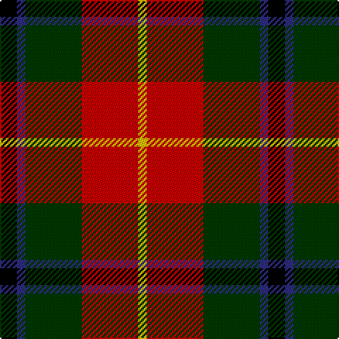

In pattern [KBGRY](/patterns/kbgry/).

This was sourced from register-of-tartans.  It is a [5 stripes tartan](/stripes/stripes5/).

Original link https://www.tartanregister.gov.uk/tartanDetails.aspx?ref=961

## Attestations

This cloth appears in 2 source records; the oldest owns this page.

- 01/01/1984 — Douglas of Roxburgh (register-of-tartans, [record](https://www.tartanregister.gov.uk/tartanDetails.aspx?ref=961))
- 1984 — Douglas of Roxburgh (Clan) (tartans-authority, [record](http://www.tartansauthority.com/tartan-ferret/display/4699/))

## Register references

External register numbers recorded for this tartan.

- Scottish Register of Tartans: [961](https://www.tartanregister.gov.uk/tartanDetails.aspx?ref=961)
- Scottish Tartans Authority (ITI): 4699

## Thread count
K/12 DB6 G40 R40 Y/6

## Palette
Each colour and its ΔE from the base-6 reference it is a variant of.

| Colour | Shade | Base | ΔE (OKLab) |
|---|---|---|---|
| DB | <code style="background-color:#2C2C80;">#2C2C80</code> `#2C2C80` | B <code style="background-color:#2A418A;">#2A418A</code> | 0.06 |
| G | <code style="background-color:#003800;">#003800</code> `#003800` | G <code style="background-color:#006100;">#006100</code> | 0.14 |
| K | <code style="background-color:#000000;">#000000</code> `#000000` | K <code style="background-color:#000000;">#000000</code> | 0.00 |
| R | <code style="background-color:#C80000;">#C80000</code> `#C80000` | R <code style="background-color:#CC0000;">#CC0000</code> | 0.01 |
| Y | <code style="background-color:#E8C000;">#E8C000</code> `#E8C000` | Y <code style="background-color:#F2BF00;">#F2BF00</code> | 0.02 |

# Sample pattern

## Nearest tartans

The nearest existing variants by ΔTartan distance.

1. [Sachie Hara Scottish Check (Personal)](/setts/s5/k5b4g24r21w3~b2c2c80-g006818-k101010-rc80000-wfcfcfc~x2/) — ΔT 1.05
1. [Caledonian Brewery Corporate Tartan Tartan Number: 2315. Earliest known date: pre 1997 Designed by Kinloch Anderson Ltd to commemorate the opening of the new Caledonian Brewery Malting Building. See products available Copyright © Blair Urquhart, Comrie, 2015](/setts/s7/w4k13g6r16wa2r2g2~g006818-k101010-r880000-wc0c0c0-waa8ace8~x2/) — ΔT 1.05
1. [Turnbull, dress](/setts/s5/k7b3g28r28y3~b304080-g008000-k000000-rc00000-yf0c000~x2/) — ΔT 1.22
1. [Turnbull Dress Clan Tartan Tartan Number: 1035. Earliest known date: 1979 An unusual dress tartan having no white. See products available Copyright © Blair Urquhart, Comrie, 2015](/setts/s5/k7b3g28r28y3~b2c2c80-g006818-k101010-rc80000-ye8c000~x2/) — ΔT 1.23
1. [Tyrolean (Fashion?)](/setts/s6/w3r22k18g10ga6y3~g006818-ga604000-k101010-rc80000-we0e0e0-ye8c000~x2/) — ΔT 1.24
1. [Aboyne II (Fashion)](/setts/s6/r2y1r5k4g5w1~g006818-k101010-rc80000-wfcfcfc-yfccc00~x4/) — ΔT 1.25
1. [Strathspey, Check](/setts/s6/g3r22b5g10k10g2~b5480b0-g008000-k000000-rc00000~x2/) — ΔT 1.30
1. [Craigmoor (Fashion)](/setts/s8/k1r7k2r1k2b1g3y1~b441800-g006818-k101010-rc80000-ye8c000~x4/) — ΔT 1.31
1. [Wolves Wod Kindred](/setts/s6/r2g2ra9k9ga2y2~g003c14-ga289c18-k101010-r888888-rac80000-yffe600~x4/) — ΔT 1.32
1. [Unidentified No 5](/setts/s8/k10y2g11r11w1r1w1k9~g005020-k101010-rdc0000-we0e0e0-ye8c000~x2/) — ΔT 1.32

## Neighbour map

Every grey dot is one of 15726 variants placed by the first two principal components of the ΔTartan feature space (44% of its variance). Red is this tartan; blue dots are its nearest — click one to open its page.

<svg viewBox="0 0 640 380" role="img" style="max-width:100%;height:auto;border:1px solid #e0e0e0;border-radius:4px;display:block" xmlns="http://www.w3.org/2000/svg"><image href="/nn/cloud.v1.png" width="640" height="380"/><a href="/setts/s5/k5b4g24r21w3~b2c2c80-g006818-k101010-rc80000-wfcfcfc~x2/"><circle cx="192.5" cy="203.0" r="4" fill="#3465a4"><title>Sachie Hara Scottish Check (Personal)</title></circle></a><a href="/setts/s7/w4k13g6r16wa2r2g2~g006818-k101010-r880000-wc0c0c0-waa8ace8~x2/"><circle cx="170.2" cy="188.1" r="4" fill="#3465a4"><title>Caledonian Brewery Corporate Tartan Tartan Number: 2315. Earliest known date: pre 1997 Designed by Kinloch Anderson Ltd to commemorate the opening of the new Caledonian Brewery Malting Building. See products available Copyright © Blair Urquhart, Comrie, 2015</title></circle></a><a href="/setts/s5/k7b3g28r28y3~b304080-g008000-k000000-rc00000-yf0c000~x2/"><circle cx="195.4" cy="191.4" r="4" fill="#3465a4"><title>Turnbull, dress</title></circle></a><a href="/setts/s5/k7b3g28r28y3~b2c2c80-g006818-k101010-rc80000-ye8c000~x2/"><circle cx="215.4" cy="198.0" r="4" fill="#3465a4"><title>Turnbull Dress Clan Tartan Tartan Number: 1035. Earliest known date: 1979 An unusual dress tartan having no white. See products available Copyright © Blair Urquhart, Comrie, 2015</title></circle></a><a href="/setts/s6/w3r22k18g10ga6y3~g006818-ga604000-k101010-rc80000-we0e0e0-ye8c000~x2/"><circle cx="108.1" cy="183.9" r="4" fill="#3465a4"><title>Tyrolean (Fashion?)</title></circle></a><a href="/setts/s6/r2y1r5k4g5w1~g006818-k101010-rc80000-wfcfcfc-yfccc00~x4/"><circle cx="112.0" cy="224.2" r="4" fill="#3465a4"><title>Aboyne II (Fashion)</title></circle></a><a href="/setts/s6/g3r22b5g10k10g2~b5480b0-g008000-k000000-rc00000~x2/"><circle cx="196.3" cy="196.7" r="4" fill="#3465a4"><title>Strathspey, Check</title></circle></a><a href="/setts/s8/k1r7k2r1k2b1g3y1~b441800-g006818-k101010-rc80000-ye8c000~x4/"><circle cx="190.3" cy="180.5" r="4" fill="#3465a4"><title>Craigmoor (Fashion)</title></circle></a><a href="/setts/s6/r2g2ra9k9ga2y2~g003c14-ga289c18-k101010-r888888-rac80000-yffe600~x4/"><circle cx="87.5" cy="193.6" r="4" fill="#3465a4"><title>Wolves Wod Kindred</title></circle></a><a href="/setts/s8/k10y2g11r11w1r1w1k9~g005020-k101010-rdc0000-we0e0e0-ye8c000~x2/"><circle cx="172.1" cy="171.2" r="4" fill="#3465a4"><title>Unidentified No 5</title></circle></a><circle cx="162.8" cy="211.7" r="5" fill="#c00000"/></svg>

ID: /setts/s5/k6b3g20r20y3~b2c2c80-g003800-k000000-rc80000-ye8c000~x2/
