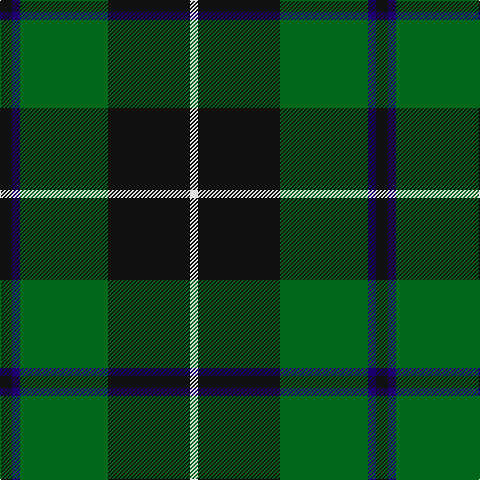

In pattern [KBGKW](/patterns/kbgkw/).

This was sourced from register-of-tartans.  It is a [5 stripes tartan](/stripes/stripes5/).

Original link https://www.tartanregister.gov.uk/tartanDetails.aspx?ref=956

## Thread count
K/12 DB8 G88 K82 LN/8

## Palette
Each colour and its ΔE from the base-6 reference it is a variant of.

| Colour | Shade | Base | ΔE (OKLab) |
|---|---|---|---|
| DB | <code style="background-color:#1C0070;">#1C0070</code> `#1C0070` | B <code style="background-color:#2A418A;">#2A418A</code> | 0.14 |
| G | <code style="background-color:#006818;">#006818</code> `#006818` | G <code style="background-color:#006100;">#006100</code> | 0.02 |
| K | <code style="background-color:#101010;">#101010</code> `#101010` | K <code style="background-color:#000000;">#000000</code> | 0.17 |
| LN | <code style="background-color:#E0E0E0;">#E0E0E0</code> `#E0E0E0` | W <code style="background-color:#F7F7F7;">#F7F7F7</code> | 0.07 |

# Sample pattern

## Nearest tartans

The nearest existing variants by ΔTartan distance.

1. [Raeside](/setts/s5/k6g4ga44k41w4x2~g289c18-ga006818-k101010-we0e0e0/) — ΔT 0.31
1. [Brooks Brothers (Corporate)](/setts/s4/r1g11k11y1x4~g006818-k101010-r880000-yd09800/) — ΔT 0.80
1. [Wcwm 1255](/setts/s5/g3r1k14g14y1x4~g006818-k101010-r880000-yd09800/) — ΔT 0.87
1. [MacArthur (Variant)](/setts/s6/r3g30k12g6k16y2x2~g006818-k101010-rc80000-ye8c000/) — ΔT 0.96
1. [Douglas (Clan)](/setts/s5/k6b4g44k41w4x2~b20007c-g005030-k101010-we0e0e0/) — ΔT 1.03
1. [MacIntyre L](/setts/s6/g4b12r3b12g32w4~b000064-g004c00-rc80000-wd0d0d0/) — ΔT 1.07
1. [MacIntyre Hunting (VS)](/setts/s6/g4b12r3b12g32w4x2~b202060-g006818-rc80000-wfcfcfc/) — ΔT 1.13
1. [Michaluk (Personal)](/setts/s6/k3b4g20k20g3y3x4~b1474b4-g408060-k101010-ybc8c00/) — ΔT 1.22
1. [Page](/setts/s7/g46k18g6k13r4k4w4x2~g004810-k101010-rc80000-we0e0e0/) — ΔT 1.22
1. [MacIntyre LC](/setts/s6/g4b12r3b12g32y4x2~b000052-g11450d-raa0000-yaaaaaa/) — ΔT 1.24

## Neighbour map

Every grey dot is one of 15726 variants placed by the first two principal components of the ΔTartan feature space (44% of its variance). Red is this tartan; blue dots are its nearest — click one to open its page.

<svg viewBox="0 0 640 380" role="img" style="max-width:100%;height:auto;border:1px solid #e0e0e0;border-radius:4px;display:block" xmlns="http://www.w3.org/2000/svg"><image href="/nn/cloud.v1.png" width="640" height="380"/><a href="/setts/s5/k6g4ga44k41w4x2~g289c18-ga006818-k101010-we0e0e0/"><circle cx="286.5" cy="220.7" r="4" fill="#3465a4"><title>Raeside</title></circle></a><a href="/setts/s4/r1g11k11y1x4~g006818-k101010-r880000-yd09800/"><circle cx="293.8" cy="243.5" r="4" fill="#3465a4"><title>Brooks Brothers (Corporate)</title></circle></a><a href="/setts/s5/g3r1k14g14y1x4~g006818-k101010-r880000-yd09800/"><circle cx="335.1" cy="221.7" r="4" fill="#3465a4"><title>Wcwm 1255</title></circle></a><a href="/setts/s6/r3g30k12g6k16y2x2~g006818-k101010-rc80000-ye8c000/"><circle cx="316.8" cy="213.2" r="4" fill="#3465a4"><title>MacArthur (Variant)</title></circle></a><a href="/setts/s5/k6b4g44k41w4x2~b20007c-g005030-k101010-we0e0e0/"><circle cx="315.0" cy="232.4" r="4" fill="#3465a4"><title>Douglas (Clan)</title></circle></a><a href="/setts/s6/g4b12r3b12g32w4~b000064-g004c00-rc80000-wd0d0d0/"><circle cx="298.0" cy="217.8" r="4" fill="#3465a4"><title>MacIntyre L</title></circle></a><a href="/setts/s6/g4b12r3b12g32w4x2~b202060-g006818-rc80000-wfcfcfc/"><circle cx="292.2" cy="211.3" r="4" fill="#3465a4"><title>MacIntyre Hunting (VS)</title></circle></a><a href="/setts/s6/k3b4g20k20g3y3x4~b1474b4-g408060-k101010-ybc8c00/"><circle cx="230.8" cy="226.8" r="4" fill="#3465a4"><title>Michaluk (Personal)</title></circle></a><a href="/setts/s7/g46k18g6k13r4k4w4x2~g004810-k101010-rc80000-we0e0e0/"><circle cx="341.5" cy="207.2" r="4" fill="#3465a4"><title>Page</title></circle></a><a href="/setts/s6/g4b12r3b12g32y4x2~b000052-g11450d-raa0000-yaaaaaa/"><circle cx="319.1" cy="226.1" r="4" fill="#3465a4"><title>MacIntyre LC</title></circle></a><circle cx="290.1" cy="222.1" r="5" fill="#c00000"/></svg>

ID: /setts/s5/k6b4g44k41w4x2~b1c0070-g006818-k101010-we0e0e0/
