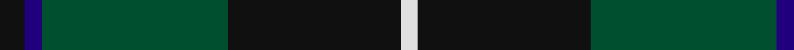

In pattern [KBGKW](/patterns/kbgkw/).

This was sourced from tartans-authority.  It is a [5 stripes tartan](/stripes/stripes5/).

Original link http://www.tartansauthority.com/tartan-ferret/display/1032/

## Thread count
K/12 DB8 G88 K82 LN/8

## Palette
Each colour and its ΔE from the base-6 reference it is a variant of.

| Colour | Shade | Base | ΔE (OKLab) |
|---|---|---|---|
| DB | <code style="background-color:#20007C;">#20007C</code> `#20007C` | B <code style="background-color:#2A418A;">#2A418A</code> | 0.13 |
| G | <code style="background-color:#005030;">#005030</code> `#005030` | G <code style="background-color:#006100;">#006100</code> | 0.08 |
| K | <code style="background-color:#101010;">#101010</code> `#101010` | K <code style="background-color:#000000;">#000000</code> | 0.17 |
| LN | <code style="background-color:#E0E0E0;">#E0E0E0</code> `#E0E0E0` | W <code style="background-color:#F7F7F7;">#F7F7F7</code> | 0.07 |

# Sample pattern

## Nearest tartans

The nearest existing variants by ΔTartan distance.

1. [MacIntyre LC](/setts/s6/g4b12r3b12g32y4x2~b000052-g11450d-raa0000-yaaaaaa/) — ΔT 0.82
1. [MacIntyre LC](/setts/s6/g4b12r3b12g32y4~b000052-g11450d-raa0000-yaaaaaa/) — ΔT 0.82
1. [St. Andrews Old Course Hotel (Corp)](/setts/s6/g26b10k3b2ga2b10x4~b1c0070-g006818-ga604000-k101010/) — ΔT 1.01
1. [Douglas (alternative threadcount)](/setts/s5/k6b4g44k41w4x2~b1c0070-g006818-k101010-we0e0e0/) — ΔT 1.03
1. [MacIntyre](/setts/s6/g4b12r3b12g32w4x2~b304080-g004010-rc00000-we0e0e0/) — ΔT 1.04
1. [Tolmie](/setts/s5/k8y1k8g13r2x4~g005020-k101010-rff0000-yd87c00/) — ΔT 1.14
1. [Page](/setts/s7/g46k18g6k13r4k4w4x2~g004810-k101010-rc80000-we0e0e0/) — ΔT 1.16
1. [Brooks Brothers (Corporate)](/setts/s4/r1g11k11y1x4~g006818-k101010-r880000-yd09800/) — ΔT 1.16
1. [Rowan (Personal)](/setts/s5/g12y1b8k1b1x4~b2c2c80-g006818-k101010-yd09800/) — ΔT 1.17
1. [Wcwm 1255](/setts/s5/g3r1k14g14y1x4~g006818-k101010-r880000-yd09800/) — ΔT 1.21

## Neighbour map

Every grey dot is one of 15726 variants placed by the first two principal components of the ΔTartan feature space (44% of its variance). Red is this tartan; blue dots are its nearest — click one to open its page.

<svg viewBox="0 0 640 380" role="img" style="max-width:100%;height:auto;border:1px solid #e0e0e0;border-radius:4px;display:block" xmlns="http://www.w3.org/2000/svg"><image href="/nn/cloud.v1.png" width="640" height="380"/><a href="/setts/s6/g4b12r3b12g32y4x2~b000052-g11450d-raa0000-yaaaaaa/"><circle cx="319.1" cy="226.1" r="4" fill="#3465a4"><title>MacIntyre LC</title></circle></a><a href="/setts/s6/g4b12r3b12g32y4~b000052-g11450d-raa0000-yaaaaaa/"><circle cx="319.1" cy="226.1" r="4" fill="#3465a4"><title>MacIntyre LC</title></circle></a><a href="/setts/s6/g26b10k3b2ga2b10x4~b1c0070-g006818-ga604000-k101010/"><circle cx="312.4" cy="214.2" r="4" fill="#3465a4"><title>St. Andrews Old Course Hotel (Corp)</title></circle></a><a href="/setts/s5/k6b4g44k41w4x2~b1c0070-g006818-k101010-we0e0e0/"><circle cx="290.1" cy="222.1" r="4" fill="#3465a4"><title>Douglas (alternative threadcount)</title></circle></a><a href="/setts/s6/g4b12r3b12g32w4x2~b304080-g004010-rc00000-we0e0e0/"><circle cx="320.7" cy="223.1" r="4" fill="#3465a4"><title>MacIntyre</title></circle></a><a href="/setts/s5/k8y1k8g13r2x4~g005020-k101010-rff0000-yd87c00/"><circle cx="305.4" cy="243.6" r="4" fill="#3465a4"><title>Tolmie</title></circle></a><a href="/setts/s7/g46k18g6k13r4k4w4x2~g004810-k101010-rc80000-we0e0e0/"><circle cx="341.5" cy="207.2" r="4" fill="#3465a4"><title>Page</title></circle></a><a href="/setts/s4/r1g11k11y1x4~g006818-k101010-r880000-yd09800/"><circle cx="293.8" cy="243.5" r="4" fill="#3465a4"><title>Brooks Brothers (Corporate)</title></circle></a><a href="/setts/s5/g12y1b8k1b1x4~b2c2c80-g006818-k101010-yd09800/"><circle cx="337.4" cy="222.7" r="4" fill="#3465a4"><title>Rowan (Personal)</title></circle></a><a href="/setts/s5/g3r1k14g14y1x4~g006818-k101010-r880000-yd09800/"><circle cx="335.1" cy="221.7" r="4" fill="#3465a4"><title>Wcwm 1255</title></circle></a><circle cx="315.0" cy="232.4" r="5" fill="#c00000"/></svg>

ID: /setts/s5/k6b4g44k41w4x2~b20007c-g005030-k101010-we0e0e0/
