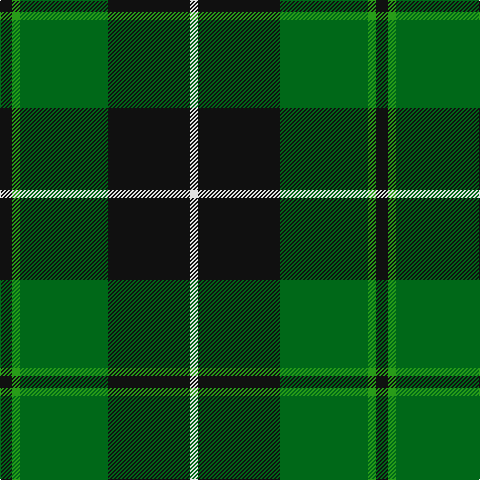

In pattern [KGGKW](/stripes/kggkw/).

This was sourced from register-of-tartans.  It is a [5 stripe tartan](/stripes/stripes5/).

Original link https://www.tartanregister.gov.uk/tartanDetails.aspx?ref=3437

## Attestations

This cloth appears in 2 source records; the oldest owns this page.

- 01/01/2005 — Raeside (register-of-tartans, [record](https://www.tartanregister.gov.uk/tartanDetails.aspx?ref=3437))
- 2005 — Raeside (Name) (tartans-authority, [record](http://www.tartansauthority.com/tartan-ferret/display/6633/))

## Register references

External register numbers recorded for this tartan.

- Scottish Register of Tartans: [3437](https://www.tartanregister.gov.uk/tartanDetails.aspx?ref=3437)
- Scottish Tartans Authority (ITI): 6633

## Thread count
K/12 Ga8 G88 K82 LN/8

## Palette
Each colour and its ΔE from the base-6 reference it is a variant of.

| Colour | Shade | Base | ΔE (OKLab) |
|---|---|---|---|
| G | <code style="background-color:#006818;">#006818</code> `#006818` | G <code style="background-color:#006100;">#006100</code> | 0.02 |
| Ga | <code style="background-color:#289C18;">#289C18</code> `#289C18` | G <code style="background-color:#006100;">#006100</code> | 0.19 |
| K | <code style="background-color:#101010;">#101010</code> `#101010` | K <code style="background-color:#000000;">#000000</code> | 0.17 |
| LN | <code style="background-color:#E0E0E0;">#E0E0E0</code> `#E0E0E0` | W <code style="background-color:#F7F7F7;">#F7F7F7</code> | 0.07 |

# Sample pattern

## Nearest tartans

The nearest existing variants by ΔTartan distance.

1. [Douglas (alternative threadcount)](/setts/s5/k6db4g44k41w4~x2/) — ΔT 0.31
1. [Brooks Brothers (Corporate)](/setts/s4/r1g11k11lo1~x4/) — ΔT 0.82
1. [Wcwm 1255](/setts/s5/g3r1k14g14lo1~x4/) — ΔT 0.85
1. [MacArthur (Variant)](/setts/s6/r3g30k12g6k16ly2~x2/) — ΔT 0.88
1. [MacIntyre Hunting (VS)](/setts/s6/g4db12r3db12g32w4~x2/) — ΔT 1.17
1. [Hartmann (Personal)](/setts/s8/k4g32k4g4k8w3k8t4~x2/) — ΔT 1.21
1. [MacAulay of Lewis](/setts/s8/g6k16r3k16g28k4g12w3~x2/) — ΔT 1.26
1. [MacIntyre L](/setts/s6/dg4db12r3db12dg32lb4/) — ΔT 1.26
1. [Wilson's No.079](/setts/s4/k7w1g7t1~x2/) — ΔT 1.26
1. [Brunton (Personal)](/setts/s8/k7r3k27g27ly3g3ly3g3~x2/) — ΔT 1.26

## Neighbour map

Every grey dot is one of 14299 variants placed by the first two principal components of the ΔTartan feature space (44% of its variance). Red is this tartan; blue dots are its nearest — click one to open its page.

<svg viewBox="0 0 640 380" role="img" style="max-width:100%;height:auto;border:1px solid #e0e0e0;border-radius:4px;display:block" xmlns="http://www.w3.org/2000/svg"><image href="/nn/cloud.v1.png" width="640" height="380"/><a href="/setts/s5/k6db4g44k41w4~x2/"><circle cx="293.3" cy="222.6" r="4" fill="#3465a4"><title>Douglas (alternative threadcount)</title></circle></a><a href="/setts/s4/r1g11k11lo1~x4/"><circle cx="296.6" cy="244.7" r="4" fill="#3465a4"><title>Brooks Brothers (Corporate)</title></circle></a><a href="/setts/s5/g3r1k14g14lo1~x4/"><circle cx="337.7" cy="223.3" r="4" fill="#3465a4"><title>Wcwm 1255</title></circle></a><a href="/setts/s6/r3g30k12g6k16ly2~x2/"><circle cx="319.5" cy="213.9" r="4" fill="#3465a4"><title>MacArthur (Variant)</title></circle></a><a href="/setts/s6/g4db12r3db12g32w4~x2/"><circle cx="295.2" cy="210.9" r="4" fill="#3465a4"><title>MacIntyre Hunting (VS)</title></circle></a><a href="/setts/s8/k4g32k4g4k8w3k8t4~x2/"><circle cx="305.3" cy="190.7" r="4" fill="#3465a4"><title>Hartmann (Personal)</title></circle></a><a href="/setts/s8/g6k16r3k16g28k4g12w3~x2/"><circle cx="280.1" cy="221.8" r="4" fill="#3465a4"><title>MacAulay of Lewis</title></circle></a><a href="/setts/s6/dg4db12r3db12dg32lb4/"><circle cx="301.3" cy="218.4" r="4" fill="#3465a4"><title>MacIntyre L</title></circle></a><a href="/setts/s4/k7w1g7t1~x2/"><circle cx="222.0" cy="251.2" r="4" fill="#3465a4"><title>Wilson's No.079</title></circle></a><a href="/setts/s8/k7r3k27g27ly3g3ly3g3~x2/"><circle cx="252.2" cy="188.7" r="4" fill="#3465a4"><title>Brunton (Personal)</title></circle></a><circle cx="289.7" cy="220.9" r="5" fill="#c00000"/></svg>

ID: /setts/s5/k6g4g44k41w4~x2/
