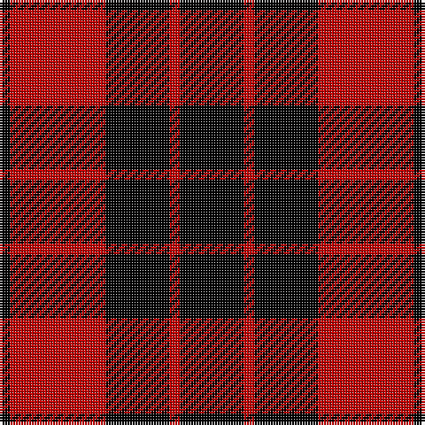

In pattern [KRKRK](/stripes/krkrk/).

This was sourced from weddslist.  It is a [5 stripe tartan](/stripes/stripes5/).

Original link http://www.weddslist.com/cgi-bin/tartans/pg.pl?source=sts

## Attestations

This cloth appears in 2 source records; the oldest owns this page.

- undated — MacLeod of Raasay (weddslist, [record](http://www.weddslist.com/cgi-bin/tartans/pg.pl?source=sts))
- undated — MacLeod of Raasay Clan Tartan Tartan Number: 1172. Earliest known date: c.1815-20 The thread count given is from the Provost MacBean Collection sample, which is very similar to to the sample in the collection of the Highland Society of London: K2 R18 K12 R2 K16. The design seems likely to be derived from the Vestiarium Scoticum, and would therefore be later than 1829. See products available Copyright © Blair Urquhart, Comrie, 2015 (house-of-tartan, [record](http://www.house-of-tartan.scotland.net/house/TartanViewjs.asp?colr=Def&tnam=1172))

## Thread count
K/24 R4 K24 R36 K/4

## Palette
Each colour and the base-6 reference it is a variant of.

| Colour | Shade | Base |
|---|---|---|
| K | <code style="background-color:#000000;">#000000</code> `oklch(0.0% 0.000 0.0)` <small>#000000</small> | K <code style="background-color:#000000;">#000000</code> |
| R | <code style="background-color:#C00000;">#C00000</code> `oklch(50.7% 0.208 29.2)` <small>#C00000</small> | R <code style="background-color:#CC0000;">#CC0000</code> |

# Sample pattern

## Nearest tartans

The nearest existing variants by ΔTartan distance, with this tartan at the top so the swatches line up against it.

ΔTartan

Tartan

Sett

—

<a href="/ttd/edit/#slug=k6r1k6r9k1~x4">MacLeod of Raasay</a> <a class="nn-out" href="/setts/s5/k6r1k6r9k1~x4/" title="open its dictionary page">↗</a>

0.68

<a href="/setts/s4/k67r32k6/">Lendrum, or MacFarlane</a>

1.15

<a href="/ttd/edit/#slug=k6r31k31r6~x2">Ettrick</a> <a class="nn-out" href="/setts/s4/k6r31k31r6~x2/" title="open its dictionary page">↗</a>

1.16

<a href="/ttd/edit/#slug=k2r6k2r6k12ly1~x2">MacQueen</a> <a class="nn-out" href="/setts/s6/k2r6k2r6k12ly1~x2/" title="open its dictionary page">↗</a>

1.17

<a href="/ttd/edit/#slug=r4k1r12k12r2~x2">Campbell of Armaddie</a> <a class="nn-out" href="/setts/s5/r4k1r12k12r2~x2/" title="open its dictionary page">↗</a>

1.22

<a href="/ttd/edit/#slug=k13r2k13r19k2~x2">MacLeod of Raasay (Highland Society of London)</a> <a class="nn-out" href="/setts/s5/k13r2k13r19k2~x2/" title="open its dictionary page">↗</a>

1.22

<a href="/ttd/edit/#slug=k18r4k18r32lr3~x2">Munro VS</a> <a class="nn-out" href="/setts/s5/k18r4k18r32lr3~x2/" title="open its dictionary page">↗</a>

1.22

<a href="/ttd/edit/#slug=k18r4k18r32lr3">Munro VS</a> <a class="nn-out" href="/setts/s5/k18r4k18r32lr3/" title="open its dictionary page">↗</a>

1.31

<a href="/ttd/edit/#slug=k1r8k8ly1~x2">Wallace</a> <a class="nn-out" href="/setts/s4/k1r8k8ly1~x2/" title="open its dictionary page">↗</a>

1.35

<a href="/ttd/edit/#slug=k18r4k18r32lb3">Munro VS</a> <a class="nn-out" href="/setts/s5/k18r4k18r32lb3/" title="open its dictionary page">↗</a>

1.38

<a href="/ttd/edit/#slug=k2r1k6r6k1r1k1~x4">Campbell of Lochlane</a> <a class="nn-out" href="/setts/s7/k2r1k6r6k1r1k1~x4/" title="open its dictionary page">↗</a>

## Neighbour map

Every grey dot is one of 14299 variants placed by the first two principal components of the ΔTartan feature space (44% of its variance). Red is this tartan; blue dots are its nearest — click one to open its page.

<svg viewBox="0 0 640 380" role="img" style="max-width:100%;height:auto;border:1px solid #e0e0e0;border-radius:4px;display:block" xmlns="http://www.w3.org/2000/svg"><image href="/nn/cloud.v1.png" width="640" height="380"/><a href="/setts/s4/k67r32k6/"><circle cx="343.1" cy="263.8" r="4" fill="#3465a4"><title>Lendrum, or MacFarlane</title></circle></a><a href="/setts/s4/k6r31k31r6~x2/"><circle cx="307.8" cy="284.2" r="4" fill="#3465a4"><title>Ettrick</title></circle></a><a href="/setts/s6/k2r6k2r6k12ly1~x2/"><circle cx="324.5" cy="212.7" r="4" fill="#3465a4"><title>MacQueen</title></circle></a><a href="/setts/s5/r4k1r12k12r2~x2/"><circle cx="373.8" cy="229.8" r="4" fill="#3465a4"><title>Campbell of Armaddie</title></circle></a><a href="/setts/s5/k13r2k13r19k2~x2/"><circle cx="373.7" cy="261.7" r="4" fill="#3465a4"><title>MacLeod of Raasay (Highland Society of London)</title></circle></a><a href="/setts/s5/k18r4k18r32lr3~x2/"><circle cx="296.9" cy="232.4" r="4" fill="#3465a4"><title>Munro VS</title></circle></a><a href="/setts/s5/k18r4k18r32lr3/"><circle cx="296.9" cy="232.4" r="4" fill="#3465a4"><title>Munro VS</title></circle></a><a href="/setts/s4/k1r8k8ly1~x2/"><circle cx="296.4" cy="245.8" r="4" fill="#3465a4"><title>Wallace</title></circle></a><a href="/setts/s5/k18r4k18r32lb3/"><circle cx="289.3" cy="225.1" r="4" fill="#3465a4"><title>Munro VS</title></circle></a><a href="/setts/s7/k2r1k6r6k1r1k1~x4/"><circle cx="355.8" cy="257.4" r="4" fill="#3465a4"><title>Campbell of Lochlane</title></circle></a><circle cx="348.3" cy="259.3" r="5" fill="#c00000"/></svg>

ID: /setts/s5/k6r1k6r9k1~x4/
