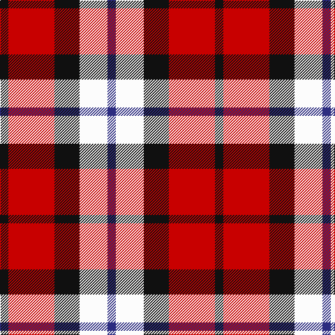

In pattern [BWKRK](/stripes/bwkrk/).

This was sourced from register-of-tartans.  It is a [5 stripe tartan](/stripes/stripes5/).

Original link https://www.tartanregister.gov.uk/tartanDetails.aspx?ref=371

## Register references

External register numbers recorded for this tartan.

- Scottish Register of Tartans: [371](https://www.tartanregister.gov.uk/tartanDetails.aspx?ref=371)
- Scottish Tartans Authority (ITI): 6283

## Thread count
K/12 R66 K36 W40 DB/12

## Palette
Each colour and the base-6 reference it is a variant of.

| Colour | Shade | Base |
|---|---|---|
| DB | <code style="background-color:#2C2C80;">#2C2C80</code> `oklch(35.0% 0.138 276.6)` <small>#2C2C80</small> | B <code style="background-color:#2A418A;">#2A418A</code> |
| K | <code style="background-color:#101010;">#101010</code> `oklch(17.3% 0.000 89.9)` <small>#101010</small> | K <code style="background-color:#000000;">#000000</code> |
| R | <code style="background-color:#C80000;">#C80000</code> `oklch(52.3% 0.215 29.2)` <small>#C80000</small> | R <code style="background-color:#CC0000;">#CC0000</code> |
| W | <code style="background-color:#FCFCFC;">#FCFCFC</code> `oklch(99.1% 0.000 89.9)` <small>#FCFCFC</small> | W <code style="background-color:#F7F7F7;">#F7F7F7</code> |

# Sample pattern

## Nearest tartans

The nearest existing variants by ΔTartan distance.

1. [SAL Cubiska Stenen](/setts/s5/r15g3w2k10w5~x2/) — ΔT 0.96
1. [Aberdeen University (1992)](/setts/s5/ly4r27k12db15ly4~x2/) — ΔT 1.13
1. [Hamby Sport (Personal)](/setts/s4/r25k13w8db5~x2/) — ΔT 1.19
1. [Aberdeen University](/setts/s5/ly2r15k7db8ly2~x4/) — ΔT 1.21
1. [Clark](/setts/s5/r3k1dg1k1lb3~x4/) — ΔT 1.25
1. [Thomas Newcomen's Combustion Engine](/setts/s4/k7r5w3db2~x4/) — ΔT 1.33
1. [SAL Glindrande Stiernan](/setts/s4/r3g1k3w1~x20/) — ΔT 1.34
1. [Common Ground (Dress)](/setts/s5/w3r27w16db27ly3~x2/) — ΔT 1.36
1. [Wallace Dress, Red (Dance)](/setts/s5/k3r28k10w28t3~x2/) — ΔT 1.38
1. [Abbink, Ingmar (Personal)](/setts/s5/r39t22k11ly22g5~x2/) — ΔT 1.39

## Neighbour map

Every grey dot is one of 14299 variants placed by the first two principal components of the ΔTartan feature space (44% of its variance). Red is this tartan; blue dots are its nearest — click one to open its page.

<svg viewBox="0 0 640 380" role="img" style="max-width:100%;height:auto;border:1px solid #e0e0e0;border-radius:4px;display:block" xmlns="http://www.w3.org/2000/svg"><image href="/nn/cloud.v1.png" width="640" height="380"/><a href="/setts/s5/r15g3w2k10w5~x2/"><circle cx="166.1" cy="205.8" r="4" fill="#3465a4"><title>SAL Cubiska Stenen</title></circle></a><a href="/setts/s5/ly4r27k12db15ly4~x2/"><circle cx="188.0" cy="222.2" r="4" fill="#3465a4"><title>Aberdeen University (1992)</title></circle></a><a href="/setts/s4/r25k13w8db5~x2/"><circle cx="195.6" cy="244.9" r="4" fill="#3465a4"><title>Hamby Sport (Personal)</title></circle></a><a href="/setts/s5/ly2r15k7db8ly2~x4/"><circle cx="185.9" cy="213.6" r="4" fill="#3465a4"><title>Aberdeen University</title></circle></a><a href="/setts/s5/r3k1dg1k1lb3~x4/"><circle cx="74.4" cy="254.3" r="4" fill="#3465a4"><title>Clark</title></circle></a><a href="/setts/s4/k7r5w3db2~x4/"><circle cx="104.9" cy="271.3" r="4" fill="#3465a4"><title>Thomas Newcomen's Combustion Engine</title></circle></a><a href="/setts/s4/r3g1k3w1~x20/"><circle cx="103.2" cy="269.4" r="4" fill="#3465a4"><title>SAL Glindrande Stiernan</title></circle></a><a href="/setts/s5/w3r27w16db27ly3~x2/"><circle cx="149.6" cy="201.8" r="4" fill="#3465a4"><title>Common Ground (Dress)</title></circle></a><a href="/setts/s5/k3r28k10w28t3~x2/"><circle cx="183.6" cy="185.9" r="4" fill="#3465a4"><title>Wallace Dress, Red (Dance)</title></circle></a><a href="/setts/s5/r39t22k11ly22g5~x2/"><circle cx="130.8" cy="203.4" r="4" fill="#3465a4"><title>Abbink, Ingmar (Personal)</title></circle></a><circle cx="136.0" cy="223.9" r="5" fill="#c00000"/></svg>

ID: /setts/s5/k6r33k18w20db6~x2/
