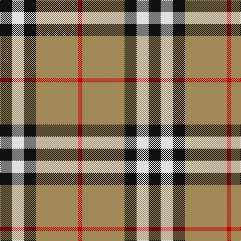

**Bands:** [KWKYR](/stripes/kwkyr/) · **Stripes:** [K W K LO R](/stripes/stripes5/) K W K LO R

This was sourced from house-of-tartan.  It is a [5 band tartan](/bands/bands5/).

Original link http://www.house-of-tartan.scotland.net/house/TartanViewjs.asp?colr=Def&tnam=1239

## Also known as

This cloth is also recorded under:

- Burberry, Check

## Thread count
K/24 LN24 K24 LT84 R/8

## Palette
Each colour and its ΔE from the base-6 reference it is a variant of.

| Colour | Shade | Base | ΔE (OKLab) |
|---|---|---|---|
| K | <code style="background-color:#101010;">#101010</code> `#101010` | K <code style="background-color:#000000;">#000000</code> | 0.17 |
| LN | <code style="background-color:#E0E0E0;">#E0E0E0</code> `#E0E0E0` | W <code style="background-color:#F7F7F7;">#F7F7F7</code> | 0.07 |
| LT | <code style="background-color:#A08858;">#A08858</code> `#A08858` | Y <code style="background-color:#F2BF00;">#F2BF00</code> | 0.21 |
| R | <code style="background-color:#C80000;">#C80000</code> `#C80000` | R <code style="background-color:#CC0000;">#CC0000</code> | 0.01 |

# Sample pattern

## Nearest tartans

The nearest existing variants by ΔTartan distance.

1. [Burberry (Genuine)](/setts/s5/k3w3k3ly10r1~x6/) — ΔT 0.54
1. [Thomson Camel](/setts/s6/r4lo30k6w13k13w3~x2/) — ΔT 0.90
1. [Ikelman No 2](/setts/s5/y26k10r10ly10y3~x2/) — ΔT 0.92
1. [Downside (Corporate)](/setts/s6/r4o41k5w14k18r4~x2/) — ΔT 0.96
1. [Thomson Camel (Jedburgh Mill)](/setts/s6/r4k2lb10k10y28k3~x2/) — ΔT 0.96
1. [Oban Grey (Fashion)](/setts/s5/k4lb4k4o15r2~x4/) — ΔT 1.00
1. [Burberry, Check](/setts/s5/k6w6k6o21r2~x4/) — ΔT 1.05
1. [Thompson Camel Clan Tartan Tartan Number: 2421. Earliest known date: 1967 Designed by Scotty Thompson. It it a simple colour variation on the usual blue Thompson, but is often confused with the Burberry Check. See products available Copyright © Blair Urquhart, Comrie, 2015](/setts/s6/r2lo20k5w10k10w2~x2/) — ΔT 1.07
1. [Thomson, Camel (Fashion)](/setts/s6/r4ly30k6w13k13w3~x2/) — ΔT 1.07
1. [Burberry Hunting](/setts/s5/k3w3k3y10r1~x6/) — ΔT 1.09

## Neighbour map

Every grey dot is one of 14299 variants placed by the first two principal components of the ΔTartan feature space (44% of its variance). Red is this tartan; blue dots are its nearest — click one to open its page.

<svg viewBox="0 0 640 380" role="img" style="max-width:100%;height:auto;border:1px solid #e0e0e0;border-radius:4px;display:block" xmlns="http://www.w3.org/2000/svg"><image href="/nn/cloud.v1.png" width="640" height="380"/><a href="/setts/s5/k3w3k3ly10r1~x6/"><circle cx="223.6" cy="194.8" r="4" fill="#3465a4"><title>Burberry (Genuine)</title></circle></a><a href="/setts/s6/r4lo30k6w13k13w3~x2/"><circle cx="190.6" cy="186.9" r="4" fill="#3465a4"><title>Thomson Camel</title></circle></a><a href="/setts/s5/y26k10r10ly10y3~x2/"><circle cx="200.0" cy="215.3" r="4" fill="#3465a4"><title>Ikelman No 2</title></circle></a><a href="/setts/s6/r4o41k5w14k18r4~x2/"><circle cx="224.3" cy="181.7" r="4" fill="#3465a4"><title>Downside (Corporate)</title></circle></a><a href="/setts/s6/r4k2lb10k10y28k3~x2/"><circle cx="261.2" cy="176.9" r="4" fill="#3465a4"><title>Thomson Camel (Jedburgh Mill)</title></circle></a><a href="/setts/s5/k4lb4k4o15r2~x4/"><circle cx="242.6" cy="217.8" r="4" fill="#3465a4"><title>Oban Grey (Fashion)</title></circle></a><a href="/setts/s5/k6w6k6o21r2~x4/"><circle cx="239.9" cy="196.7" r="4" fill="#3465a4"><title>Burberry, Check</title></circle></a><a href="/setts/s6/r2lo20k5w10k10w2~x2/"><circle cx="176.4" cy="189.9" r="4" fill="#3465a4"><title>Thompson Camel Clan Tartan Tartan Number: 2421. Earliest known date: 1967 Designed by Scotty Thompson. It it a simple colour variation on the usual blue Thompson, but is often confused with the Burberry Check. See products available Copyright © Blair Urquhart, Comrie, 2015</title></circle></a><a href="/setts/s6/r4ly30k6w13k13w3~x2/"><circle cx="185.9" cy="183.4" r="4" fill="#3465a4"><title>Thomson, Camel (Fashion)</title></circle></a><a href="/setts/s5/k3w3k3y10r1~x6/"><circle cx="232.2" cy="210.5" r="4" fill="#3465a4"><title>Burberry Hunting</title></circle></a><circle cx="244.9" cy="197.7" r="5" fill="#c00000"/></svg>

ID: /setts/s5/k6w6k6lo21r2~x4/
