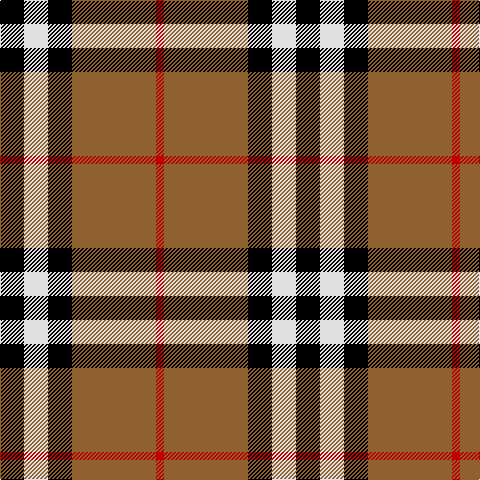

In pattern [KWKRR](/stripes/kwkrr/).

This was sourced from weddslist.  It is a [5 stripe tartan](/stripes/stripes5/).

Original link http://www.weddslist.com/cgi-bin/tartans/pg.pl?source=sts

## Also known as

This cloth is also recorded under:

- Burberry, Check

## Thread count
K/24 LN24 K24 LT84 R/8

## Palette
Each colour and the base-6 reference it is a variant of.

| Colour | Shade | Base |
|---|---|---|
| K | <code style="background-color:#000000;">#000000</code> `oklch(0.0% 0.000 0.0)` <small>#000000</small> | K <code style="background-color:#000000;">#000000</code> |
| LN | <code style="background-color:#E0E0E0;">#E0E0E0</code> `oklch(90.7% 0.000 89.9)` <small>#E0E0E0</small> | W <code style="background-color:#F7F7F7;">#F7F7F7</code> |
| LT | <code style="background-color:#906030;">#906030</code> `oklch(53.1% 0.089 63.7)` <small>#906030</small> | R <code style="background-color:#CC0000;">#CC0000</code> |
| R | <code style="background-color:#C00000;">#C00000</code> `oklch(50.7% 0.208 29.2)` <small>#C00000</small> | R <code style="background-color:#CC0000;">#CC0000</code> |

# Sample pattern

## Nearest tartans

The nearest existing variants by ΔTartan distance.

1. [Oklahoma State University](/setts/s4/o80k52w7o12/) — ΔT 0.92
1. [Thom(p)son camel](/setts/s6/r4o30k6w13k13w3~x2/) — ΔT 1.04
1. [Wcwm 759-3](/setts/s6/lb5o34k24o4r24o4~x2/) — ΔT 1.05
1. [Burberry Check Corporate Tartan Tartan Number: 1239. Earliest known date: 1984 Nothing See products available Copyright © Blair Urquhart, Comrie, 2015](/setts/s5/k6w6k6lo21r2~x4/) — ΔT 1.05
1. [Greystone (Burberry Grey)](/setts/s5/k3lb3k3n10r1~x6/) — ΔT 1.05
1. [MacMillan Varient (Unidentified)](/setts/s6/k3ly18dg6r17k31dg3~x2/) — ΔT 1.08
1. [British Hills](/setts/s5/r2dg17r8db8ly2~x4/) — ΔT 1.14
1. [Loch Ness](/setts/s6/r10w2k10w10o35k5~x2/) — ΔT 1.17
1. [Ikelman No 2](/setts/s5/y26k10r10ly10y3~x2/) — ΔT 1.17
1. [Loch Ness](/setts/s6/r10w2k10w10dy35k5~x2/) — ΔT 1.18

## Neighbour map

Every grey dot is one of 14299 variants placed by the first two principal components of the ΔTartan feature space (44% of its variance). Red is this tartan; blue dots are its nearest — click one to open its page.

<svg viewBox="0 0 640 380" role="img" style="max-width:100%;height:auto;border:1px solid #e0e0e0;border-radius:4px;display:block" xmlns="http://www.w3.org/2000/svg"><image href="/nn/cloud.v1.png" width="640" height="380"/><a href="/setts/s4/o80k52w7o12/"><circle cx="264.6" cy="199.0" r="4" fill="#3465a4"><title>Oklahoma State University</title></circle></a><a href="/setts/s6/r4o30k6w13k13w3~x2/"><circle cx="185.0" cy="187.3" r="4" fill="#3465a4"><title>Thom(p)son camel</title></circle></a><a href="/setts/s6/lb5o34k24o4r24o4~x2/"><circle cx="190.9" cy="202.0" r="4" fill="#3465a4"><title>Wcwm 759-3</title></circle></a><a href="/setts/s5/k6w6k6lo21r2~x4/"><circle cx="244.9" cy="197.7" r="4" fill="#3465a4"><title>Burberry Check Corporate Tartan Tartan Number: 1239. Earliest known date: 1984 Nothing See products available Copyright © Blair Urquhart, Comrie, 2015</title></circle></a><a href="/setts/s5/k3lb3k3n10r1~x6/"><circle cx="231.0" cy="209.1" r="4" fill="#3465a4"><title>Greystone (Burberry Grey)</title></circle></a><a href="/setts/s6/k3ly18dg6r17k31dg3~x2/"><circle cx="189.6" cy="190.8" r="4" fill="#3465a4"><title>MacMillan Varient (Unidentified)</title></circle></a><a href="/setts/s5/r2dg17r8db8ly2~x4/"><circle cx="220.6" cy="221.1" r="4" fill="#3465a4"><title>British Hills</title></circle></a><a href="/setts/s6/r10w2k10w10o35k5~x2/"><circle cx="241.0" cy="160.8" r="4" fill="#3465a4"><title>Loch Ness</title></circle></a><a href="/setts/s5/y26k10r10ly10y3~x2/"><circle cx="200.0" cy="215.3" r="4" fill="#3465a4"><title>Ikelman No 2</title></circle></a><a href="/setts/s6/r10w2k10w10dy35k5~x2/"><circle cx="253.1" cy="169.2" r="4" fill="#3465a4"><title>Loch Ness</title></circle></a><circle cx="239.9" cy="196.7" r="5" fill="#c00000"/></svg>

ID: /setts/s5/k6w6k6o21r2~x4/
