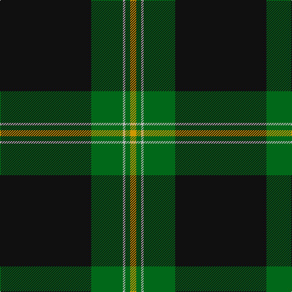

**Bands:** [KGYGY](/stripes/kgygy/) · **Stripes:** [K G LR G LO](/stripes/stripes5/) K G LR G LO

This was sourced from register-of-tartans.  It is a [5 band tartan](/bands/bands5/).

Original link https://www.tartanregister.gov.uk/tartanDetails.aspx?ref=3323

## Also known as

This cloth is also recorded under:

- Perry Hunting

## Attestations

This cloth appears in 2 source records; the oldest owns this page.

- 01/01/1986 — Perry Hunting (Green) (Personal) (register-of-tartans, [record](https://www.tartanregister.gov.uk/tartanDetails.aspx?ref=3323))
- 1986 — Perry Htg (Personal) (tartans-authority, [record](http://www.tartansauthority.com/tartan-ferret/display/1119/))

## Register references

External register numbers recorded for this tartan.

- Scottish Register of Tartans: [3323](https://www.tartanregister.gov.uk/tartanDetails.aspx?ref=3323)
- Scottish Tartans Authority (ITI): 1119
- Scottish Tartans World Register: 1119

## Thread count
K/150 G52 N4 G8 DY/10

## Palette
Each colour and its ΔE from the base-6 reference it is a variant of.

| Colour | Shade | Base | ΔE (OKLab) |
|---|---|---|---|
| DY | <code style="background-color:#D09800;">#D09800</code> `#D09800` | Y <code style="background-color:#F2BF00;">#F2BF00</code> | 0.12 |
| G | <code style="background-color:#006818;">#006818</code> `#006818` | G <code style="background-color:#006100;">#006100</code> | 0.02 |
| K | <code style="background-color:#101010;">#101010</code> `#101010` | K <code style="background-color:#000000;">#000000</code> | 0.17 |
| N | <code style="background-color:#B8B8B8;">#B8B8B8</code> `#B8B8B8` | Y <code style="background-color:#F2BF00;">#F2BF00</code> | 0.17 |

# Sample pattern

## Nearest tartans

The nearest existing variants by ΔTartan distance.

1. [MacGregor, Black (Personal)](/setts/s6/k72g23k7g8r1w3~x2/) — ΔT 0.71
1. [Touch](/setts/s6/y5ly1k5dg46k5r3~x2/) — ΔT 1.22
1. [O'Boyle (Name)](/setts/s7/g12k1r1k12m9k45g9~x2/) — ΔT 1.25
1. [Harley Davidson (Corporate)](/setts/s6/o4n6k4o8k49o2/) — ΔT 1.36
1. [Tough (Personal)](/setts/s6/n4ly1k4dg32k4r2~x2/) — ΔT 1.42
1. [Perry (Calgary), Alex (Personal)](/setts/s4/k62dt24lo5w3~x2/) — ΔT 1.46
1. [Perry Dress (Personal)](/setts/s5/k65r27w2k4ly5~x2/) — ΔT 1.50
1. [Green Ridge](/setts/s8/dg24o2dg3k6o1ly2o1k4~x4/) — ΔT 1.53
1. [Childers (Personal)](/setts/s6/k44g8k4g13k4w3~x2/) — ΔT 1.54
1. [Pride of New Zealand, The](/setts/s4/n124k60w1k2~x2/) — ΔT 1.56

## Neighbour map

Every grey dot is one of 14299 variants placed by the first two principal components of the ΔTartan feature space (44% of its variance). Red is this tartan; blue dots are its nearest — click one to open its page.

<svg viewBox="0 0 640 380" role="img" style="max-width:100%;height:auto;border:1px solid #e0e0e0;border-radius:4px;display:block" xmlns="http://www.w3.org/2000/svg"><image href="/nn/cloud.v1.png" width="640" height="380"/><a href="/setts/s6/k72g23k7g8r1w3~x2/"><circle cx="500.4" cy="149.3" r="4" fill="#3465a4"><title>MacGregor, Black (Personal)</title></circle></a><a href="/setts/s6/y5ly1k5dg46k5r3~x2/"><circle cx="482.8" cy="129.0" r="4" fill="#3465a4"><title>Touch</title></circle></a><a href="/setts/s7/g12k1r1k12m9k45g9~x2/"><circle cx="415.5" cy="139.4" r="4" fill="#3465a4"><title>O'Boyle (Name)</title></circle></a><a href="/setts/s6/o4n6k4o8k49o2/"><circle cx="489.6" cy="164.4" r="4" fill="#3465a4"><title>Harley Davidson (Corporate)</title></circle></a><a href="/setts/s6/n4ly1k4dg32k4r2~x2/"><circle cx="442.3" cy="143.0" r="4" fill="#3465a4"><title>Tough (Personal)</title></circle></a><a href="/setts/s4/k62dt24lo5w3~x2/"><circle cx="421.6" cy="203.4" r="4" fill="#3465a4"><title>Perry (Calgary), Alex (Personal)</title></circle></a><a href="/setts/s5/k65r27w2k4ly5~x2/"><circle cx="457.3" cy="164.2" r="4" fill="#3465a4"><title>Perry Dress (Personal)</title></circle></a><a href="/setts/s8/dg24o2dg3k6o1ly2o1k4~x4/"><circle cx="424.4" cy="165.1" r="4" fill="#3465a4"><title>Green Ridge</title></circle></a><a href="/setts/s6/k44g8k4g13k4w3~x2/"><circle cx="413.5" cy="192.8" r="4" fill="#3465a4"><title>Childers (Personal)</title></circle></a><a href="/setts/s4/n124k60w1k2~x2/"><circle cx="484.0" cy="179.8" r="4" fill="#3465a4"><title>Pride of New Zealand, The</title></circle></a><circle cx="466.4" cy="166.7" r="5" fill="#c00000"/></svg>

ID: /setts/s5/k75g26lr2g4lo5~x2/
