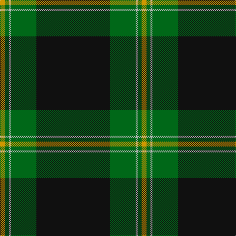

In pattern [KGYGY](/patterns/kgygy/).

This was sourced from register-of-tartans.  It is a [5 stripes tartan](/stripes/stripes5/).

Original link https://www.tartanregister.gov.uk/tartanDetails.aspx?ref=3323

## Attestations

This cloth appears in 2 source records; the oldest owns this page.

- 01/01/1986 — Perry Hunting (Green) (Personal) (register-of-tartans, [record](https://www.tartanregister.gov.uk/tartanDetails.aspx?ref=3323))
- 1986 — Perry Htg (Personal) (tartans-authority, [record](http://www.tartansauthority.com/tartan-ferret/display/1119/))

## Register references

External register numbers recorded for this tartan.

- Scottish Register of Tartans: [3323](https://www.tartanregister.gov.uk/tartanDetails.aspx?ref=3323)
- Scottish Tartans Authority (ITI): 1119
- Scottish Tartans World Register: 1119

## Thread count
DY/10 G8 N4 G52 K/150

## Palette
Each colour and its ΔE from the base-6 reference it is a variant of.

| Colour | Shade | Base | ΔE (OKLab) |
|---|---|---|---|
| DY | <code style="background-color:#D09800;">#D09800</code> `#D09800` | Y <code style="background-color:#F2BF00;">#F2BF00</code> | 0.12 |
| G | <code style="background-color:#006818;">#006818</code> `#006818` | G <code style="background-color:#006100;">#006100</code> | 0.02 |
| K | <code style="background-color:#101010;">#101010</code> `#101010` | K <code style="background-color:#000000;">#000000</code> | 0.17 |
| N | <code style="background-color:#B8B8B8;">#B8B8B8</code> `#B8B8B8` | Y <code style="background-color:#F2BF00;">#F2BF00</code> | 0.17 |

# Sample pattern

## Nearest tartans

The nearest existing variants by ΔTartan distance.

1. [MacGregor, Black (Personal)](/setts/s6/k72g23k7g8r1w3~g006818-k101010-rc80000-we0e0e0~x2/) — ΔT 0.71
1. [Touch](/setts/s6/g5y1k5ga46k5r3~g808080-ga003000-k000000-rc00000-yf0c000~x2/) — ΔT 1.22
1. [O'Boyle (Name)](/setts/s7/g12k1r1k12ra9k45g9~g289c18-k101010-rc80000-ra9c68a4~x2/) — ΔT 1.25
1. [Harley Davidson (Corporate)](/setts/s6/r4b6k4ra8k49r2~b5c5c5c-k101010-r888888-rab84c00/) — ΔT 1.35
1. [Tough (Personal)](/setts/s6/b4y1k4g32k4r2~b646464-g004c00-k000000-r8c0000-ydcbc00~x2/) — ΔT 1.41
1. [Perry (Calgary), Alex (Personal)](/setts/s4/k62b24y5w3~b3f4441-k120a01-wf7f1e8-yef8f06~x2/) — ΔT 1.45
1. [Perry Dress (Personal)](/setts/s5/k65r27w2k4y5~k101010-r880000-we0e0e0-ye8c000~x2/) — ΔT 1.49
1. [Childers Regimental Tartan Tartan Number: 1090. Earliest known date: 1907 1s Battalion, 1st Gurkha Rifles is recorded as using this tartan for plaids, ribbons and bag-covers. See products available Copyright © Blair Urquhart, Comrie, 2015](/setts/s6/k88g17k8ga28k8r6~g289c18-ga006818-k101010-rc80000~x2/) — ΔT 1.51
1. [Childers (Personal)](/setts/s6/k44g8k4ga13k4w3~g408060-ga006818-k101010-we0e0e0~x2/) — ΔT 1.54
1. [Green Ridge](/setts/s8/g24r2g3k6r1y2r1k4~g003014-k000000-r640000-yc89800~x4/) — ΔT 1.54

## Neighbour map

Every grey dot is one of 15726 variants placed by the first two principal components of the ΔTartan feature space (44% of its variance). Red is this tartan; blue dots are its nearest — click one to open its page.

<svg viewBox="0 0 640 380" role="img" style="max-width:100%;height:auto;border:1px solid #e0e0e0;border-radius:4px;display:block" xmlns="http://www.w3.org/2000/svg"><image href="/nn/cloud.v1.png" width="640" height="380"/><a href="/setts/s6/k72g23k7g8r1w3~g006818-k101010-rc80000-we0e0e0~x2/"><circle cx="498.2" cy="150.2" r="4" fill="#3465a4"><title>MacGregor, Black (Personal)</title></circle></a><a href="/setts/s6/g5y1k5ga46k5r3~g808080-ga003000-k000000-rc00000-yf0c000~x2/"><circle cx="480.6" cy="129.1" r="4" fill="#3465a4"><title>Touch</title></circle></a><a href="/setts/s7/g12k1r1k12ra9k45g9~g289c18-k101010-rc80000-ra9c68a4~x2/"><circle cx="413.1" cy="142.5" r="4" fill="#3465a4"><title>O'Boyle (Name)</title></circle></a><a href="/setts/s6/r4b6k4ra8k49r2~b5c5c5c-k101010-r888888-rab84c00/"><circle cx="488.0" cy="166.8" r="4" fill="#3465a4"><title>Harley Davidson (Corporate)</title></circle></a><a href="/setts/s6/b4y1k4g32k4r2~b646464-g004c00-k000000-r8c0000-ydcbc00~x2/"><circle cx="439.9" cy="142.5" r="4" fill="#3465a4"><title>Tough (Personal)</title></circle></a><a href="/setts/s4/k62b24y5w3~b3f4441-k120a01-wf7f1e8-yef8f06~x2/"><circle cx="419.8" cy="206.3" r="4" fill="#3465a4"><title>Perry (Calgary), Alex (Personal)</title></circle></a><a href="/setts/s5/k65r27w2k4y5~k101010-r880000-we0e0e0-ye8c000~x2/"><circle cx="456.0" cy="167.7" r="4" fill="#3465a4"><title>Perry Dress (Personal)</title></circle></a><a href="/setts/s6/k88g17k8ga28k8r6~g289c18-ga006818-k101010-rc80000~x2/"><circle cx="407.2" cy="198.0" r="4" fill="#3465a4"><title>Childers Regimental Tartan Tartan Number: 1090. Earliest known date: 1907 1s Battalion, 1st Gurkha Rifles is recorded as using this tartan for plaids, ribbons and bag-covers. See products available Copyright © Blair Urquhart, Comrie, 2015</title></circle></a><a href="/setts/s6/k44g8k4ga13k4w3~g408060-ga006818-k101010-we0e0e0~x2/"><circle cx="411.0" cy="194.7" r="4" fill="#3465a4"><title>Childers (Personal)</title></circle></a><a href="/setts/s8/g24r2g3k6r1y2r1k4~g003014-k000000-r640000-yc89800~x4/"><circle cx="421.9" cy="163.0" r="4" fill="#3465a4"><title>Green Ridge</title></circle></a><circle cx="464.2" cy="167.9" r="5" fill="#c00000"/></svg>

ID: /setts/s5/k75g26y2g4ya5~g006818-k101010-yb8b8b8-yad09800~x2/
