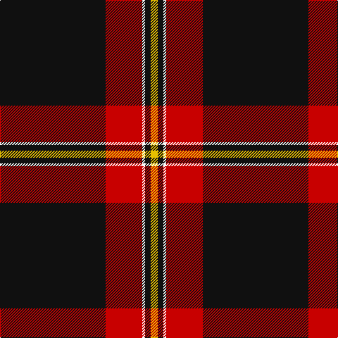

This page is one **sett** — a single exact thread-count. It belongs to the [tartan](/tartans/k75r26w2k4ly5/)
(the same proportion at any scale), whose colour order is pattern [KRWKY](/stripes/krwky/).

Sourced from register-of-tartans.  It is a [5 stripe tartan](/stripes/stripes5/).

Original link https://www.tartanregister.gov.uk/tartanDetails.aspx?ref=3324

## Also known as

This cloth is also recorded under:

- Perry / Pirrie
- Perry Pirrie
- Perry, Pirrie

4 attestations — the source records this cloth was collapsed from (oldest owns this page)

<ul>
<li>01/01/1981 — Perry / Pirrie (Personal) (register-of-tartans, <a href="https://www.tartanregister.gov.uk/tartanDetails.aspx?ref=3324">record</a>)</li>
<li>1982 — Perry (Personal) (tartans-authority, <a href="http://www.tartansauthority.com/tartan-ferret/display/1212/">record</a>)</li>
<li>undated — Perry, Pirrie (weddslist, <a href="http://www.weddslist.com/cgi-bin/tartans/pg.pl?source=sts">record</a>)</li>
<li>undated — Perry Pirrie Family Tartan Tartan Number: 1212. Earliest known date: 1982 A modern family tartan designed in 1981 for Dr J.R. Perry, Alberta, Canada. The name is most common in Aberdeen and Banffshire, although for many generations there have been several families of this name in and around the Wigtonshire area of Galloway. Various spellings include Pirrie, Pere, and Pire. See products available Copyright © Blair Urquhart, Comrie, 2015 (house-of-tartan, <a href="http://www.house-of-tartan.scotland.net/house/TartanViewjs.asp?colr=Def&tnam=1212">record</a>)</li>
</ul>

## Register references

External register numbers recorded for this tartan.

- Scottish Register of Tartans: [3324](https://www.tartanregister.gov.uk/tartanDetails.aspx?ref=3324)
- Scottish Tartans Authority (ITI): 1212
- Scottish Tartans World Register: 1212

## Thread count
K/150 R52 W4 K8 Y/10

## Palette

Palette: <strong>Tartan Register</strong>
<table><thead><tr><th>Colour</th><th>Threads</th><th>Shade</th><th>Base</th><th>OKLCh</th></tr></thead><tbody><tr><td>K/</td><td style="text-align:right;font-variant-numeric:tabular-nums">150</td><td><code style="background-color:#101010;">#101010</code> <small style="color:#888">#101010</small></td><td>K <code style="background-color:#000000;">#000000</code></td><td><small style="color:#888">oklch(17.3% 0.000 89.9)</small></td></tr><tr><td>R</td><td style="text-align:right;font-variant-numeric:tabular-nums">52</td><td><code style="background-color:#C80000;">#C80000</code> <small style="color:#888">#C80000</small></td><td>R <code style="background-color:#CC0000;">#CC0000</code></td><td><small style="color:#888">oklch(52.3% 0.215 29.2)</small></td></tr><tr><td>W</td><td style="text-align:right;font-variant-numeric:tabular-nums">4</td><td><code style="background-color:#FCFCFC;">#FCFCFC</code> <small style="color:#888">#FCFCFC</small></td><td>W <code style="background-color:#F7F7F7;">#F7F7F7</code></td><td><small style="color:#888">oklch(99.1% 0.000 89.9)</small></td></tr><tr><td>K</td><td style="text-align:right;font-variant-numeric:tabular-nums">8</td><td><code style="background-color:#101010;">#101010</code> <small style="color:#888">#101010</small></td><td>K <code style="background-color:#000000;">#000000</code></td><td><small style="color:#888">oklch(17.3% 0.000 89.9)</small></td></tr><tr><td>Y/</td><td style="text-align:right;font-variant-numeric:tabular-nums">10</td><td><code style="background-color:#E8C000;">#E8C000</code> <small style="color:#888">#E8C000</small></td><td>Y <code style="background-color:#F2BF00;">#F2BF00</code></td><td><small style="color:#888">oklch(81.9% 0.168 93.7)</small></td></tr></tbody></table>

# Sample pattern

## Nearest tartans

The nearest existing variants by ΔTartan distance, with this tartan at the top so the swatches line up against it.

ΔTartan

Tartan

Sett

—

<a href="/ttd/edit/#slug=k75r26w2k4ly5~x2">Perry / Pirrie (Personal)</a> <a class="nn-out" href="/setts/s5/k75r26w2k4ly5~x2/" title="open its dictionary page">↗</a>

0.81

<a href="/ttd/edit/#slug=k30r10ly1k8w3~x4">Union Fire Club Pipes and Drums</a> <a class="nn-out" href="/setts/s5/k30r10ly1k8w3~x4/" title="open its dictionary page">↗</a>

0.81

<a href="/ttd/edit/#slug=k65r27w2k4ly5~x2">Perry Dress (Personal)</a> <a class="nn-out" href="/setts/s5/k65r27w2k4ly5~x2/" title="open its dictionary page">↗</a>

1.40

<a href="/ttd/edit/#slug=k53ly4k7ly2k4r30w3~x2">Partick Thistle Football Club</a> <a class="nn-out" href="/setts/s7/k53ly4k7ly2k4r30w3~x2/" title="open its dictionary page">↗</a>

1.41

<a href="/ttd/edit/#slug=k4r11k32ly1k4~x2">Harvie</a> <a class="nn-out" href="/setts/s5/k4r11k32ly1k4~x2/" title="open its dictionary page">↗</a>

1.45

<a href="/ttd/edit/#slug=oi4n6k4o8k49oi2">Harley Davidson (Corporate)</a> <a class="nn-out" href="/setts/s6/oi4n6k4o8k49oi2/" title="open its dictionary page">↗</a>

1.50

<a href="/ttd/edit/#slug=k75y26y3k4ly6~x2">Perry Ancient (Personal)</a> <a class="nn-out" href="/setts/s5/k75y26y3k4ly6~x2/" title="open its dictionary page">↗</a>

1.50

<a href="/ttd/edit/#slug=k80r6g3r12k2w2~x2">Dellen</a> <a class="nn-out" href="/setts/s6/k80r6g3r12k2w2~x2/" title="open its dictionary page">↗</a>

1.52

<a href="/ttd/edit/#slug=k70r5k3lb4dp4lb4k3r12">State University of New York College at Buffalo</a> <a class="nn-out" href="/setts/s8/k70r5k3lb4dp4lb4k3r12/" title="open its dictionary page">↗</a>

1.66

<a href="/ttd/edit/#slug=n124k60w1k2~x2">Pride of New Zealand, The</a> <a class="nn-out" href="/setts/s4/n124k60w1k2~x2/" title="open its dictionary page">↗</a>

1.66

<a href="/ttd/edit/#slug=k42t2r3k5r16k8ly2k3~x2">Highland Brewing Company</a> <a class="nn-out" href="/setts/s8/k42t2r3k5r16k8ly2k3~x2/" title="open its dictionary page">↗</a>

## Neighbour map

Every grey dot is one of 14359 variants placed by the first two principal components of the ΔTartan feature space (44% of its variance). Red is this tartan; blue dots are its nearest — click one to open its page.

<svg viewBox="0 0 640 380" role="img" style="max-width:100%;height:auto;border:1px solid #e0e0e0;border-radius:4px;display:block" xmlns="http://www.w3.org/2000/svg"><image href="/nn/cloud.v1.png" width="640" height="380"/><a href="/setts/s5/k30r10ly1k8w3~x4/"><circle cx="458.6" cy="167.5" r="4" fill="#3465a4"><title>Union Fire Club Pipes and Drums</title></circle></a><a href="/setts/s5/k65r27w2k4ly5~x2/"><circle cx="456.4" cy="164.7" r="4" fill="#3465a4"><title>Perry Dress (Personal)</title></circle></a><a href="/setts/s7/k53ly4k7ly2k4r30w3~x2/"><circle cx="389.5" cy="134.3" r="4" fill="#3465a4"><title>Partick Thistle Football Club</title></circle></a><a href="/setts/s5/k4r11k32ly1k4~x2/"><circle cx="538.5" cy="185.6" r="4" fill="#3465a4"><title>Harvie</title></circle></a><a href="/setts/s6/oi4n6k4o8k49oi2/"><circle cx="488.8" cy="164.8" r="4" fill="#3465a4"><title>Harley Davidson (Corporate)</title></circle></a><a href="/setts/s5/k75y26y3k4ly6~x2/"><circle cx="462.0" cy="183.0" r="4" fill="#3465a4"><title>Perry Ancient (Personal)</title></circle></a><a href="/setts/s6/k80r6g3r12k2w2~x2/"><circle cx="556.5" cy="131.5" r="4" fill="#3465a4"><title>Dellen</title></circle></a><a href="/setts/s8/k70r5k3lb4dp4lb4k3r12/"><circle cx="462.9" cy="120.7" r="4" fill="#3465a4"><title>State University of New York College at Buffalo</title></circle></a><a href="/setts/s4/n124k60w1k2~x2/"><circle cx="483.2" cy="180.4" r="4" fill="#3465a4"><title>Pride of New Zealand, The</title></circle></a><a href="/setts/s8/k42t2r3k5r16k8ly2k3~x2/"><circle cx="480.6" cy="162.1" r="4" fill="#3465a4"><title>Highland Brewing Company</title></circle></a><circle cx="472.5" cy="145.6" r="5" fill="#c00000"/></svg>

ID: /setts/s5/k75r26w2k4ly5~x2/
