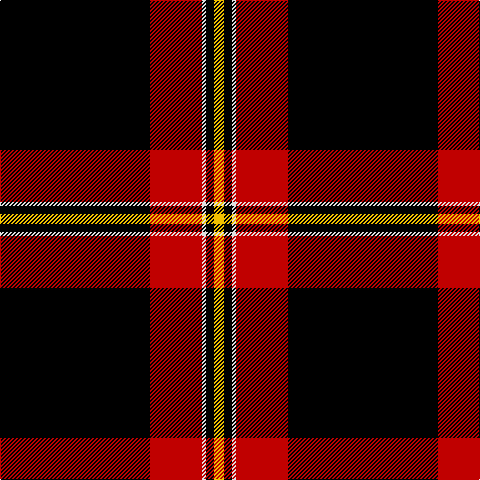

In pattern [KRWKY](/patterns/krwky/).

This was sourced from weddslist.  It is a [5 stripes tartan](/stripes/stripes5/).

Original link http://www.weddslist.com/cgi-bin/tartans/pg.pl?source=sts

## Thread count
K/150 R52 LN4 K8 Y/10

## Palette
Each colour and its ΔE from the base-6 reference it is a variant of.

| Colour | Shade | Base | ΔE (OKLab) |
|---|---|---|---|
| K | <code style="background-color:#000000;">#000000</code> `#000000` | K <code style="background-color:#000000;">#000000</code> | 0.00 |
| LN | <code style="background-color:#E0E0E0;">#E0E0E0</code> `#E0E0E0` | W <code style="background-color:#F7F7F7;">#F7F7F7</code> | 0.07 |
| R | <code style="background-color:#C00000;">#C00000</code> `#C00000` | R <code style="background-color:#CC0000;">#CC0000</code> | 0.03 |
| Y | <code style="background-color:#F0C000;">#F0C000</code> `#F0C000` | Y <code style="background-color:#F2BF00;">#F2BF00</code> | 0.00 |

# Sample pattern

## Nearest tartans

The nearest existing variants by ΔTartan distance.

1. [Perry, Ancient](/setts/s5/k65r27w2k4y5~k000000-rc00000-we0e0e0-yf0c000~x2/) — ΔT 0.55
1. [Perry, dress](/setts/s5/k65r27w2k4y5~k000000-r800000-we0e0e0-yf0c000~x2/) — ΔT 0.60
1. [Perry / Pirrie (Personal)](/setts/s5/k75r26w2k4y5~k101010-rc80000-wfcfcfc-ye8c000~x2/) — ΔT 1.22
1. [Perry Pirrie Family Tartan Tartan Number: 1212. Earliest known date: 1982 A modern family tartan designed in 1981 for Dr J.R. Perry, Alberta, Canada. The name is most common in Aberdeen and Banffshire, although for many generations there have been several families of this name in and around the Wigtonshire area of Galloway. Various spellings include Pirrie, Pere, and Pire. See products available Copyright © Blair Urquhart, Comrie, 2015](/setts/s5/k75r26w2k4y5~k101010-rc80000-we0e0e0-ye8c000~x2/) — ΔT 1.24
1. [Highland Brewing Company (USA)](/setts/s8/k42b2r3k5r16k8y2k3~b3c82af-k000000-rc8002c-ye0a126~x2/) — ΔT 1.34
1. [Union Fire Club Pipes & Drums (Corp.](/setts/s5/k30r10y1k8w3~k101010-rc80000-we0e0e0-ye8c000~x4/) — ΔT 1.41
1. [Union Fire Club Pipes and Drums](/setts/s5/k30r10y1k8w3~k101010-rdc0000-we0e0e0-ye8c000~x4/) — ΔT 1.41
1. [Harvie](/setts/s5/k4r11k32y1k4~k000000-rc00000-yf0c000~x2/) — ΔT 1.44
1. [Perry Dress (Personal)](/setts/s5/k65r27w2k4y5~k101010-r880000-we0e0e0-ye8c000~x2/) — ΔT 1.56
1. [Perry, hunting (Green)](/setts/s5/k65g27w2k4y5~g008000-k000000-we0e0e0-yf0c000~x2/) — ΔT 1.78

## Neighbour map

Every grey dot is one of 15726 variants placed by the first two principal components of the ΔTartan feature space (44% of its variance). Red is this tartan; blue dots are its nearest — click one to open its page.

<svg viewBox="0 0 640 380" role="img" style="max-width:100%;height:auto;border:1px solid #e0e0e0;border-radius:4px;display:block" xmlns="http://www.w3.org/2000/svg"><image href="/nn/cloud.v1.png" width="640" height="380"/><a href="/setts/s5/k65r27w2k4y5~k000000-rc00000-we0e0e0-yf0c000~x2/"><circle cx="425.6" cy="157.9" r="4" fill="#3465a4"><title>Perry, Ancient</title></circle></a><a href="/setts/s5/k65r27w2k4y5~k000000-r800000-we0e0e0-yf0c000~x2/"><circle cx="433.9" cy="164.7" r="4" fill="#3465a4"><title>Perry, dress</title></circle></a><a href="/setts/s5/k75r26w2k4y5~k101010-rc80000-wfcfcfc-ye8c000~x2/"><circle cx="472.4" cy="151.4" r="4" fill="#3465a4"><title>Perry / Pirrie (Personal)</title></circle></a><a href="/setts/s5/k75r26w2k4y5~k101010-rc80000-we0e0e0-ye8c000~x2/"><circle cx="474.1" cy="152.0" r="4" fill="#3465a4"><title>Perry Pirrie Family Tartan Tartan Number: 1212. Earliest known date: 1982 A modern family tartan designed in 1981 for Dr J.R. Perry, Alberta, Canada. The name is most common in Aberdeen and Banffshire, although for many generations there have been several families of this name in and around the Wigtonshire area of Galloway. Various spellings include Pirrie, Pere, and Pire. See products available Copyright © Blair Urquhart, Comrie, 2015</title></circle></a><a href="/setts/s8/k42b2r3k5r16k8y2k3~b3c82af-k000000-rc8002c-ye0a126~x2/"><circle cx="445.9" cy="154.6" r="4" fill="#3465a4"><title>Highland Brewing Company (USA)</title></circle></a><a href="/setts/s5/k30r10y1k8w3~k101010-rc80000-we0e0e0-ye8c000~x4/"><circle cx="461.7" cy="175.9" r="4" fill="#3465a4"><title>Union Fire Club Pipes &amp; Drums (Corp.</title></circle></a><a href="/setts/s5/k30r10y1k8w3~k101010-rdc0000-we0e0e0-ye8c000~x4/"><circle cx="458.4" cy="173.9" r="4" fill="#3465a4"><title>Union Fire Club Pipes and Drums</title></circle></a><a href="/setts/s5/k4r11k32y1k4~k000000-rc00000-yf0c000~x2/"><circle cx="526.6" cy="194.8" r="4" fill="#3465a4"><title>Harvie</title></circle></a><a href="/setts/s5/k65r27w2k4y5~k101010-r880000-we0e0e0-ye8c000~x2/"><circle cx="456.0" cy="167.7" r="4" fill="#3465a4"><title>Perry Dress (Personal)</title></circle></a><a href="/setts/s5/k65g27w2k4y5~g008000-k000000-we0e0e0-yf0c000~x2/"><circle cx="412.8" cy="166.2" r="4" fill="#3465a4"><title>Perry, hunting (Green)</title></circle></a><circle cx="460.5" cy="152.9" r="5" fill="#c00000"/></svg>

ID: /setts/s5/k75r26w2k4y5~k000000-rc00000-we0e0e0-yf0c000~x2/
