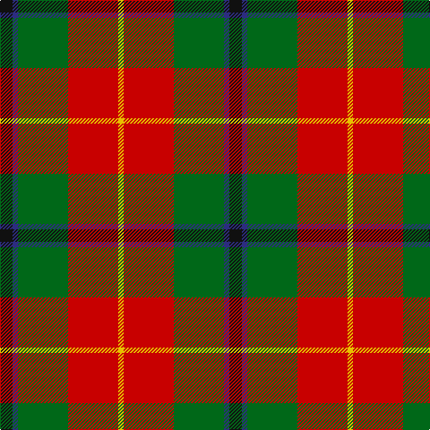

In pattern [KBGRY](/patterns/kbgry/).

This was sourced from house-of-tartan.  It is a [5 stripes tartan](/stripes/stripes5/).

Original link http://www.house-of-tartan.scotland.net/house/TartanViewjs.asp?colr=Def&tnam=1035

## Thread count
K/14 DB6 G56 R56 Y/6

## Palette
Each colour and its ΔE from the base-6 reference it is a variant of.

| Colour | Shade | Base | ΔE (OKLab) |
|---|---|---|---|
| DB | <code style="background-color:#2C2C80;">#2C2C80</code> `#2C2C80` | B <code style="background-color:#2A418A;">#2A418A</code> | 0.06 |
| G | <code style="background-color:#006818;">#006818</code> `#006818` | G <code style="background-color:#006100;">#006100</code> | 0.02 |
| K | <code style="background-color:#101010;">#101010</code> `#101010` | K <code style="background-color:#000000;">#000000</code> | 0.17 |
| R | <code style="background-color:#C80000;">#C80000</code> `#C80000` | R <code style="background-color:#CC0000;">#CC0000</code> | 0.01 |
| Y | <code style="background-color:#E8C000;">#E8C000</code> `#E8C000` | Y <code style="background-color:#F2BF00;">#F2BF00</code> | 0.02 |

# Sample pattern

## Nearest tartans

The nearest existing variants by ΔTartan distance.

1. [Turnbull Dress](/setts/s5/k2b1g10r10y1~b2c2c80-g006818-k101010-rc80000-yd8b000~x6/) — ΔT 0.28
1. [Sachie Hara Scottish Check (Personal)](/setts/s5/k5b4g24r21w3~b2c2c80-g006818-k101010-rc80000-wfcfcfc~x2/) — ΔT 0.59
1. [Turnbull, dress](/setts/s5/k7b3g28r28y3~b304080-g008000-k000000-rc00000-yf0c000~x2/) — ΔT 0.72
1. [Eglinton, Duke of (Artefact)](/setts/s5/g15y1b4w1r15~b2c2c80-g006818-rc80000-we0e0e0-ye8c000~x4/) — ΔT 0.83
1. [Celtic Combat](/setts/s6/k2r20k8g18r3w2~g005010-k101010-rc04c04-we0e0e0~x2/) — ΔT 1.01
1. [Caledonian Brewery](/setts/s7/w4g20ga10r25b2r2ga2~b8080d0-g003000-ga008000-rc00000-we0e0e0~x2/) — ΔT 1.01
1. [Craik of Assington Personal Tartan Tartan Number: 494. Earliest known date: 1981 Restricted See products available Copyright © Blair Urquhart, Comrie, 2015](/setts/s8/b4r11b1g8r2g4k1y2~b2c2c80-g006818-k101010-rc80000-ye8c000~x4/) — ΔT 1.10
1. [Craik, of Assington](/setts/s8/b4r11b1g8r2g4k1y2~b304080-g008000-k000000-rc00000-yf0c000~x4/) — ΔT 1.11
1. [George Watson's College](/setts/s7/b1r8y1g4w1g4ra1~b2888c4-g006818-r880000-rac80000-wfcfcfc-ye8c000~x6/) — ΔT 1.18
1. [Caledonian Brewery (Corporate)](/setts/s7/w4g13ga6r16wa2r2ga2~g003820-ga006818-r880000-wc0c0c0-waa8ace8~x2/) — ΔT 1.20

## Neighbour map

Every grey dot is one of 15726 variants placed by the first two principal components of the ΔTartan feature space (44% of its variance). Red is this tartan; blue dots are its nearest — click one to open its page.

<svg viewBox="0 0 640 380" role="img" style="max-width:100%;height:auto;border:1px solid #e0e0e0;border-radius:4px;display:block" xmlns="http://www.w3.org/2000/svg"><image href="/nn/cloud.v1.png" width="640" height="380"/><a href="/setts/s5/k2b1g10r10y1~b2c2c80-g006818-k101010-rc80000-yd8b000~x6/"><circle cx="234.7" cy="194.4" r="4" fill="#3465a4"><title>Turnbull Dress</title></circle></a><a href="/setts/s5/k5b4g24r21w3~b2c2c80-g006818-k101010-rc80000-wfcfcfc~x2/"><circle cx="192.5" cy="203.0" r="4" fill="#3465a4"><title>Sachie Hara Scottish Check (Personal)</title></circle></a><a href="/setts/s5/k7b3g28r28y3~b304080-g008000-k000000-rc00000-yf0c000~x2/"><circle cx="195.4" cy="191.4" r="4" fill="#3465a4"><title>Turnbull, dress</title></circle></a><a href="/setts/s5/g15y1b4w1r15~b2c2c80-g006818-rc80000-we0e0e0-ye8c000~x4/"><circle cx="249.1" cy="177.7" r="4" fill="#3465a4"><title>Eglinton, Duke of (Artefact)</title></circle></a><a href="/setts/s6/k2r20k8g18r3w2~g005010-k101010-rc04c04-we0e0e0~x2/"><circle cx="235.8" cy="205.1" r="4" fill="#3465a4"><title>Celtic Combat</title></circle></a><a href="/setts/s7/w4g20ga10r25b2r2ga2~b8080d0-g003000-ga008000-rc00000-we0e0e0~x2/"><circle cx="205.8" cy="159.3" r="4" fill="#3465a4"><title>Caledonian Brewery</title></circle></a><a href="/setts/s8/b4r11b1g8r2g4k1y2~b2c2c80-g006818-k101010-rc80000-ye8c000~x4/"><circle cx="194.2" cy="172.3" r="4" fill="#3465a4"><title>Craik of Assington Personal Tartan Tartan Number: 494. Earliest known date: 1981 Restricted See products available Copyright © Blair Urquhart, Comrie, 2015</title></circle></a><a href="/setts/s8/b4r11b1g8r2g4k1y2~b304080-g008000-k000000-rc00000-yf0c000~x4/"><circle cx="187.0" cy="170.1" r="4" fill="#3465a4"><title>Craik, of Assington</title></circle></a><a href="/setts/s7/b1r8y1g4w1g4ra1~b2888c4-g006818-r880000-rac80000-wfcfcfc-ye8c000~x6/"><circle cx="176.2" cy="170.8" r="4" fill="#3465a4"><title>George Watson's College</title></circle></a><a href="/setts/s7/w4g13ga6r16wa2r2ga2~g003820-ga006818-r880000-wc0c0c0-waa8ace8~x2/"><circle cx="183.5" cy="194.8" r="4" fill="#3465a4"><title>Caledonian Brewery (Corporate)</title></circle></a><circle cx="215.4" cy="198.0" r="5" fill="#c00000"/></svg>

ID: /setts/s5/k7b3g28r28y3~b2c2c80-g006818-k101010-rc80000-ye8c000~x2/
