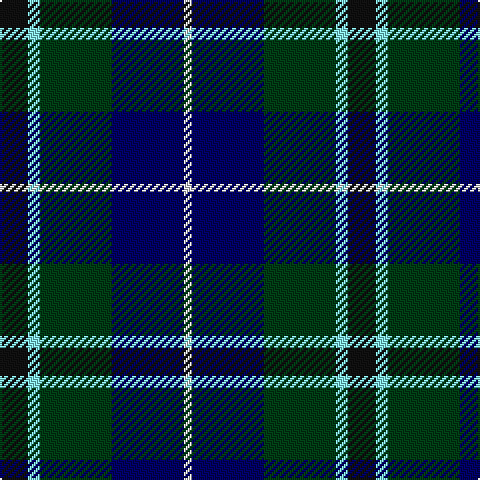

This page is one **sett** — a single exact thread-count. It belongs to the [tartan](/tartans/k7lb3dg18db18ln2/)
(the same proportion at any scale), whose colour order is pattern [KWGBW](/stripes/kwgbw/).

Sourced from register-of-tartans.  It is a [5 stripe tartan](/stripes/stripes5/).

Original link https://www.tartanregister.gov.uk/tartanDetails.aspx?ref=5834

## Register references

External register numbers recorded for this tartan.

- Scottish Register of Tartans: [5834](https://www.tartanregister.gov.uk/tartanDetails.aspx?ref=5834)
- Scottish Tartans World Register: 3158

## Thread count
K/14 LB6 DG36 DB36 LN/4

## Palette
Each colour and the base-6 reference it is a variant of.

| Colour | Shade | Base |
|---|---|---|
| DB | <code style="background-color:#000064;">#000064</code> `oklch(22.7% 0.158 264.1)` <small>#000064</small> | B <code style="background-color:#2A418A;">#2A418A</code> |
| DG | <code style="background-color:#003C14;">#003C14</code> `oklch(31.1% 0.089 148.5)` <small>#003C14</small> | G <code style="background-color:#006100;">#006100</code> |
| K | <code style="background-color:#101010;">#101010</code> `oklch(17.3% 0.000 89.9)` <small>#101010</small> | K <code style="background-color:#000000;">#000000</code> |
| LB | <code style="background-color:#82F5FA;">#82F5FA</code> `oklch(90.4% 0.105 199.2)` <small>#82F5FA</small> | W <code style="background-color:#F7F7F7;">#F7F7F7</code> |
| LN | <code style="background-color:#E0E0E0;">#E0E0E0</code> `oklch(90.7% 0.000 89.9)` <small>#E0E0E0</small> | W <code style="background-color:#F7F7F7;">#F7F7F7</code> |

# Sample pattern

## Nearest tartans

The nearest existing variants by ΔTartan distance, with this tartan at the top so the swatches line up against it.

ΔTartan

Tartan

Sett

—

<a href="/ttd/edit/#slug=k7lt3dg18db18w2~x2">Bhatti</a> <a class="nn-out" href="/setts/s5/k7lt3dg18db18w2~x2/" title="open its dictionary page">↗</a>

0.66

<a href="/ttd/edit/#slug=k2b2dg8db8lr1~x2">Douglas</a> <a class="nn-out" href="/setts/s5/k2b2dg8db8lr1~x2/" title="open its dictionary page">↗</a>

0.66

<a href="/ttd/edit/#slug=k2b2dg8db8lr1">Douglas</a> <a class="nn-out" href="/setts/s5/k2b2dg8db8lr1/" title="open its dictionary page">↗</a>

0.84

<a href="/ttd/edit/#slug=k4b2dg8db8lr1~x2">Dougles Green</a> <a class="nn-out" href="/setts/s5/k4b2dg8db8lr1~x2/" title="open its dictionary page">↗</a>

0.84

<a href="/ttd/edit/#slug=k4b2dg8db8lr1">Dougles Green</a> <a class="nn-out" href="/setts/s5/k4b2dg8db8lr1/" title="open its dictionary page">↗</a>

0.92

<a href="/ttd/edit/#slug=k7lb3g18db18w2~x2">Bhatti (Name)</a> <a class="nn-out" href="/setts/s5/k7lb3g18db18w2~x2/" title="open its dictionary page">↗</a>

0.96

<a href="/ttd/edit/#slug=db31b4db5k19g20lo4~x2">Midlothian</a> <a class="nn-out" href="/setts/s6/db31b4db5k19g20lo4~x2/" title="open its dictionary page">↗</a>

1.01

<a href="/ttd/edit/#slug=k7r3g30db28lb3~x2">Highlander Highland Laddie</a> <a class="nn-out" href="/setts/s5/k7r3g30db28lb3~x2/" title="open its dictionary page">↗</a>

1.03

<a href="/ttd/edit/#slug=g16lb3g3k10db12r2db3~x2">MacLean, Donald (Personal)</a> <a class="nn-out" href="/setts/s7/g16lb3g3k10db12r2db3~x2/" title="open its dictionary page">↗</a>

1.05

<a href="/ttd/edit/#slug=k2g17k16r2db17w2~x2">Galbraith</a> <a class="nn-out" href="/setts/s6/k2g17k16r2db17w2~x2/" title="open its dictionary page">↗</a>

1.08

<a href="/ttd/edit/#slug=ly3dt17n9k25lb3~x2">Teylu Coleman (Name)</a> <a class="nn-out" href="/setts/s5/ly3dt17n9k25lb3~x2/" title="open its dictionary page">↗</a>

## Neighbour map

Every grey dot is one of 14299 variants placed by the first two principal components of the ΔTartan feature space (44% of its variance). Red is this tartan; blue dots are its nearest — click one to open its page.

<svg viewBox="0 0 640 380" role="img" style="max-width:100%;height:auto;border:1px solid #e0e0e0;border-radius:4px;display:block" xmlns="http://www.w3.org/2000/svg"><image href="/nn/cloud.v1.png" width="640" height="380"/><a href="/setts/s5/k2b2dg8db8lr1~x2/"><circle cx="182.5" cy="237.3" r="4" fill="#3465a4"><title>Douglas</title></circle></a><a href="/setts/s5/k2b2dg8db8lr1/"><circle cx="182.5" cy="237.3" r="4" fill="#3465a4"><title>Douglas</title></circle></a><a href="/setts/s5/k4b2dg8db8lr1~x2/"><circle cx="147.0" cy="245.0" r="4" fill="#3465a4"><title>Dougles Green</title></circle></a><a href="/setts/s5/k4b2dg8db8lr1/"><circle cx="147.0" cy="245.0" r="4" fill="#3465a4"><title>Dougles Green</title></circle></a><a href="/setts/s5/k7lb3g18db18w2~x2/"><circle cx="167.9" cy="220.5" r="4" fill="#3465a4"><title>Bhatti (Name)</title></circle></a><a href="/setts/s6/db31b4db5k19g20lo4~x2/"><circle cx="191.1" cy="226.6" r="4" fill="#3465a4"><title>Midlothian</title></circle></a><a href="/setts/s5/k7r3g30db28lb3~x2/"><circle cx="222.4" cy="213.7" r="4" fill="#3465a4"><title>Highlander Highland Laddie</title></circle></a><a href="/setts/s7/g16lb3g3k10db12r2db3~x2/"><circle cx="164.3" cy="215.2" r="4" fill="#3465a4"><title>MacLean, Donald (Personal)</title></circle></a><a href="/setts/s6/k2g17k16r2db17w2~x2/"><circle cx="151.3" cy="213.2" r="4" fill="#3465a4"><title>Galbraith</title></circle></a><a href="/setts/s5/ly3dt17n9k25lb3~x2/"><circle cx="192.2" cy="221.7" r="4" fill="#3465a4"><title>Teylu Coleman (Name)</title></circle></a><circle cx="165.2" cy="225.1" r="5" fill="#c00000"/></svg>

ID: /setts/s5/k7lt3dg18db18w2~x2/
