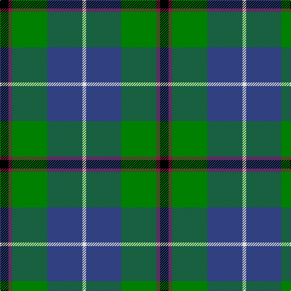

In pattern [KRGBW](/patterns/krgbw/).

This was sourced from weddslist.  It is a [5 stripes tartan](/stripes/stripes5/).

Original link http://www.weddslist.com/cgi-bin/tartans/pg.pl?source=sts

## Thread count
K/14 DR6 G58 B58 LN/6

## Palette
Each colour and its ΔE from the base-6 reference it is a variant of.

| Colour | Shade | Base | ΔE (OKLab) |
|---|---|---|---|
| B | <code style="background-color:#304080;">#304080</code> `#304080` | B <code style="background-color:#2A418A;">#2A418A</code> | 0.02 |
| DR | <code style="background-color:#802040;">#802040</code> `#802040` | R <code style="background-color:#CC0000;">#CC0000</code> | 0.17 |
| G | <code style="background-color:#008000;">#008000</code> `#008000` | G <code style="background-color:#006100;">#006100</code> | 0.10 |
| K | <code style="background-color:#000000;">#000000</code> `#000000` | K <code style="background-color:#000000;">#000000</code> | 0.00 |
| LN | <code style="background-color:#E0E0E0;">#E0E0E0</code> `#E0E0E0` | W <code style="background-color:#F7F7F7;">#F7F7F7</code> | 0.07 |

# Sample pattern

## Nearest tartans

The nearest existing variants by ΔTartan distance.

1. [Turnbull, hunting](/setts/s5/k7y3g28b28w3~b304080-g008000-k000000-we0e0e0-yf0c000~x2/) — ΔT 0.35
1. [Turnbull Hunting (1983) #2](/setts/s5/k2y1g10b10w1~b2c2c80-g006818-k101010-wfcfcfc-ye8c000~x6/) — ΔT 0.47
1. [Turnbull Hunting Clan Tartan Tartan Number: 1265. Earliest known date: pre 2003 An unusual dress tartan having no white. See products available Copyright © Blair Urquhart, Comrie, 2015](/setts/s5/k7y3g28b28w3~b2c2c80-g006818-k101010-we0e0e0-ye8c000~x2/) — ΔT 0.51
1. [Douglas](/setts/s5/k1b1g8ba8w1~b5480b0-ba304080-g008000-k000000-we0e0e0~x4/) — ΔT 0.59
1. [Turnbull Hunting (Name)](/setts/s5/r2y1g10b10w1~b2c2c80-g006818-rc80000-we0e0e0-ye8c000~x6/) — ΔT 0.70
1. [Turnbull, hunting](/setts/s5/r7y3g28b28w3~b304080-g008000-r800000-we0e0e0-yf0c000~x2/) — ΔT 0.77
1. [Inglis (Name)](/setts/s6/y4g24b10r3b12ya4~b1c0070-g006818-rc80000-yb8b8b8-yad09800~x2/) — ΔT 0.79
1. [Douglas, Green (Wilsons)](/setts/s5/k1b1g8ba8w1~b2c2c80-ba202060-g006818-k101010-wfcfcfc~x4/) — ΔT 0.80
1. [Gamba (Commemorative)](/setts/s5/g5r3ga30b30w3~b2c2c80-g003820-ga006818-rc80000-wfcfcfc~x2/) — ΔT 0.87
1. [Irving of Glentulchan](/setts/s6/r1g9b9k1b1w1~b304080-g008000-k000000-rc00000-we0e0e0~x6/) — ΔT 0.89

## Neighbour map

Every grey dot is one of 15726 variants placed by the first two principal components of the ΔTartan feature space (44% of its variance). Red is this tartan; blue dots are its nearest — click one to open its page.

<svg viewBox="0 0 640 380" role="img" style="max-width:100%;height:auto;border:1px solid #e0e0e0;border-radius:4px;display:block" xmlns="http://www.w3.org/2000/svg"><image href="/nn/cloud.v1.png" width="640" height="380"/><a href="/setts/s5/k7y3g28b28w3~b304080-g008000-k000000-we0e0e0-yf0c000~x2/"><circle cx="182.0" cy="202.3" r="4" fill="#3465a4"><title>Turnbull, hunting</title></circle></a><a href="/setts/s5/k2y1g10b10w1~b2c2c80-g006818-k101010-wfcfcfc-ye8c000~x6/"><circle cx="212.1" cy="203.0" r="4" fill="#3465a4"><title>Turnbull Hunting (1983) #2</title></circle></a><a href="/setts/s5/k7y3g28b28w3~b2c2c80-g006818-k101010-we0e0e0-ye8c000~x2/"><circle cx="200.9" cy="209.4" r="4" fill="#3465a4"><title>Turnbull Hunting Clan Tartan Tartan Number: 1265. Earliest known date: pre 2003 An unusual dress tartan having no white. See products available Copyright © Blair Urquhart, Comrie, 2015</title></circle></a><a href="/setts/s5/k1b1g8ba8w1~b5480b0-ba304080-g008000-k000000-we0e0e0~x4/"><circle cx="206.9" cy="210.0" r="4" fill="#3465a4"><title>Douglas</title></circle></a><a href="/setts/s5/r2y1g10b10w1~b2c2c80-g006818-rc80000-we0e0e0-ye8c000~x6/"><circle cx="217.9" cy="201.2" r="4" fill="#3465a4"><title>Turnbull Hunting (Name)</title></circle></a><a href="/setts/s5/r7y3g28b28w3~b304080-g008000-r800000-we0e0e0-yf0c000~x2/"><circle cx="204.2" cy="206.9" r="4" fill="#3465a4"><title>Turnbull, hunting</title></circle></a><a href="/setts/s6/y4g24b10r3b12ya4~b1c0070-g006818-rc80000-yb8b8b8-yad09800~x2/"><circle cx="180.1" cy="208.1" r="4" fill="#3465a4"><title>Inglis (Name)</title></circle></a><a href="/setts/s5/k1b1g8ba8w1~b2c2c80-ba202060-g006818-k101010-wfcfcfc~x4/"><circle cx="215.7" cy="214.7" r="4" fill="#3465a4"><title>Douglas, Green (Wilsons)</title></circle></a><a href="/setts/s5/g5r3ga30b30w3~b2c2c80-g003820-ga006818-rc80000-wfcfcfc~x2/"><circle cx="233.1" cy="207.1" r="4" fill="#3465a4"><title>Gamba (Commemorative)</title></circle></a><a href="/setts/s6/r1g9b9k1b1w1~b304080-g008000-k000000-rc00000-we0e0e0~x6/"><circle cx="236.1" cy="188.9" r="4" fill="#3465a4"><title>Irving of Glentulchan</title></circle></a><circle cx="194.8" cy="203.9" r="5" fill="#c00000"/></svg>

ID: /setts/s5/k7r3g29b29w3~b304080-g008000-k000000-r802040-we0e0e0~x2/
