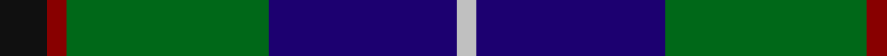

In pattern [KRGBW](/patterns/krgbw/).

This was sourced from register-of-tartans.  It is a [5 stripes tartan](/stripes/stripes5/).

Original link https://www.tartanregister.gov.uk/tartanDetails.aspx?ref=1727

## Attestations

This cloth appears in 3 source records; the oldest owns this page.

- 01/09/1997 — Highlander Highland Laddie (register-of-tartans, [record](https://www.tartanregister.gov.uk/tartanDetails.aspx?ref=1727))
- 1997 Sep — Highlander Highland Laddie (Fashion) (tartans-authority, [record](http://www.tartansauthority.com/tartan-ferret/display/2396/))
- undated — Highlander Universal Tartan Tartan Number: 2396. Earliest known date: 1997 Sep Can be worn by customers of the Highland Laddie - an Edinburgh Highland outfitters and kilt maker. See products available Copyright © Blair Urquhart, Comrie, 2015 (house-of-tartan, [record](http://www.house-of-tartan.scotland.net/house/TartanViewjs.asp?colr=Def&tnam=2396))

## Register references

External register numbers recorded for this tartan.

- Scottish Register of Tartans: [1727](https://www.tartanregister.gov.uk/tartanDetails.aspx?ref=1727)
- Scottish Tartans Authority (ITI): 2396
- Scottish Tartans World Register: 2396

## Thread count
K/14 DR6 G60 DB56 N/6

## Palette
Each colour and its ΔE from the base-6 reference it is a variant of.

| Colour | Shade | Base | ΔE (OKLab) |
|---|---|---|---|
| DB | <code style="background-color:#1C0070;">#1C0070</code> `#1C0070` | B <code style="background-color:#2A418A;">#2A418A</code> | 0.14 |
| DR | <code style="background-color:#880000;">#880000</code> `#880000` | R <code style="background-color:#CC0000;">#CC0000</code> | 0.15 |
| G | <code style="background-color:#006818;">#006818</code> `#006818` | G <code style="background-color:#006100;">#006100</code> | 0.02 |
| K | <code style="background-color:#101010;">#101010</code> `#101010` | K <code style="background-color:#000000;">#000000</code> | 0.17 |
| N | <code style="background-color:#C0C0C0;">#C0C0C0</code> `#C0C0C0` | W <code style="background-color:#F7F7F7;">#F7F7F7</code> | 0.17 |

# Sample pattern

## Nearest tartans

The nearest existing variants by ΔTartan distance.

1. [Douglas, Green (Wilsons)](/setts/s5/k1b1g8ba8w1~b2c2c80-ba202060-g006818-k101010-wfcfcfc~x4/) — ΔT 0.53
1. [Turnbull Hunting Clan Tartan Tartan Number: 1265. Earliest known date: pre 2003 An unusual dress tartan having no white. See products available Copyright © Blair Urquhart, Comrie, 2015](/setts/s5/k7y3g28b28w3~b2c2c80-g006818-k101010-we0e0e0-ye8c000~x2/) — ΔT 0.59
1. [Leslie, Hebridean](/setts/s6/k6g15w2b22r2k4~b2c2c80-g006818-k101010-re87878-we0e0e0~x2/) — ΔT 0.64
1. [Gamba (Commemorative)](/setts/s5/g5r3ga30b30w3~b2c2c80-g003820-ga006818-rc80000-wfcfcfc~x2/) — ΔT 0.65
1. [Turnbull Hunting (1983) #2](/setts/s5/k2y1g10b10w1~b2c2c80-g006818-k101010-wfcfcfc-ye8c000~x6/) — ΔT 0.65
1. [Paterson Blue (Personal)](/setts/s6/b22w2k10g11r3g4~b2c2c80-g006818-k101010-rc80000-we0e0e0~x2/) — ΔT 0.76
1. [MacPhail Hunting Clan Tartan Tartan Number: 1367. Earliest known date: 1880 In Clans Originaux as 'Macphail'. with this thread count: R8 B48 K24 G28 K8 LN6. (Does not divide by 4) This sample shown here comes from the MacGregor-Hastie collection which forms the basis of the cloth archive of the Scottish Tartans Society. See products available Copyright © Blair Urquhart, Comrie, 2015](/setts/s6/r2b23k14g16k2w2~b2c2c80-g006818-k101010-rc80000-we0e0e0~x2/) — ΔT 0.79
1. [DeLoughery (Personal)](/setts/s6/b20k6y4b3g20w2~b38409c-g006818-k101010-wfcfcfc-ya08858~x2/) — ΔT 0.81
1. [Carmichael](/setts/s6/k5g32b32r3b3y3~b2c2c80-g006818-k000000-rc80000-ye8c000~x2/) — ΔT 0.81
1. [Douglas Clan Tartan Tartan Number: 1032. Earliest known date: 1831 Wilson's sent a list of tartans to Logan about 1830 stating that 'No 148' had been sold as Douglas for a 'considerable' time. Logan included the Douglas tartan even though he said that no family tartans appeared in his book. The distinction between clans and families is obscure. There are many historic references to the 'Border Clans' which would certainly describe the Douglas'. There is also a black and grey sett for the clan which first appeared in the Vestiarium Scoticum in 1842. The present chiefship is vacant on account of the compound surnames of the eligible claimants. Lord Lyon will not recognise 'double barrel' names. See products available Copyright © Blair Urquhart, Comrie, 2015](/setts/s5/k3b3g23b21w2~b2c2c80-g006818-k101010-we0e0e0~x2/) — ΔT 0.83

## Neighbour map

Every grey dot is one of 15726 variants placed by the first two principal components of the ΔTartan feature space (44% of its variance). Red is this tartan; blue dots are its nearest — click one to open its page.

<svg viewBox="0 0 640 380" role="img" style="max-width:100%;height:auto;border:1px solid #e0e0e0;border-radius:4px;display:block" xmlns="http://www.w3.org/2000/svg"><image href="/nn/cloud.v1.png" width="640" height="380"/><a href="/setts/s5/k1b1g8ba8w1~b2c2c80-ba202060-g006818-k101010-wfcfcfc~x4/"><circle cx="215.7" cy="214.7" r="4" fill="#3465a4"><title>Douglas, Green (Wilsons)</title></circle></a><a href="/setts/s5/k7y3g28b28w3~b2c2c80-g006818-k101010-we0e0e0-ye8c000~x2/"><circle cx="200.9" cy="209.4" r="4" fill="#3465a4"><title>Turnbull Hunting Clan Tartan Tartan Number: 1265. Earliest known date: pre 2003 An unusual dress tartan having no white. See products available Copyright © Blair Urquhart, Comrie, 2015</title></circle></a><a href="/setts/s6/k6g15w2b22r2k4~b2c2c80-g006818-k101010-re87878-we0e0e0~x2/"><circle cx="211.2" cy="194.7" r="4" fill="#3465a4"><title>Leslie, Hebridean</title></circle></a><a href="/setts/s5/g5r3ga30b30w3~b2c2c80-g003820-ga006818-rc80000-wfcfcfc~x2/"><circle cx="233.1" cy="207.1" r="4" fill="#3465a4"><title>Gamba (Commemorative)</title></circle></a><a href="/setts/s5/k2y1g10b10w1~b2c2c80-g006818-k101010-wfcfcfc-ye8c000~x6/"><circle cx="212.1" cy="203.0" r="4" fill="#3465a4"><title>Turnbull Hunting (1983) #2</title></circle></a><a href="/setts/s6/b22w2k10g11r3g4~b2c2c80-g006818-k101010-rc80000-we0e0e0~x2/"><circle cx="200.8" cy="201.7" r="4" fill="#3465a4"><title>Paterson Blue (Personal)</title></circle></a><a href="/setts/s6/r2b23k14g16k2w2~b2c2c80-g006818-k101010-rc80000-we0e0e0~x2/"><circle cx="198.2" cy="198.3" r="4" fill="#3465a4"><title>MacPhail Hunting Clan Tartan Tartan Number: 1367. Earliest known date: 1880 In Clans Originaux as 'Macphail'. with this thread count: R8 B48 K24 G28 K8 LN6. (Does not divide by 4) This sample shown here comes from the MacGregor-Hastie collection which forms the basis of the cloth archive of the Scottish Tartans Society. See products available Copyright © Blair Urquhart, Comrie, 2015</title></circle></a><a href="/setts/s6/b20k6y4b3g20w2~b38409c-g006818-k101010-wfcfcfc-ya08858~x2/"><circle cx="203.4" cy="200.0" r="4" fill="#3465a4"><title>DeLoughery (Personal)</title></circle></a><a href="/setts/s6/k5g32b32r3b3y3~b2c2c80-g006818-k000000-rc80000-ye8c000~x2/"><circle cx="247.5" cy="186.4" r="4" fill="#3465a4"><title>Carmichael</title></circle></a><a href="/setts/s5/k3b3g23b21w2~b2c2c80-g006818-k101010-we0e0e0~x2/"><circle cx="255.4" cy="208.2" r="4" fill="#3465a4"><title>Douglas Clan Tartan Tartan Number: 1032. Earliest known date: 1831 Wilson's sent a list of tartans to Logan about 1830 stating that 'No 148' had been sold as Douglas for a 'considerable' time. Logan included the Douglas tartan even though he said that no family tartans appeared in his book. The distinction between clans and families is obscure. There are many historic references to the 'Border Clans' which would certainly describe the Douglas'. There is also a black and grey sett for the clan which first appeared in the Vestiarium Scoticum in 1842. The present chiefship is vacant on account of the compound surnames of the eligible claimants. Lord Lyon will not recognise 'double barrel' names. See products available Copyright © Blair Urquhart, Comrie, 2015</title></circle></a><circle cx="218.8" cy="211.1" r="5" fill="#c00000"/></svg>

ID: /setts/s5/k7r3g30b28w3~b1c0070-g006818-k101010-r880000-wc0c0c0~x2/
