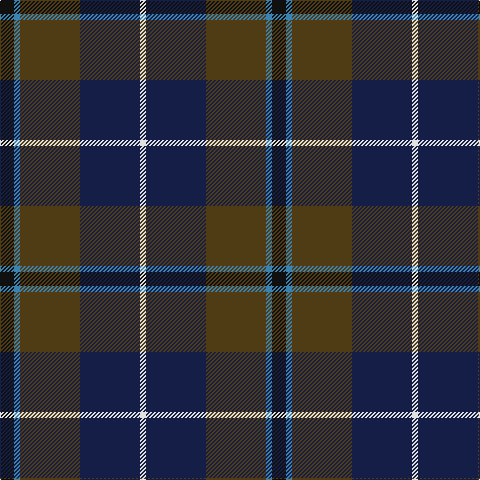

In pattern [KBGBW](/stripes/kbgbw/).

This was sourced from register-of-tartans.  It is a [5 stripe tartan](/stripes/stripes5/).

Original link https://www.tartanregister.gov.uk/tartanDetails.aspx?ref=963

## Register references

External register numbers recorded for this tartan.

- Scottish Register of Tartans: [963](https://www.tartanregister.gov.uk/tartanDetails.aspx?ref=963)
- Scottish Tartans World Register: 2523

## Thread count
K/14 B6 T60 DB60 LN/6

## Palette
Each colour and its ΔE from the base-6 reference it is a variant of.

| Colour | Shade | Base | ΔE (OKLab) |
|---|---|---|---|
| B | <code style="background-color:#3C82AF;">#3C82AF</code> `#3C82AF` | B <code style="background-color:#2A418A;">#2A418A</code> | 0.19 |
| DB | <code style="background-color:#141E46;">#141E46</code> `#141E46` | B <code style="background-color:#2A418A;">#2A418A</code> | 0.16 |
| K | <code style="background-color:#101010;">#101010</code> `#101010` | K <code style="background-color:#000000;">#000000</code> | 0.17 |
| LN | <code style="background-color:#E0E0E0;">#E0E0E0</code> `#E0E0E0` | W <code style="background-color:#F7F7F7;">#F7F7F7</code> | 0.07 |
| T | <code style="background-color:#503C14;">#503C14</code> `#503C14` | G <code style="background-color:#006100;">#006100</code> | 0.14 |

# Sample pattern

## Nearest tartans

The nearest existing variants by ΔTartan distance.

1. [Loch Long One Design](/setts/s6/lo4k28r2do22t8do3~x2/) — ΔT 0.81
1. [Lyle and Scott](/setts/s6/dg5b2dg9dt19r9ly2~x2/) — ΔT 0.83
1. [Cultoquhey Hotel Corporate Tartan Tartan Number: 3393. Earliest known date: circa1990 Designed by Peter MacDonald as a Cook tartan for the former owners (David & Anna) of the Cultoquhey Hotel near Crieff. When they left, if became the house tartan of the hotel See products available Copyright © Blair Urquhart, Comrie, 2015](/setts/s5/r3db22k11dg32ly3~x2/) — ΔT 0.84
1. [Leslie Hebridean Artifact Tartan Tartan Number: 1111. Earliest known date: 1740 From the Telfer Dunbar collection and said to date to C.1740s. See products available Copyright © Blair Urquhart, Comrie, 2015](/setts/s6/k6dg11w2db22r2k4~x2/) — ΔT 0.89
1. [Lisbon](/setts/s6/r2do22g22do3db12y2~x2/) — ΔT 0.99
1. [Kilkenny, County (District)](/setts/s7/dr4dg27o2db25lo5dg3o3~x2/) — ΔT 1.06
1. [MacPhail Hunting](/setts/s6/r2db23k14dg16k2w2~x2/) — ΔT 1.06
1. [Bailies of Bennachie Corporate Tartan Tartan Number: 3628. Earliest known date: 2002 The Bailes of Bennachie were founded in 1973 as caretakers of the mountain in Aberdeenshire, with the aim of 'preserving the amenity of the hill'. The tartan was produced on the occasion of the 25th anniversary to help create funds to continue their task. The colours reflect the autumn shades on the hill. See products available Copyright © Blair Urquhart, Comrie, 2015](/setts/s7/y27dr2y4o15db26k2db6~x2/) — ΔT 1.17
1. [Bailies of Bennachie (Corporate)](/setts/s7/g27r2g4r15db26k2db6~x2/) — ΔT 1.18
1. [Andover (Fashion)](/setts/s6/r1n12k6ly1do10r1~x4/) — ΔT 1.18

## Neighbour map

Every grey dot is one of 14299 variants placed by the first two principal components of the ΔTartan feature space (44% of its variance). Red is this tartan; blue dots are its nearest — click one to open its page.

<svg viewBox="0 0 640 380" role="img" style="max-width:100%;height:auto;border:1px solid #e0e0e0;border-radius:4px;display:block" xmlns="http://www.w3.org/2000/svg"><image href="/nn/cloud.v1.png" width="640" height="380"/><a href="/setts/s6/lo4k28r2do22t8do3~x2/"><circle cx="265.4" cy="201.5" r="4" fill="#3465a4"><title>Loch Long One Design</title></circle></a><a href="/setts/s6/dg5b2dg9dt19r9ly2~x2/"><circle cx="220.4" cy="225.5" r="4" fill="#3465a4"><title>Lyle and Scott</title></circle></a><a href="/setts/s5/r3db22k11dg32ly3~x2/"><circle cx="271.4" cy="243.3" r="4" fill="#3465a4"><title>Cultoquhey Hotel Corporate Tartan Tartan Number: 3393. Earliest known date: circa1990 Designed by Peter MacDonald as a Cook tartan for the former owners (David &amp; Anna) of the Cultoquhey Hotel near Crieff. When they left, if became the house tartan of the hotel See products available Copyright © Blair Urquhart, Comrie, 2015</title></circle></a><a href="/setts/s6/k6dg11w2db22r2k4~x2/"><circle cx="261.6" cy="208.0" r="4" fill="#3465a4"><title>Leslie Hebridean Artifact Tartan Tartan Number: 1111. Earliest known date: 1740 From the Telfer Dunbar collection and said to date to C.1740s. See products available Copyright © Blair Urquhart, Comrie, 2015</title></circle></a><a href="/setts/s6/r2do22g22do3db12y2~x2/"><circle cx="241.0" cy="217.9" r="4" fill="#3465a4"><title>Lisbon</title></circle></a><a href="/setts/s7/dr4dg27o2db25lo5dg3o3~x2/"><circle cx="282.8" cy="195.0" r="4" fill="#3465a4"><title>Kilkenny, County (District)</title></circle></a><a href="/setts/s6/r2db23k14dg16k2w2~x2/"><circle cx="214.9" cy="209.8" r="4" fill="#3465a4"><title>MacPhail Hunting</title></circle></a><a href="/setts/s7/y27dr2y4o15db26k2db6~x2/"><circle cx="261.3" cy="207.1" r="4" fill="#3465a4"><title>Bailies of Bennachie Corporate Tartan Tartan Number: 3628. Earliest known date: 2002 The Bailes of Bennachie were founded in 1973 as caretakers of the mountain in Aberdeenshire, with the aim of 'preserving the amenity of the hill'. The tartan was produced on the occasion of the 25th anniversary to help create funds to continue their task. The colours reflect the autumn shades on the hill. See products available Copyright © Blair Urquhart, Comrie, 2015</title></circle></a><a href="/setts/s7/g27r2g4r15db26k2db6~x2/"><circle cx="240.9" cy="194.9" r="4" fill="#3465a4"><title>Bailies of Bennachie (Corporate)</title></circle></a><a href="/setts/s6/r1n12k6ly1do10r1~x4/"><circle cx="241.7" cy="208.0" r="4" fill="#3465a4"><title>Andover (Fashion)</title></circle></a><circle cx="259.5" cy="228.9" r="5" fill="#c00000"/></svg>

ID: /setts/s5/k7t3dy30db30w3~x2/
