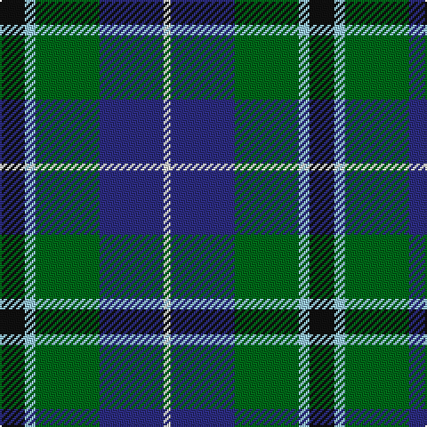

In pattern [KWGBW](/patterns/kwgbw/).

This was sourced from tartans-authority.  It is a [5 stripes tartan](/stripes/stripes5/).

Original link http://www.tartansauthority.com/tartan-ferret/display/7134/

## Thread count
K/14 LB6 G36 DB36 LN/4

## Palette
Each colour and its ΔE from the base-6 reference it is a variant of.

| Colour | Shade | Base | ΔE (OKLab) |
|---|---|---|---|
| DB | <code style="background-color:#2C2C80;">#2C2C80</code> `#2C2C80` | B <code style="background-color:#2A418A;">#2A418A</code> | 0.06 |
| G | <code style="background-color:#006818;">#006818</code> `#006818` | G <code style="background-color:#006100;">#006100</code> | 0.02 |
| K | <code style="background-color:#101010;">#101010</code> `#101010` | K <code style="background-color:#000000;">#000000</code> | 0.17 |
| LB | <code style="background-color:#98C8E8;">#98C8E8</code> `#98C8E8` | W <code style="background-color:#F7F7F7;">#F7F7F7</code> | 0.18 |
| LN | <code style="background-color:#E0E0E0;">#E0E0E0</code> `#E0E0E0` | W <code style="background-color:#F7F7F7;">#F7F7F7</code> | 0.07 |

# Sample pattern

## Nearest tartans

The nearest existing variants by ΔTartan distance.

1. [Bath](/setts/s5/k4b2g13ba13w2x4~b1474b4-ba2c2c80-g006818-k101010-we0e0e0/) — ΔT 0.59
1. [Turnbull Hunting Clan Tartan Tartan Number: 1265. Earliest known date: pre 2003 An unusual dress tartan having no white. See products available Copyright © Blair Urquhart, Comrie, 2015](/setts/s5/k7y3g28b28w3x2~b2c2c80-g006818-k101010-we0e0e0-ye8c000/) — ΔT 0.61
1. [Inglis (Name)](/setts/s6/y4g24b10r3b12ya4x2~b1c0070-g006818-rc80000-yb8b8b8-yad09800/) — ΔT 0.77
1. [DeLoughery (Personal)](/setts/s6/b20k6y4b3g20w2x2~b38409c-g006818-k101010-wfcfcfc-ya08858/) — ΔT 0.79
1. [Turnbull Hunting (1983) #2](/setts/s5/k2y1g10b10w1x6~b2c2c80-g006818-k101010-wfcfcfc-ye8c000/) — ΔT 0.82
1. [MacLeod of Assynt](/setts/s6/r3k2g20k10b20y2x2~b1474b4-g006818-k101010-rc80000-ye8c000/) — ΔT 0.86
1. [Highlander Highland Laddie](/setts/s5/k7r3g30b28w3x2~b1c0070-g006818-k101010-r880000-wc0c0c0/) — ΔT 0.87
1. [Highlander, Highland Laddie Kilts](/setts/s5/k7r3g29b29w3x2~b304080-g008000-k000000-r802040-we0e0e0/) — ΔT 0.89
1. [Royal Ashburn Golf Club](/setts/s6/g2b22r2k21g23y2x2~b1474b4-g006818-k101010-rc80000-ye8c000/) — ΔT 0.91
1. [Bhatti](/setts/s5/k7w3g18b18wa2x2~b000064-g003c14-k101010-w82f5fa-wae0e0e0/) — ΔT 0.92

## Neighbour map

Every grey dot is one of 15726 variants placed by the first two principal components of the ΔTartan feature space (44% of its variance). Red is this tartan; blue dots are its nearest — click one to open its page.

<svg viewBox="0 0 640 380" role="img" style="max-width:100%;height:auto;border:1px solid #e0e0e0;border-radius:4px;display:block" xmlns="http://www.w3.org/2000/svg"><image href="/nn/cloud.v1.png" width="640" height="380"/><a href="/setts/s5/k4b2g13ba13w2x4~b1474b4-ba2c2c80-g006818-k101010-we0e0e0/"><circle cx="166.6" cy="232.2" r="4" fill="#3465a4"><title>Bath</title></circle></a><a href="/setts/s5/k7y3g28b28w3x2~b2c2c80-g006818-k101010-we0e0e0-ye8c000/"><circle cx="200.9" cy="209.4" r="4" fill="#3465a4"><title>Turnbull Hunting Clan Tartan Tartan Number: 1265. Earliest known date: pre 2003 An unusual dress tartan having no white. See products available Copyright © Blair Urquhart, Comrie, 2015</title></circle></a><a href="/setts/s6/y4g24b10r3b12ya4x2~b1c0070-g006818-rc80000-yb8b8b8-yad09800/"><circle cx="180.1" cy="208.1" r="4" fill="#3465a4"><title>Inglis (Name)</title></circle></a><a href="/setts/s6/b20k6y4b3g20w2x2~b38409c-g006818-k101010-wfcfcfc-ya08858/"><circle cx="203.4" cy="200.0" r="4" fill="#3465a4"><title>DeLoughery (Personal)</title></circle></a><a href="/setts/s5/k2y1g10b10w1x6~b2c2c80-g006818-k101010-wfcfcfc-ye8c000/"><circle cx="212.1" cy="203.0" r="4" fill="#3465a4"><title>Turnbull Hunting (1983) #2</title></circle></a><a href="/setts/s6/r3k2g20k10b20y2x2~b1474b4-g006818-k101010-rc80000-ye8c000/"><circle cx="166.0" cy="199.1" r="4" fill="#3465a4"><title>MacLeod of Assynt</title></circle></a><a href="/setts/s5/k7r3g30b28w3x2~b1c0070-g006818-k101010-r880000-wc0c0c0/"><circle cx="218.8" cy="211.1" r="4" fill="#3465a4"><title>Highlander Highland Laddie</title></circle></a><a href="/setts/s5/k7r3g29b29w3x2~b304080-g008000-k000000-r802040-we0e0e0/"><circle cx="194.8" cy="203.9" r="4" fill="#3465a4"><title>Highlander, Highland Laddie Kilts</title></circle></a><a href="/setts/s6/g2b22r2k21g23y2x2~b1474b4-g006818-k101010-rc80000-ye8c000/"><circle cx="171.9" cy="195.7" r="4" fill="#3465a4"><title>Royal Ashburn Golf Club</title></circle></a><a href="/setts/s5/k7w3g18b18wa2x2~b000064-g003c14-k101010-w82f5fa-wae0e0e0/"><circle cx="161.1" cy="222.4" r="4" fill="#3465a4"><title>Bhatti</title></circle></a><circle cx="164.3" cy="218.1" r="5" fill="#c00000"/></svg>

ID: /setts/s5/k7w3g18b18wa2x2~b2c2c80-g006818-k101010-w98c8e8-wae0e0e0/
