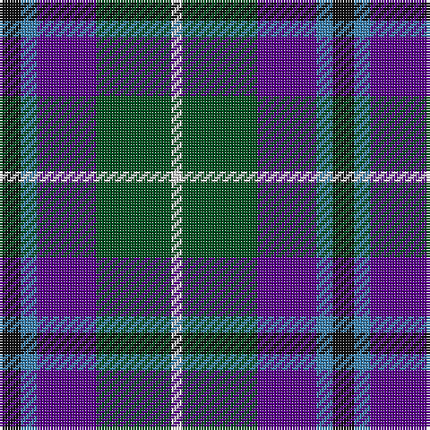

In pattern [KBBGW](/patterns/kbbgw/).

This was sourced from register-of-tartans.  It is a [5 stripes tartan](/stripes/stripes5/).

Original link https://www.tartanregister.gov.uk/tartanDetails.aspx?ref=4589

## Thread count
K/8 B6 P22 G28 LN/4

## Palette
Each colour and its ΔE from the base-6 reference it is a variant of.

| Colour | Shade | Base | ΔE (OKLab) |
|---|---|---|---|
| B | <code style="background-color:#3C82AF;">#3C82AF</code> `#3C82AF` | B <code style="background-color:#2A418A;">#2A418A</code> | 0.19 |
| G | <code style="background-color:#005020;">#005020</code> `#005020` | G <code style="background-color:#006100;">#006100</code> | 0.07 |
| K | <code style="background-color:#101010;">#101010</code> `#101010` | K <code style="background-color:#000000;">#000000</code> | 0.17 |
| LN | <code style="background-color:#E0E0E0;">#E0E0E0</code> `#E0E0E0` | W <code style="background-color:#F7F7F7;">#F7F7F7</code> | 0.07 |
| P | <code style="background-color:#5A008C;">#5A008C</code> `#5A008C` | B <code style="background-color:#2A418A;">#2A418A</code> | 0.13 |

# Sample pattern

## Nearest tartans

The nearest existing variants by ΔTartan distance.

1. [MacPhail Hunting #2](/setts/s6/r8b48k24g28k8w6-b2c2c80-g006818-k101010-rc80000-wc0c0c0/) — ΔT 0.64
1. [Teylu Coleman (Name)](/setts/s5/w6k50b18ba34y6-b5c5c5c-ba003c64-k101010-we8ccb8-yfccc00/) — ΔT 0.81
1. [Stovell (2015)](/setts/s6/b90r36g48k12w12k12-b202060-g005020-k101010-rb03000-wf8f4d0/) — ΔT 0.82
1. [Davidson of Tulloch #2](/setts/s5/r4b24k12g24w4-b2c4084-g005020-k101010-rdc0000-we0e0e0/) — ΔT 0.84
1. [Cala Homes (Corporate)](/setts/s6/y5b24k8ba18y6g3-b202060-ba2c2c80-g604000-k101010-ye8c000/) — ΔT 0.85
1. [Unidentified (Sock Tie)](/setts/s5/b54r18w6g32ra14-b003c96-g525014-rbe7832-ra960028-we0e0e0/) — ΔT 0.85
1. [Bath](/setts/s5/k16b8g52ba52w8-b1474b4-ba2c2c80-g006818-k101010-we0e0e0/) — ΔT 0.89
1. [Forbo Nairn](/setts/s5/b8g32k28ba48r8-b5c8ca8-ba2c2c80-g006818-k101010-rc80000/) — ΔT 0.89
1. [Paterson Blue (Personal)](/setts/s6/b44w4k20g22r6g8-b2c2c80-g006818-k101010-rc80000-we0e0e0/) — ΔT 0.93
1. [Midlothian](/setts/s6/b62ba8b10k38g40y8-b1c0070-ba2474e8-g006818-k101010-yd09800/) — ΔT 0.94

## Neighbour map

Every grey dot is one of 15726 variants placed by the first two principal components of the ΔTartan feature space (44% of its variance). Red is this tartan; blue dots are its nearest — click one to open its page.

<svg viewBox="0 0 640 380" role="img" style="max-width:100%;height:auto;border:1px solid #e0e0e0;border-radius:4px;display:block" xmlns="http://www.w3.org/2000/svg"><image href="/nn/cloud.v1.png" width="640" height="380"/><a href="/setts/s6/r8b48k24g28k8w6-b2c2c80-g006818-k101010-rc80000-wc0c0c0/"><circle cx="168.7" cy="217.5" r="4" fill="#3465a4"><title>MacPhail Hunting #2</title></circle></a><a href="/setts/s5/w6k50b18ba34y6-b5c5c5c-ba003c64-k101010-we8ccb8-yfccc00/"><circle cx="189.0" cy="219.6" r="4" fill="#3465a4"><title>Teylu Coleman (Name)</title></circle></a><a href="/setts/s6/b90r36g48k12w12k12-b202060-g005020-k101010-rb03000-wf8f4d0/"><circle cx="178.9" cy="208.3" r="4" fill="#3465a4"><title>Stovell (2015)</title></circle></a><a href="/setts/s5/r4b24k12g24w4-b2c4084-g005020-k101010-rdc0000-we0e0e0/"><circle cx="143.3" cy="243.9" r="4" fill="#3465a4"><title>Davidson of Tulloch #2</title></circle></a><a href="/setts/s6/y5b24k8ba18y6g3-b202060-ba2c2c80-g604000-k101010-ye8c000/"><circle cx="139.0" cy="209.7" r="4" fill="#3465a4"><title>Cala Homes (Corporate)</title></circle></a><a href="/setts/s5/b54r18w6g32ra14-b003c96-g525014-rbe7832-ra960028-we0e0e0/"><circle cx="192.8" cy="221.8" r="4" fill="#3465a4"><title>Unidentified (Sock Tie)</title></circle></a><a href="/setts/s5/k16b8g52ba52w8-b1474b4-ba2c2c80-g006818-k101010-we0e0e0/"><circle cx="166.5" cy="232.5" r="4" fill="#3465a4"><title>Bath</title></circle></a><a href="/setts/s5/b8g32k28ba48r8-b5c8ca8-ba2c2c80-g006818-k101010-rc80000/"><circle cx="156.5" cy="253.0" r="4" fill="#3465a4"><title>Forbo Nairn</title></circle></a><a href="/setts/s6/b44w4k20g22r6g8-b2c2c80-g006818-k101010-rc80000-we0e0e0/"><circle cx="200.0" cy="201.5" r="4" fill="#3465a4"><title>Paterson Blue (Personal)</title></circle></a><a href="/setts/s6/b62ba8b10k38g40y8-b1c0070-ba2474e8-g006818-k101010-yd09800/"><circle cx="186.9" cy="222.8" r="4" fill="#3465a4"><title>Midlothian</title></circle></a><circle cx="169.9" cy="228.7" r="5" fill="#c00000"/></svg>

ID: /setts/s5/k8b6ba22g28w4-b3c82af-ba5a008c-g005020-k101010-we0e0e0/
