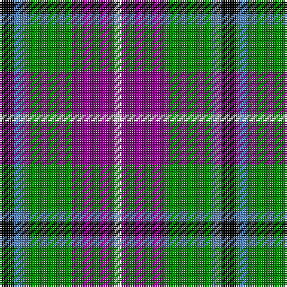

In pattern [KBGBW](/patterns/kbgbw/).

This was sourced from weddslist.  It is a [5 stripes tartan](/stripes/stripes5/).

Original link http://www.weddslist.com/cgi-bin/tartans/pg.pl?source=sts

## Thread count
K/8 B6 G26 P24 LN/4

## Palette
Each colour and its ΔE from the base-6 reference it is a variant of.

| Colour | Shade | Base | ΔE (OKLab) |
|---|---|---|---|
| B | <code style="background-color:#5480B0;">#5480B0</code> `#5480B0` | B <code style="background-color:#2A418A;">#2A418A</code> | 0.19 |
| G | <code style="background-color:#008000;">#008000</code> `#008000` | G <code style="background-color:#006100;">#006100</code> | 0.10 |
| K | <code style="background-color:#000000;">#000000</code> `#000000` | K <code style="background-color:#000000;">#000000</code> | 0.00 |
| LN | <code style="background-color:#E0E0E0;">#E0E0E0</code> `#E0E0E0` | W <code style="background-color:#F7F7F7;">#F7F7F7</code> | 0.07 |
| P | <code style="background-color:#800080;">#800080</code> `#800080` | B <code style="background-color:#2A418A;">#2A418A</code> | 0.17 |

# Sample pattern

## Nearest tartans

The nearest existing variants by ΔTartan distance.

1. [Wilson's, No 176](/setts/s5/k8b6g24ba26y4-b5480b0-ba800080-g008000-k000000-yf0c000/) — ΔT 0.22
1. [Wellington, No 229](/setts/s5/k8b6ba22g28w4-b5480b0-ba800080-g008000-k000000-we0e0e0/) — ΔT 0.35
1. [Wellington, No 122](/setts/s5/k8b6ba22g28y4-b5480b0-ba800080-g008000-k000000-yf0c000/) — ΔT 0.47
1. [Wilson's, No 183](/setts/s6/k8b4ba24g24r4g4-b5480b0-ba800080-g008000-k000000-rc00000/) — ΔT 0.76
1. [Thompson's Fancy (Fashion)](/setts/s6/r6g36b12w24k24w6-b1c0070-g604000-k101010-r880000-w98c8e8/) — ΔT 0.78
1. [Davidson of Tulloch](/setts/s5/r4b20k10g24w4-b2c2c80-g289c18-k101010-rc80000-wfcfcfc/) — ΔT 0.98
1. [Dunbog, Primary School](/setts/s6/r24b6g10ba32y4g4-b304080-ba000050-g008000-rc00000-yf0c000/) — ΔT 0.98
1. [Thom(p)son's, Fancy](/setts/s6/r12ra48b12ba24k24ba6-b304080-ba5480b0-k000000-rc00000-ra806050/) — ΔT 0.99
1. [Davidson](/setts/s5/r4b24k12g24w4-b304080-g008000-k000000-rc00000-we0e0e0/) — ΔT 1.02
1. [MacTavish Dress](/setts/s6/r8b56k12w24k24y6-b5c8ca8-k101010-r880000-wc0c0c0-yd09800/) — ΔT 1.06

## Neighbour map

Every grey dot is one of 15726 variants placed by the first two principal components of the ΔTartan feature space (44% of its variance). Red is this tartan; blue dots are its nearest — click one to open its page.

<svg viewBox="0 0 640 380" role="img" style="max-width:100%;height:auto;border:1px solid #e0e0e0;border-radius:4px;display:block" xmlns="http://www.w3.org/2000/svg"><image href="/nn/cloud.v1.png" width="640" height="380"/><a href="/setts/s5/k8b6g24ba26y4-b5480b0-ba800080-g008000-k000000-yf0c000/"><circle cx="133.4" cy="216.4" r="4" fill="#3465a4"><title>Wilson's, No 176</title></circle></a><a href="/setts/s5/k8b6ba22g28w4-b5480b0-ba800080-g008000-k000000-we0e0e0/"><circle cx="143.5" cy="213.3" r="4" fill="#3465a4"><title>Wellington, No 229</title></circle></a><a href="/setts/s5/k8b6ba22g28y4-b5480b0-ba800080-g008000-k000000-yf0c000/"><circle cx="145.6" cy="213.9" r="4" fill="#3465a4"><title>Wellington, No 122</title></circle></a><a href="/setts/s6/k8b4ba24g24r4g4-b5480b0-ba800080-g008000-k000000-rc00000/"><circle cx="159.0" cy="205.5" r="4" fill="#3465a4"><title>Wilson's, No 183</title></circle></a><a href="/setts/s6/r6g36b12w24k24w6-b1c0070-g604000-k101010-r880000-w98c8e8/"><circle cx="85.0" cy="219.1" r="4" fill="#3465a4"><title>Thompson's Fancy (Fashion)</title></circle></a><a href="/setts/s5/r4b20k10g24w4-b2c2c80-g289c18-k101010-rc80000-wfcfcfc/"><circle cx="116.7" cy="224.9" r="4" fill="#3465a4"><title>Davidson of Tulloch</title></circle></a><a href="/setts/s6/r24b6g10ba32y4g4-b304080-ba000050-g008000-rc00000-yf0c000/"><circle cx="157.1" cy="193.2" r="4" fill="#3465a4"><title>Dunbog, Primary School</title></circle></a><a href="/setts/s6/r12ra48b12ba24k24ba6-b304080-ba5480b0-k000000-rc00000-ra806050/"><circle cx="132.6" cy="210.0" r="4" fill="#3465a4"><title>Thom(p)son's, Fancy</title></circle></a><a href="/setts/s5/r4b24k12g24w4-b304080-g008000-k000000-rc00000-we0e0e0/"><circle cx="108.0" cy="229.2" r="4" fill="#3465a4"><title>Davidson</title></circle></a><a href="/setts/s6/r8b56k12w24k24y6-b5c8ca8-k101010-r880000-wc0c0c0-yd09800/"><circle cx="165.5" cy="187.3" r="4" fill="#3465a4"><title>MacTavish Dress</title></circle></a><circle cx="130.1" cy="216.3" r="5" fill="#c00000"/></svg>

ID: /setts/s5/k8b6g26ba24w4-b5480b0-ba800080-g008000-k000000-we0e0e0/
