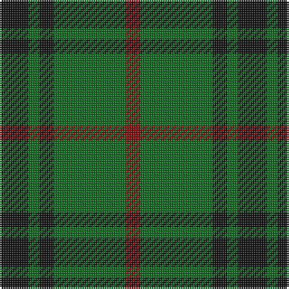

In pattern [KGKGR](/stripes/kgkgr/).

This was sourced from register-of-tartans.  It is a [5 stripe tartan](/stripes/stripes5/).

Original link https://www.tartanregister.gov.uk/tartanDetails.aspx?ref=2282

## Register references

External register numbers recorded for this tartan.

- Scottish Register of Tartans: [2282](https://www.tartanregister.gov.uk/tartanDetails.aspx?ref=2282)
- Scottish Tartans Authority (ITI): 1088
- Scottish Tartans World Register: 1088

## Thread count
K/16 G6 K8 G40 DR/8

## Palette
Each colour and the base-6 reference it is a variant of.

| Colour | Shade | Base |
|---|---|---|
| DR | <code style="background-color:#880000;">#880000</code> `oklch(39.4% 0.162 29.2)` <small>#880000</small> | R <code style="background-color:#CC0000;">#CC0000</code> |
| G | <code style="background-color:#006818;">#006818</code> `oklch(45.0% 0.142 145.0)` <small>#006818</small> | G <code style="background-color:#006100;">#006100</code> |
| K | <code style="background-color:#101010;">#101010</code> `oklch(17.3% 0.000 89.9)` <small>#101010</small> | K <code style="background-color:#000000;">#000000</code> |

# Sample pattern

## Nearest tartans

The nearest existing variants by ΔTartan distance, with this tartan at the top so the swatches line up against it.

ΔTartan

Tartan

Sett

—

<a href="/ttd/edit/#slug=k8g3k4g20r4~x2">MacArthur-Fox (Personal)</a> <a class="nn-out" href="/setts/s5/k8g3k4g20r4~x2/" title="open its dictionary page">↗</a>

0.86

<a href="/ttd/edit/#slug=g22dt5r4dt5r3~x2">Romsdal</a> <a class="nn-out" href="/setts/s5/g22dt5r4dt5r3~x2/" title="open its dictionary page">↗</a>

1.06

<a href="/ttd/edit/#slug=dg2y14dg8y3dg12lo2~x2">Confederate Cavalry (Military)</a> <a class="nn-out" href="/setts/s6/dg2y14dg8y3dg12lo2~x2/" title="open its dictionary page">↗</a>

1.15

<a href="/ttd/edit/#slug=g3db8g3k4g15r2~x2">Lauder (Family)</a> <a class="nn-out" href="/setts/s6/g3db8g3k4g15r2~x2/" title="open its dictionary page">↗</a>

1.16

<a href="/ttd/edit/#slug=g18ly2g18k4g2k15~x2">MacArthur (Highland Society)</a> <a class="nn-out" href="/setts/s6/g18ly2g18k4g2k15~x2/" title="open its dictionary page">↗</a>

1.24

<a href="/ttd/edit/#slug=dg2o14dg8o3dg12db2~x2">Confederate Infantry</a> <a class="nn-out" href="/setts/s6/dg2o14dg8o3dg12db2~x2/" title="open its dictionary page">↗</a>

1.25

<a href="/ttd/edit/#slug=dg2o14dg8o3dg12r2~x2">Confederate Artillery</a> <a class="nn-out" href="/setts/s6/dg2o14dg8o3dg12r2~x2/" title="open its dictionary page">↗</a>

1.30

<a href="/ttd/edit/#slug=dg2n8dg2k3dg12r2~x2">Wcwm 1045</a> <a class="nn-out" href="/setts/s6/dg2n8dg2k3dg12r2~x2/" title="open its dictionary page">↗</a>

1.31

<a href="/ttd/edit/#slug=k9g3k3g12ly2~x4">MacArthur</a> <a class="nn-out" href="/setts/s5/k9g3k3g12ly2~x4/" title="open its dictionary page">↗</a>

1.32

<a href="/ttd/edit/#slug=lo1dg11k6dg3lo1dg1lo1~x4">Angle, Green (Fashion)</a> <a class="nn-out" href="/setts/s7/lo1dg11k6dg3lo1dg1lo1~x4/" title="open its dictionary page">↗</a>

1.35

<a href="/ttd/edit/#slug=g14k3r3lr2~x2">Bacon, Green (Fashion)</a> <a class="nn-out" href="/setts/s4/g14k3r3lr2~x2/" title="open its dictionary page">↗</a>

## Neighbour map

Every grey dot is one of 14299 variants placed by the first two principal components of the ΔTartan feature space (44% of its variance). Red is this tartan; blue dots are its nearest — click one to open its page.

<svg viewBox="0 0 640 380" role="img" style="max-width:100%;height:auto;border:1px solid #e0e0e0;border-radius:4px;display:block" xmlns="http://www.w3.org/2000/svg"><image href="/nn/cloud.v1.png" width="640" height="380"/><a href="/setts/s5/g22dt5r4dt5r3~x2/"><circle cx="342.0" cy="256.5" r="4" fill="#3465a4"><title>Romsdal</title></circle></a><a href="/setts/s6/dg2y14dg8y3dg12lo2~x2/"><circle cx="337.0" cy="273.8" r="4" fill="#3465a4"><title>Confederate Cavalry (Military)</title></circle></a><a href="/setts/s6/g3db8g3k4g15r2~x2/"><circle cx="329.0" cy="253.4" r="4" fill="#3465a4"><title>Lauder (Family)</title></circle></a><a href="/setts/s6/g18ly2g18k4g2k15~x2/"><circle cx="386.4" cy="265.0" r="4" fill="#3465a4"><title>MacArthur (Highland Society)</title></circle></a><a href="/setts/s6/dg2o14dg8o3dg12db2~x2/"><circle cx="313.8" cy="262.0" r="4" fill="#3465a4"><title>Confederate Infantry</title></circle></a><a href="/setts/s6/dg2o14dg8o3dg12r2~x2/"><circle cx="320.3" cy="262.9" r="4" fill="#3465a4"><title>Confederate Artillery</title></circle></a><a href="/setts/s6/dg2n8dg2k3dg12r2~x2/"><circle cx="294.4" cy="259.4" r="4" fill="#3465a4"><title>Wcwm 1045</title></circle></a><a href="/setts/s5/k9g3k3g12ly2~x4/"><circle cx="282.5" cy="278.4" r="4" fill="#3465a4"><title>MacArthur</title></circle></a><a href="/setts/s7/lo1dg11k6dg3lo1dg1lo1~x4/"><circle cx="396.8" cy="226.0" r="4" fill="#3465a4"><title>Angle, Green (Fashion)</title></circle></a><a href="/setts/s4/g14k3r3lr2~x2/"><circle cx="347.5" cy="250.5" r="4" fill="#3465a4"><title>Bacon, Green (Fashion)</title></circle></a><circle cx="355.9" cy="277.8" r="5" fill="#c00000"/></svg>

ID: /setts/s5/k8g3k4g20r4~x2/
