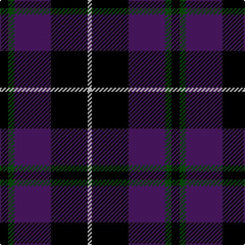

In pattern [KGBKW](/patterns/kgbkw/).

This was sourced from register-of-tartans.  It is a [5 stripes tartan](/stripes/stripes5/).

Original link https://www.tartanregister.gov.uk/tartanDetails.aspx?ref=4510

## Thread count
K/8 G6 DP36 K36 N/4

## Palette
Each colour and its ΔE from the base-6 reference it is a variant of.

| Colour | Shade | Base | ΔE (OKLab) |
|---|---|---|---|
| DP | <code style="background-color:#4C1864;">#4C1864</code> `#4C1864` | B <code style="background-color:#2C4084;">#2C4084</code> | 0.11 |
| G | <code style="background-color:#004C00;">#004C00</code> `#004C00` | G <code style="background-color:#006400;">#006400</code> | 0.08 |
| K | <code style="background-color:#000000;">#000000</code> `#000000` | K <code style="background-color:#000000;">#000000</code> | 0.00 |
| N | <code style="background-color:#C8C8C8;">#C8C8C8</code> `#C8C8C8` | W <code style="background-color:#F4F4F0;">#F4F4F0</code> | 0.13 |

# Sample pattern

## Nearest tartans

The nearest existing variants by ΔTartan distance.

1. [Scottish Express International](/setts/s6/b6k29ba6k29b50ka6-b304080-ba8080d0-k000000-ka000030/) — ΔT 0.95
1. [College of Radiographers](/setts/s5/k30g4k20b36w6-b304080-g908000-k000000-we0e0e0/) — ΔT 1.11
1. [Nairn](/setts/s5/r4k32g8b16r4-b304080-g008000-k000000-rc00000/) — ΔT 1.13
1. [Marchmont](/setts/s7/k4b48k48g4k48b48w4-b304080-g407050-k000000-we0e0e0/) — ΔT 1.26
1. [Carrick High School](/setts/s7/k12y4k32b12k6ba36k4-b788cb4-ba00008c-k000000-yc88c00/) — ΔT 1.33
1. [College of Radiographers Corporate Tartan Tartan Number: 1274. Earliest known date: 1988 Marketed in Edinburgh around 1930s but no longer seen. See products available Copyright © Blair Urquhart, Comrie, 2015](/setts/s5/k30y4k20b36w6-b2c2c80-k101010-we0e0e0-ye8c000/) — ΔT 1.33
1. [Printing Industries of America](/setts/s8/k28r8k8ka24y4ka4y4ka16-k000000-ka000034-r8c0000-yc88c00/) — ΔT 1.35
1. [Britannia](/setts/s5/k28r8k50b60w8-b202060-k101010-rc80000-we0e0e0/) — ΔT 1.43
1. [MacKay, Blue](/setts/s5/k30b8k30b56r4-b304080-k000000-rc00000/) — ΔT 1.45
1. [College of Radiographers](/setts/s5/k30y4k20b36w6-b00008c-k101010-wc8c8c8-yc88c00/) — ΔT 1.49

## Neighbour map

Every grey dot is one of 15726 variants placed by the first two principal components of the ΔTartan feature space (44% of its variance). Red is this tartan; blue dots are its nearest — click one to open its page.

<svg viewBox="0 0 640 380" role="img" style="max-width:100%;height:auto;border:1px solid #e0e0e0;border-radius:4px;display:block" xmlns="http://www.w3.org/2000/svg"><image href="/nn/cloud.v1.png" width="640" height="380"/><a href="/setts/s6/b6k29ba6k29b50ka6-b304080-ba8080d0-k000000-ka000030/"><circle cx="252.6" cy="232.3" r="4" fill="#3465a4"><title>Scottish Express International</title></circle></a><a href="/setts/s5/k30g4k20b36w6-b304080-g908000-k000000-we0e0e0/"><circle cx="248.6" cy="239.8" r="4" fill="#3465a4"><title>College of Radiographers</title></circle></a><a href="/setts/s5/r4k32g8b16r4-b304080-g008000-k000000-rc00000/"><circle cx="231.4" cy="226.4" r="4" fill="#3465a4"><title>Nairn</title></circle></a><a href="/setts/s7/k4b48k48g4k48b48w4-b304080-g407050-k000000-we0e0e0/"><circle cx="281.7" cy="216.1" r="4" fill="#3465a4"><title>Marchmont</title></circle></a><a href="/setts/s7/k12y4k32b12k6ba36k4-b788cb4-ba00008c-k000000-yc88c00/"><circle cx="246.1" cy="215.9" r="4" fill="#3465a4"><title>Carrick High School</title></circle></a><a href="/setts/s5/k30y4k20b36w6-b2c2c80-k101010-we0e0e0-ye8c000/"><circle cx="265.6" cy="243.3" r="4" fill="#3465a4"><title>College of Radiographers Corporate Tartan Tartan Number: 1274. Earliest known date: 1988 Marketed in Edinburgh around 1930s but no longer seen. See products available Copyright © Blair Urquhart, Comrie, 2015</title></circle></a><a href="/setts/s8/k28r8k8ka24y4ka4y4ka16-k000000-ka000034-r8c0000-yc88c00/"><circle cx="228.0" cy="233.4" r="4" fill="#3465a4"><title>Printing Industries of America</title></circle></a><a href="/setts/s5/k28r8k50b60w8-b202060-k101010-rc80000-we0e0e0/"><circle cx="283.6" cy="259.1" r="4" fill="#3465a4"><title>Britannia</title></circle></a><a href="/setts/s5/k30b8k30b56r4-b304080-k000000-rc00000/"><circle cx="323.8" cy="244.1" r="4" fill="#3465a4"><title>MacKay, Blue</title></circle></a><a href="/setts/s5/k30y4k20b36w6-b00008c-k101010-wc8c8c8-yc88c00/"><circle cx="271.3" cy="250.2" r="4" fill="#3465a4"><title>College of Radiographers</title></circle></a><circle cx="269.4" cy="229.9" r="5" fill="#c00000"/></svg>

ID: /setts/s5/k8g6b36k36w4-b4c1864-g004c00-k000000-wc8c8c8/
