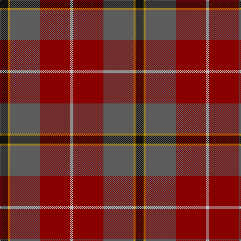

**Bands:** [KYBRW](/stripes/kybrw/) · **Stripes:** [K LO N R LB](/stripes/stripes5/) K LO N R LB

This was sourced from register-of-tartans.  It is a [5 band tartan](/bands/bands5/).

Original link https://www.tartanregister.gov.uk/tartanDetails.aspx?ref=960

## Register references

External register numbers recorded for this tartan.

- Scottish Register of Tartans: [960](https://www.tartanregister.gov.uk/tartanDetails.aspx?ref=960)
- Scottish Tartans Authority (ITI): 4701

## Thread count
K/16 DY4 N60 DR60 Na/6

## Palette
Each colour and its ΔE from the base-6 reference it is a variant of.

| Colour | Shade | Base | ΔE (OKLab) |
|---|---|---|---|
| DR | <code style="background-color:#880000;">#880000</code> `#880000` | R <code style="background-color:#CC0000;">#CC0000</code> | 0.15 |
| DY | <code style="background-color:#D09800;">#D09800</code> `#D09800` | Y <code style="background-color:#F2BF00;">#F2BF00</code> | 0.12 |
| K | <code style="background-color:#101010;">#101010</code> `#101010` | K <code style="background-color:#000000;">#000000</code> | 0.17 |
| N | <code style="background-color:#5C5C5C;">#5C5C5C</code> `#5C5C5C` | B <code style="background-color:#2A418A;">#2A418A</code> | 0.15 |
| Na | <code style="background-color:#C0C0C0;">#C0C0C0</code> `#C0C0C0` | W <code style="background-color:#F7F7F7;">#F7F7F7</code> | 0.17 |

# Sample pattern

## Nearest tartans

The nearest existing variants by ΔTartan distance.

1. [Jardine](/setts/s5/dr18o9y9r1t1~x4/) — ΔT 0.85
1. [Miller, Reverend Ian (Personal](/setts/s6/dp2g18dp15r24k1ly2~x2/) — ΔT 0.99
1. [Buncle (Duns)](/setts/s5/n9do2dg12o31lo9~x2/) — ΔT 1.07
1. [Andover (Fashion)](/setts/s6/r1n12k6ly1do10r1~x4/) — ΔT 1.24
1. [Buncle (Name)](/setts/s5/t9dy2g12r31lo9~x2/) — ΔT 1.26
1. [Leckie (Personal)](/setts/s7/r3db1r12o3dg12lb1dg2~x4/) — ΔT 1.35
1. [McCarthy, Old](/setts/s5/db7r26db7dg24ly2~x2/) — ΔT 1.35
1. [Spragg, Andrew](/setts/s7/r2dg16r1r2r12ly1y1~x2/) — ΔT 1.36
1. [Eachaidh (Personal)](/setts/s6/k6t1r18db6dg18k2~x2/) — ΔT 1.39
1. [Eachaidh](/setts/s6/k6y1r18b6dg18k2~x2/) — ΔT 1.39

## Neighbour map

Every grey dot is one of 14299 variants placed by the first two principal components of the ΔTartan feature space (44% of its variance). Red is this tartan; blue dots are its nearest — click one to open its page.

<svg viewBox="0 0 640 380" role="img" style="max-width:100%;height:auto;border:1px solid #e0e0e0;border-radius:4px;display:block" xmlns="http://www.w3.org/2000/svg"><image href="/nn/cloud.v1.png" width="640" height="380"/><a href="/setts/s5/dr18o9y9r1t1~x4/"><circle cx="287.2" cy="192.1" r="4" fill="#3465a4"><title>Jardine</title></circle></a><a href="/setts/s6/dp2g18dp15r24k1ly2~x2/"><circle cx="264.8" cy="168.6" r="4" fill="#3465a4"><title>Miller, Reverend Ian (Personal</title></circle></a><a href="/setts/s5/n9do2dg12o31lo9~x2/"><circle cx="282.4" cy="197.8" r="4" fill="#3465a4"><title>Buncle (Duns)</title></circle></a><a href="/setts/s6/r1n12k6ly1do10r1~x4/"><circle cx="241.7" cy="208.0" r="4" fill="#3465a4"><title>Andover (Fashion)</title></circle></a><a href="/setts/s5/t9dy2g12r31lo9~x2/"><circle cx="283.8" cy="198.0" r="4" fill="#3465a4"><title>Buncle (Name)</title></circle></a><a href="/setts/s7/r3db1r12o3dg12lb1dg2~x4/"><circle cx="275.0" cy="180.8" r="4" fill="#3465a4"><title>Leckie (Personal)</title></circle></a><a href="/setts/s5/db7r26db7dg24ly2~x2/"><circle cx="274.2" cy="240.7" r="4" fill="#3465a4"><title>McCarthy, Old</title></circle></a><a href="/setts/s7/r2dg16r1r2r12ly1y1~x2/"><circle cx="302.5" cy="154.1" r="4" fill="#3465a4"><title>Spragg, Andrew</title></circle></a><a href="/setts/s6/k6t1r18db6dg18k2~x2/"><circle cx="237.4" cy="197.9" r="4" fill="#3465a4"><title>Eachaidh (Personal)</title></circle></a><a href="/setts/s6/k6y1r18b6dg18k2~x2/"><circle cx="251.3" cy="204.1" r="4" fill="#3465a4"><title>Eachaidh</title></circle></a><circle cx="283.9" cy="200.2" r="5" fill="#c00000"/></svg>

ID: /setts/s5/k8lo2n30r30lb3~x2/
